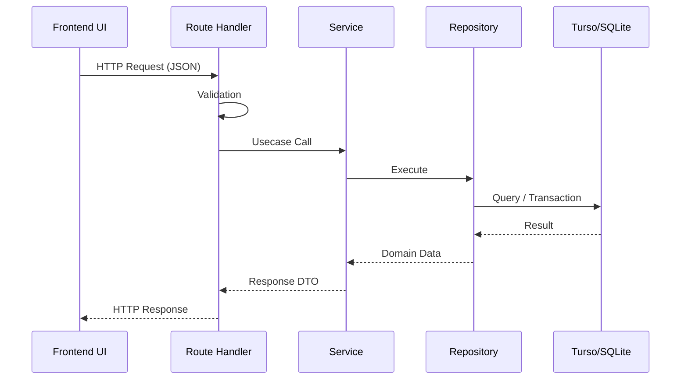

# Brewia API仕様書

## 用語定義

| 和名           | 英名       | 定義                                            |
| -------------- | ---------- | ----------------------------------------------- |
| API            | API        | HTTP 経由でリソースを操作するインターフェース。 |
| リクエスト     | Request    | クライアントから API へ送るデータ。             |
| レスポンス     | Response   | API からクライアントへ返すデータ。              |
| バリデーション | Validation | リクエスト値を検証する処理。                    |

## 機能要件

### 共通仕様

| 項目             | 内容                                                                                             |
| ---------------- | ------------------------------------------------------------------------------------------------ |
| Base Path        | `/api`                                                                                           |
| Content-Type     | `application/json`                                                                               |
| エラーレスポンス | `{"error":"Invalid request body"}` / `{"error":"Bean not found"}` / `{"error":"Brew not found"}` |

### APIフロー

### 豆管理API（Beans）

#### `GET /api/beans`

- 豆一覧を取得する。
- レスポンス: `200 OK`

#### `POST /api/beans`

- 豆を作成する。
- レスポンス: `201 Created` / `400 Bad Request`

#### `GET /api/beans/:id`

- 豆詳細を取得する。
- レスポンス: `200 OK` / `404 Not Found`

#### `PUT /api/beans/:id`

- 豆情報を更新する（全項目更新）。
- レスポンス: `200 OK` / `400 Bad Request` / `404 Not Found`

#### `DELETE /api/beans/:id`

- 豆を削除する（関連抽出・抽出フレーバーも削除）。
- レスポンス: `204 No Content` / `404 Not Found`

### 抽出管理API（Brews）

#### `GET /api/brews`

- 抽出一覧を取得する。
- クエリ: `beanId`（任意、指定時は対象 Bean の抽出のみ）。
- レスポンス: `200 OK`

#### `POST /api/brews`

- 抽出を作成する。
- レスポンス: `201 Created` / `400 Bad Request`

#### `GET /api/brews/:id`

- 抽出詳細を取得する（Bean と Flavor を含む）。
- レスポンス: `200 OK` / `404 Not Found`

#### `PUT /api/brews/:id`

- 抽出情報を更新する（全項目更新）。
- レスポンス: `200 OK` / `400 Bad Request` / `404 Not Found`

#### `DELETE /api/brews/:id`

- 抽出を削除する（関連抽出フレーバーも削除）。
- レスポンス: `204 No Content` / `404 Not Found`

### フレーバー管理API（Flavors）

#### `GET /api/flavors`

- フレーバー一覧を取得する。
- レスポンス: `200 OK`

### バリデーション方針

- 作成・更新 API はスキーマ検証に失敗した場合 `400 Bad Request` を返す。
- `PUT` は部分更新ではなく全項目更新を前提とする。
- 一覧・詳細 API は動的描画向け設定を利用する。
