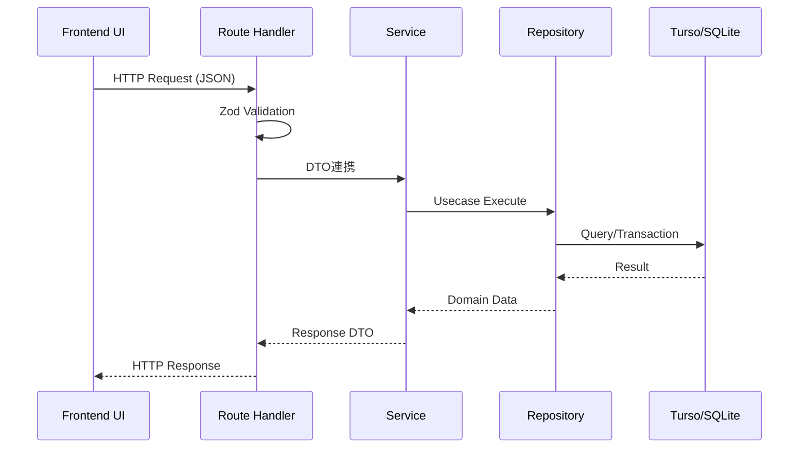

# Brewia API仕様書

## サービス概要

### 用語定義

| 用語           | 定義                                                |
| -------------- | --------------------------------------------------- |
| REST API       | HTTP メソッドでリソースを操作するインターフェース。 |
| DTO            | API 入出力で扱うデータ構造。                        |
| バリデーション | リクエスト値をスキーマ検証する処理。                |
| リソースID     | Bean / Brew / Flavor を識別する UUID 形式文字列。   |

### 背景

Brewia では画面操作のほぼすべてが API 経由でデータに反映される。
入力制約とレスポンス仕様が曖昧だと、フロント実装および将来の外部連携で不整合が起きる。

### 目的

エンドポイント、入出力、ステータスコード、エラー方針を統一し、開発者が安全に API を利用できる状態を作る。

## 業務要件

### APIフロー



## 機能要件

### 共通仕様

- Base Path: `/api`
- Content-Type: `application/json`
- エラー形式（バリデーション/未検出）:
  - `{"error":"Invalid request body"}`
  - `{"error":"Bean not found"}`
  - `{"error":"Brew not found"}`

### Beans API

#### `GET /api/beans`

- **説明**: Bean 一覧を返却する。
- **レスポンス**: `200 OK`

#### `POST /api/beans`

- **説明**: Bean を作成する。
- **リクエスト例**:

```json
{
  "name": "Ethiopia Guji",
  "roaster": "Kurasu",
  "country": "Ethiopia",
  "region": "Guji",
  "farm": "Bookkisa",
  "variety": "Heirloom",
  "process": "Washed",
  "roast": "Light",
  "notes": "Floral and citrus"
}
```

- **レスポンス**:
  - `201 Created` `{"id":"<beanId>"}`
  - `400 Bad Request`（スキーマ不一致）

#### `GET /api/beans/:id`

- **説明**: 単一 Bean を返却する。
- **レスポンス**:
  - `200 OK`
  - `404 Not Found`

#### `PUT /api/beans/:id`

- **説明**: Bean を全項目更新する。
- **レスポンス**:
  - `200 OK`
  - `400 Bad Request`
  - `404 Not Found`

#### `DELETE /api/beans/:id`

- **説明**: Bean を削除する（関連 Brew/BrewFlavor を含む）。
- **レスポンス**:
  - `204 No Content`
  - `404 Not Found`

### Brews API

#### `GET /api/brews`

- **説明**: Brew 一覧を返却する。
- **クエリ**:
  - `beanId`（任意）: 指定時は当該 Bean のみ返却。
- **レスポンス**: `200 OK`

#### `POST /api/brews`

- **説明**: Brew を作成する。
- **リクエスト例**:

```json
{
  "beanId": "<beanId>",
  "beanWeight": 15,
  "beanGrind": 22,
  "waterWeight": 240,
  "waterTemp": 92,
  "steps": [
    { "time": 0, "water": 40 },
    { "time": 30, "water": 120 },
    { "time": 60, "water": 180 },
    { "time": 90, "water": 240 }
  ],
  "aroma": 4,
  "acidity": 4,
  "sweetness": 3,
  "body": 3,
  "overall": 4,
  "notes": "Juicy and clean",
  "flavorIds": ["<flavorId1>", "<flavorId2>"]
}
```

- **レスポンス**:
  - `201 Created` `{"id":"<brewId>"}`
  - `400 Bad Request`

#### `GET /api/brews/:id`

- **説明**: 単一 Brew を返却する（Bean と Flavors を含む）。
- **レスポンス**:
  - `200 OK`
  - `404 Not Found`

#### `PUT /api/brews/:id`

- **説明**: Brew を全項目更新する。
- **レスポンス**:
  - `200 OK`
  - `400 Bad Request`
  - `404 Not Found`

#### `DELETE /api/brews/:id`

- **説明**: Brew を削除する（関連 BrewFlavor を含む）。
- **レスポンス**:
  - `204 No Content`
  - `404 Not Found`

### Flavors API

#### `GET /api/flavors`

- **説明**: Flavor 一覧を返却する。
- **レスポンス**: `200 OK`

## 補足

### 実装上の注意

- 作成・更新 API は `safeParse` でスキーマ検証を行う。
- `PUT` は部分更新ではなく全項目更新を前提とする。
- 一覧/詳細 API は動的描画向けに `dynamic = 'force-dynamic'` を指定している。
