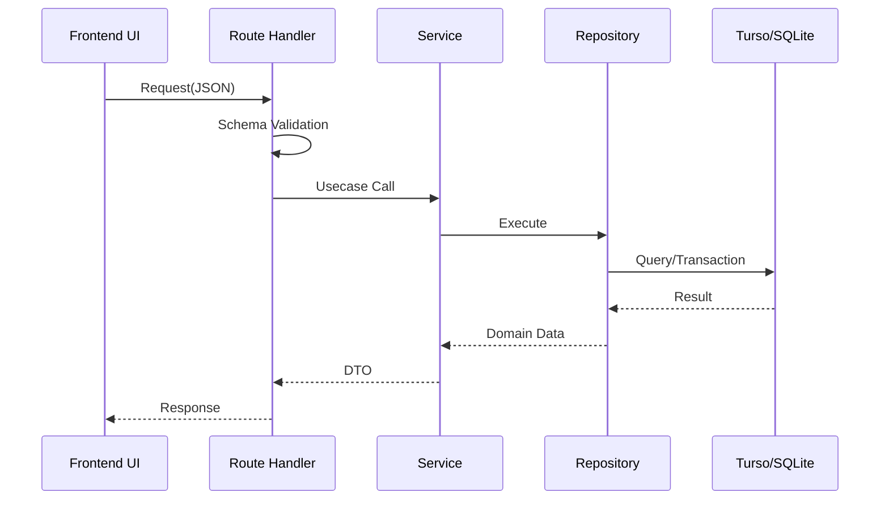

# Brewia API仕様書

## 1. 共通仕様

- Base Path: `/api`
- Content-Type: `application/json`
- 文字コード: UTF-8
- 動的描画設定: 一覧/詳細 API は `dynamic = 'force-dynamic'`

### 1.1 エラー形式

| HTTP Status | Body                               |
| ----------- | ---------------------------------- |
| 400         | `{"error":"Invalid request body"}` |
| 404(Bean)   | `{"error":"Bean not found"}`       |
| 404(Brew)   | `{"error":"Brew not found"}`       |

## 2. API フロー



## 3. エンドポイント仕様

### 3.1 Beans

#### GET `/api/beans`

- 概要: Bean 一覧取得
- Request Body: なし
- Response: `200 OK`（`Bean[]`）

#### POST `/api/beans`

- 概要: Bean 作成
- Request Body:

```json
{
  "name": "Ethiopia Guji",
  "roaster": "Kurasu",
  "country": "Ethiopia",
  "region": "Guji",
  "farm": "Bookkisa",
  "variety": "Heirloom",
  "process": "Washed",
  "roast": "Light",
  "notes": "Floral and citrus"
}
```

- Response:
  - `201 Created` `{"id":"<beanId>"}`
  - `400 Bad Request`

#### GET `/api/beans/:id`

- 概要: Bean 詳細取得
- Response:
  - `200 OK`（`Bean`）
  - `404 Not Found`

#### PUT `/api/beans/:id`

- 概要: Bean 更新（全項目更新）
- Request Body: POST と同一
- Response:
  - `200 OK`（更新後 `Bean`）
  - `400 Bad Request`
  - `404 Not Found`

#### DELETE `/api/beans/:id`

- 概要: Bean 削除（関連 Brew/BrewFlavor を含む）
- Response:
  - `204 No Content`
  - `404 Not Found`

### 3.2 Brews

#### GET `/api/brews`

- 概要: Brew 一覧取得
- Query:
  - `beanId`（任意）
- Response: `200 OK`（`Brew[]`）

#### POST `/api/brews`

- 概要: Brew 作成
- Request Body:

```json
{
  "beanId": "<beanId>",
  "beanWeight": 15,
  "beanGrind": 22,
  "waterWeight": 240,
  "waterTemp": 92,
  "steps": [
    { "time": 0, "water": 40 },
    { "time": 30, "water": 120 },
    { "time": 60, "water": 180 },
    { "time": 90, "water": 240 }
  ],
  "aroma": 4,
  "acidity": 4,
  "sweetness": 3,
  "body": 3,
  "overall": 4,
  "notes": "Juicy and clean",
  "flavorIds": ["<flavorId1>", "<flavorId2>"]
}
```

- Response:
  - `201 Created` `{"id":"<brewId>"}`
  - `400 Bad Request`

#### GET `/api/brews/:id`

- 概要: Brew 詳細取得（Bean + Flavors を含む）
- Response:
  - `200 OK`（`BrewWithBean`）
  - `404 Not Found`

#### PUT `/api/brews/:id`

- 概要: Brew 更新（全項目更新）
- Request Body: POST と同一
- Response:
  - `200 OK`（更新後 `BrewWithBean`）
  - `400 Bad Request`
  - `404 Not Found`

#### DELETE `/api/brews/:id`

- 概要: Brew 削除（関連 BrewFlavor を含む）
- Response:
  - `204 No Content`
  - `404 Not Found`

### 3.3 Flavors

#### GET `/api/flavors`

- 概要: Flavor 一覧取得
- Response: `200 OK`（`Flavor[]`）

## 4. バリデーション仕様

### 4.1 Bean

| 項目    | 条件                         |
| ------- | ---------------------------- |
| name    | string, trim 後 min length 1 |
| roaster | string, trim 後 min length 1 |
| country | 定義済み enum                |
| roast   | 定義済み enum                |

### 4.2 Brew

| 項目                                 | 条件                                       |
| ------------------------------------ | ------------------------------------------ |
| beanId                               | string, trim 後 min length 1               |
| beanWeight                           | number, positive                           |
| beanGrind                            | number, positive または空文字（null 変換） |
| waterWeight                          | number, positive                           |
| waterTemp                            | 0〜100 または空文字（null 変換）           |
| steps                                | `{time:number>=0, water:number>=0}` の配列 |
| aroma/acidity/sweetness/body/overall | int, 1〜5                                  |
| flavorIds                            | string[]（重複は内部で除去）               |

## 5. テスト観点

- `POST /api/beans` 必須欠落で 400 を返すこと。
- `GET /api/beans/:id` 不存在 ID で 404 を返すこと。
- `POST /api/brews` 評価値 6 で 400 を返すこと。
- `GET /api/brews?beanId=<id>` が指定 Bean のみ返すこと。
- `DELETE /api/beans/:id` 後に関連 Brew が取得不能（404）となること。
