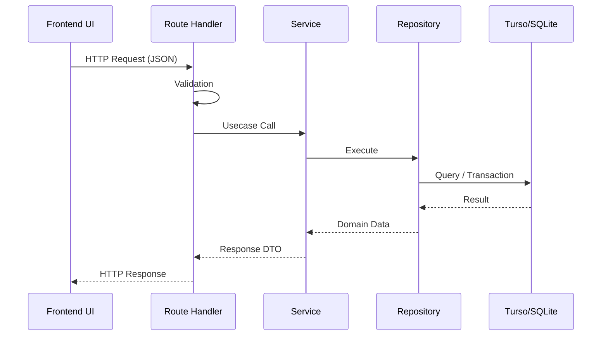

# Brewia API仕様書

## 共通仕様

| 項目           | 内容                                                                                             |
| -------------- | ------------------------------------------------------------------------------------------------ |
| Base Path      | `/api`                                                                                           |
| Content-Type   | `application/json`                                                                               |
| 主なエラー形式 | `{"error":"Invalid request body"}` / `{"error":"Bean not found"}` / `{"error":"Brew not found"}` |

## APIフロー

## エンドポイント仕様

### 豆管理API

| メソッド | パス             | 概要                     | 正常系 |
| -------- | ---------------- | ------------------------ | ------ |
| GET      | `/api/beans`     | 豆一覧取得               | 200    |
| POST     | `/api/beans`     | 豆作成                   | 201    |
| GET      | `/api/beans/:id` | 豆詳細取得               | 200    |
| PUT      | `/api/beans/:id` | 豆更新（全項目）         | 200    |
| DELETE   | `/api/beans/:id` | 豆削除（関連データ含む） | 204    |

### 抽出管理API

| メソッド | パス             | 概要                                  | 正常系 |
| -------- | ---------------- | ------------------------------------- | ------ |
| GET      | `/api/brews`     | 抽出一覧取得（`beanId` で絞り込み可） | 200    |
| POST     | `/api/brews`     | 抽出作成                              | 201    |
| GET      | `/api/brews/:id` | 抽出詳細取得（Bean/Flavor 含む）      | 200    |
| PUT      | `/api/brews/:id` | 抽出更新（全項目）                    | 200    |
| DELETE   | `/api/brews/:id` | 抽出削除（関連データ含む）            | 204    |

### フレーバー管理API

| メソッド | パス           | 概要               | 正常系 |
| -------- | -------------- | ------------------ | ------ |
| GET      | `/api/flavors` | フレーバー一覧取得 | 200    |

## エラーとバリデーション

- 入力スキーマ不一致時は `400 Bad Request` を返す。
- 対象リソース不存在時は `404 Not Found` を返す。
- `PUT` は部分更新ではなく全項目更新を前提とする。
