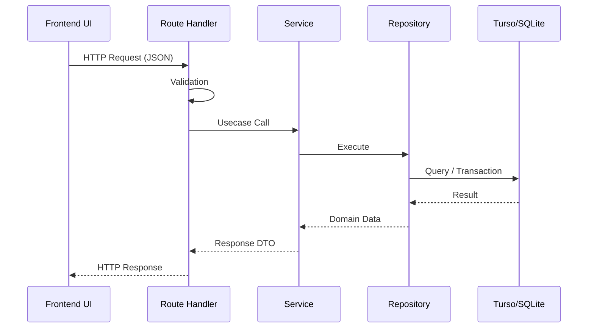

# Brewia API仕様書

## 共通仕様

| 項目           | 内容                                                                                             |
| -------------- | ------------------------------------------------------------------------------------------------ |
| Base Path      | `/api`                                                                                           |
| Content-Type   | `application/json`                                                                               |
| 主なエラー形式 | `{"error":"Invalid request body"}` / `{"error":"Bean not found"}` / `{"error":"Brew not found"}` |

## APIフロー

## エンドポイント仕様

### 豆管理API

#### GET `/api/beans`

- 説明: 豆一覧を取得する。

**レスポンスボディ（200）**

| フィールド | 型       | 説明   |
| ---------- | -------- | ------ |
| `[]`       | `Bean[]` | 豆一覧 |

**異常系**

| ステータス | 条件         | レスポンス                          |
| ---------- | ------------ | ----------------------------------- |
| 500        | 取得処理失敗 | `{"error":"Internal Server Error"}` |

#### POST `/api/beans`

- 説明: 豆を作成する。

**リクエストボディ**

| フィールド | 型     | 必須 | 説明     |
| ---------- | ------ | ---- | -------- |
| `name`     | string | ○    | 豆名     |
| `roaster`  | string | ○    | 焙煎所   |
| `country`  | string | ○    | 生産国   |
| `region`   | string | -    | 生産地域 |
| `farm`     | string | -    | 生産農園 |
| `variety`  | string | -    | 品種     |
| `process`  | string | -    | 生産処理 |
| `roast`    | string | ○    | 焙煎度   |
| `notes`    | string | -    | メモ     |

**レスポンスボディ**

| ステータス | ボディ              |
| ---------- | ------------------- |
| 201        | `{"id":"<beanId>"}` |

**異常系**

| ステータス | 条件                 | レスポンス                           |
| ---------- | -------------------- | ------------------------------------ |
| 400        | バリデーションエラー | `{"error":"Invalid request body"}`   |
| 415        | Content-Type 不正    | `{"error":"Unsupported Media Type"}` |
| 500        | 作成処理失敗         | `{"error":"Internal Server Error"}`  |

#### GET `/api/beans/:id`

- 説明: 豆詳細を取得する。

**レスポンスボディ（200）**

| フィールド | 型          | 説明     |
| ---------- | ----------- | -------- |
| `id`       | string      | 豆ID     |
| `name`     | string      | 豆名     |
| `country`  | string      | 生産国   |
| `region`   | string/null | 生産地域 |
| `farm`     | string/null | 生産農園 |
| `process`  | string/null | 生産処理 |
| `variety`  | string/null | 品種     |
| `roast`    | string      | 焙煎度   |
| `roaster`  | string/null | 焙煎所   |
| `notes`    | string/null | メモ     |
| `created`  | string      | 作成日時 |
| `updated`  | string      | 更新日時 |

**異常系**

| ステータス | 条件         | レスポンス                          |
| ---------- | ------------ | ----------------------------------- |
| 404        | 対象なし     | `{"error":"Bean not found"}`        |
| 500        | 取得処理失敗 | `{"error":"Internal Server Error"}` |

#### PUT `/api/beans/:id`

- 説明: 豆情報を更新する（全項目更新）。
- リクエストボディ: `POST /api/beans` と同一。

**レスポンスボディ（200）**

- 更新後の Bean オブジェクトを返却する。

**異常系**

| ステータス | 条件                 | レスポンス                          |
| ---------- | -------------------- | ----------------------------------- |
| 400        | バリデーションエラー | `{"error":"Invalid request body"}`  |
| 404        | 対象なし             | `{"error":"Bean not found"}`        |
| 500        | 更新処理失敗         | `{"error":"Internal Server Error"}` |

#### DELETE `/api/beans/:id`

- 説明: 豆を削除する（関連 Brew / BrewFlavor を含む）。

**レスポンスボディ**

| ステータス | ボディ |
| ---------- | ------ |
| 204        | なし   |

**異常系**

| ステータス | 条件         | レスポンス                          |
| ---------- | ------------ | ----------------------------------- |
| 404        | 対象なし     | `{"error":"Bean not found"}`        |
| 500        | 削除処理失敗 | `{"error":"Internal Server Error"}` |

### 抽出管理API

#### GET `/api/brews`

- 説明: 抽出一覧を取得する（`beanId` で絞り込み可能）。

**クエリパラメータ**

| パラメータ | 型     | 必須 | 説明                             |
| ---------- | ------ | ---- | -------------------------------- |
| `beanId`   | string | -    | 指定時は対象 Bean の抽出のみ返却 |

**レスポンスボディ（200）**

| フィールド | 型       | 説明     |
| ---------- | -------- | -------- |
| `[]`       | `Brew[]` | 抽出一覧 |

**異常系**

| ステータス | 条件         | レスポンス                          |
| ---------- | ------------ | ----------------------------------- |
| 500        | 取得処理失敗 | `{"error":"Internal Server Error"}` |

#### POST `/api/brews`

- 説明: 抽出を作成する。

**リクエストボディ**

| フィールド    | 型            | 必須 | 説明               |
| ------------- | ------------- | ---- | ------------------ |
| `beanId`      | string        | ○    | 豆ID               |
| `beanWeight`  | number        | ○    | 豆量               |
| `beanGrind`   | number/string | -    | 挽き目（未入力可） |
| `waterWeight` | number        | ○    | 湯量               |
| `waterTemp`   | number/string | -    | 湯温（未入力可）   |
| `steps`       | array         | -    | 抽出ステップ       |
| `aroma`       | number        | ○    | 香り（1〜5）       |
| `acidity`     | number        | ○    | 酸味（1〜5）       |
| `sweetness`   | number        | ○    | 甘味（1〜5）       |
| `body`        | number        | ○    | 質感（1〜5）       |
| `overall`     | number        | ○    | 総合点（1〜5）     |
| `notes`       | string        | -    | メモ               |
| `flavorIds`   | string[]      | -    | フレーバーID一覧   |

**レスポンスボディ**

| ステータス | ボディ              |
| ---------- | ------------------- |
| 201        | `{"id":"<brewId>"}` |

**異常系**

| ステータス | 条件                 | レスポンス                          |
| ---------- | -------------------- | ----------------------------------- |
| 400        | バリデーションエラー | `{"error":"Invalid request body"}`  |
| 404        | 参照 Bean 不存在     | `{"error":"Bean not found"}`        |
| 500        | 作成処理失敗         | `{"error":"Internal Server Error"}` |

#### GET `/api/brews/:id`

- 説明: 抽出詳細を取得する（Bean / Flavor 含む）。

**レスポンスボディ（200）**

- `BrewWithBean` を返却（`bean` と `flavors` を含む）。

**異常系**

| ステータス | 条件         | レスポンス                          |
| ---------- | ------------ | ----------------------------------- |
| 404        | 対象なし     | `{"error":"Brew not found"}`        |
| 500        | 取得処理失敗 | `{"error":"Internal Server Error"}` |

#### PUT `/api/brews/:id`

- 説明: 抽出情報を更新する（全項目更新）。
- リクエストボディ: `POST /api/brews` と同一。

**レスポンスボディ（200）**

- 更新後の Brew オブジェクトを返却する。

**異常系**

| ステータス | 条件                 | レスポンス                          |
| ---------- | -------------------- | ----------------------------------- |
| 400        | バリデーションエラー | `{"error":"Invalid request body"}`  |
| 404        | 対象なし             | `{"error":"Brew not found"}`        |
| 500        | 更新処理失敗         | `{"error":"Internal Server Error"}` |

#### DELETE `/api/brews/:id`

- 説明: 抽出を削除する（関連 BrewFlavor を含む）。

**レスポンスボディ**

| ステータス | ボディ |
| ---------- | ------ |
| 204        | なし   |

**異常系**

| ステータス | 条件         | レスポンス                          |
| ---------- | ------------ | ----------------------------------- |
| 404        | 対象なし     | `{"error":"Brew not found"}`        |
| 500        | 削除処理失敗 | `{"error":"Internal Server Error"}` |

### フレーバー管理API

#### GET `/api/flavors`

- 説明: フレーバー一覧を取得する。

**レスポンスボディ（200）**

| フィールド | 型         | 説明           |
| ---------- | ---------- | -------------- |
| `[]`       | `Flavor[]` | フレーバー一覧 |

**異常系**

| ステータス | 条件         | レスポンス                          |
| ---------- | ------------ | ----------------------------------- |
| 500        | 取得処理失敗 | `{"error":"Internal Server Error"}` |
