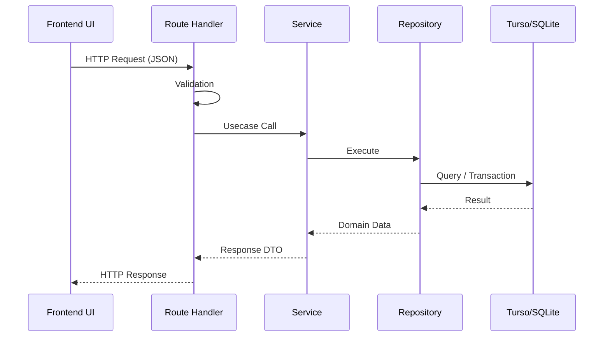

# Brewia API仕様書

## 共通仕様

Brewia の API は Base Path を `/api` とし、`Content-Type: application/json` を前提とする。バリデーションエラーや未検出エラーでは、レスポンスに `{ "error": "..." }` 形式の JSON を返却する。

## APIフロー

## エンドポイント仕様

### GET `/api/beans`

この API は豆一覧を取得する。

#### レスポンス（HTTPステータス別）

| ステータス | レスポンス型    | レスポンス例                           |
| ---------- | --------------- | -------------------------------------- |
| 200        | `Bean[]`        | `[ { "id": "...", "name": "..." } ]`   |
| 500        | `ErrorResponse` | `{ "error": "Internal Server Error" }` |

### POST `/api/beans`

この API は豆を作成する。

#### リクエスト

| 名称     | 変数名  | 型     | 必須 |
| -------- | ------- | ------ | ---- |
| 豆名     | name    | string | ○    |
| 焙煎所   | roaster | string | ○    |
| 生産国   | country | string | ○    |
| 生産地域 | region  | string | -    |
| 生産農園 | farm    | string | -    |
| 品種     | variety | string | -    |
| 生産処理 | process | string | -    |
| 焙煎度   | roast   | string | ○    |
| メモ     | notes   | string | -    |

#### レスポンス（HTTPステータス別）

| ステータス | レスポンス型     | レスポンス例                            |
| ---------- | ---------------- | --------------------------------------- |
| 201        | `CreateResponse` | `{ "id": "<beanId>" }`                  |
| 400        | `ErrorResponse`  | `{ "error": "Invalid request body" }`   |
| 415        | `ErrorResponse`  | `{ "error": "Unsupported Media Type" }` |
| 500        | `ErrorResponse`  | `{ "error": "Internal Server Error" }`  |

### GET `/api/beans/:id`

この API は豆詳細を取得する。

#### レスポンス（HTTPステータス別）

| ステータス | レスポンス型    | レスポンス例                           |
| ---------- | --------------- | -------------------------------------- |
| 200        | `Bean`          | `{ "id": "...", "name": "..." }`       |
| 404        | `ErrorResponse` | `{ "error": "Bean not found" }`        |
| 500        | `ErrorResponse` | `{ "error": "Internal Server Error" }` |

### PUT `/api/beans/:id`

この API は豆情報を全項目更新する。リクエストは `POST /api/beans` と同一である。

#### レスポンス（HTTPステータス別）

| ステータス | レスポンス型    | レスポンス例                           |
| ---------- | --------------- | -------------------------------------- |
| 200        | `Bean`          | `{ "id": "...", "name": "..." }`       |
| 400        | `ErrorResponse` | `{ "error": "Invalid request body" }`  |
| 404        | `ErrorResponse` | `{ "error": "Bean not found" }`        |
| 500        | `ErrorResponse` | `{ "error": "Internal Server Error" }` |

### DELETE `/api/beans/:id`

この API は豆を削除し、関連する Brew と BrewFlavor も削除する。

#### レスポンス（HTTPステータス別）

| ステータス | レスポンス型    | レスポンス例                           |
| ---------- | --------------- | -------------------------------------- |
| 204        | `NoContent`     | ボディなし                             |
| 404        | `ErrorResponse` | `{ "error": "Bean not found" }`        |
| 500        | `ErrorResponse` | `{ "error": "Internal Server Error" }` |

### GET `/api/brews`

この API は抽出一覧を取得する。`beanId` を指定した場合は対象 Bean の抽出のみを返す。

#### クエリパラメータ

| 名称 | 変数名 | 型     | 必須 |
| ---- | ------ | ------ | ---- |
| 豆ID | beanId | string | -    |

#### レスポンス（HTTPステータス別）

| ステータス | レスポンス型    | レスポンス例                           |
| ---------- | --------------- | -------------------------------------- |
| 200        | `Brew[]`        | `[ { "id": "...", "beanId": "..." } ]` |
| 500        | `ErrorResponse` | `{ "error": "Internal Server Error" }` |

### POST `/api/brews`

この API は抽出を作成する。

#### リクエスト

| 名称             | 変数名      | 型            | 必須 |
| ---------------- | ----------- | ------------- | ---- |
| 豆ID             | beanId      | string        | ○    |
| 豆量             | beanWeight  | number        | ○    |
| 挽き目           | beanGrind   | number/string | -    |
| 湯量             | waterWeight | number        | ○    |
| 湯温             | waterTemp   | number/string | -    |
| 抽出ステップ     | steps       | BrewStep[]    | -    |
| 香り             | aroma       | number        | ○    |
| 酸味             | acidity     | number        | ○    |
| 甘味             | sweetness   | number        | ○    |
| 質感             | body        | number        | ○    |
| 総合点           | overall     | number        | ○    |
| メモ             | notes       | string        | -    |
| フレーバーID一覧 | flavorIds   | string[]      | -    |

#### レスポンス（HTTPステータス別）

| ステータス | レスポンス型     | レスポンス例                           |
| ---------- | ---------------- | -------------------------------------- |
| 201        | `CreateResponse` | `{ "id": "<brewId>" }`                 |
| 400        | `ErrorResponse`  | `{ "error": "Invalid request body" }`  |
| 404        | `ErrorResponse`  | `{ "error": "Bean not found" }`        |
| 500        | `ErrorResponse`  | `{ "error": "Internal Server Error" }` |

### GET `/api/brews/:id`

この API は抽出詳細を取得し、`bean` と `flavors` を含む。

#### レスポンス（HTTPステータス別）

| ステータス | レスポンス型    | レスポンス例                                                               |
| ---------- | --------------- | -------------------------------------------------------------------------- |
| 200        | `BrewWithBean`  | `{ "id": "...", "bean": { "id": "..." }, "flavors": [ { "id": "..." } ] }` |
| 404        | `ErrorResponse` | `{ "error": "Brew not found" }`                                            |
| 500        | `ErrorResponse` | `{ "error": "Internal Server Error" }`                                     |

### PUT `/api/brews/:id`

この API は抽出情報を全項目更新する。リクエストは `POST /api/brews` と同一である。

#### レスポンス（HTTPステータス別）

| ステータス | レスポンス型    | レスポンス例                           |
| ---------- | --------------- | -------------------------------------- |
| 200        | `Brew`          | `{ "id": "...", "beanId": "..." }`     |
| 400        | `ErrorResponse` | `{ "error": "Invalid request body" }`  |
| 404        | `ErrorResponse` | `{ "error": "Brew not found" }`        |
| 500        | `ErrorResponse` | `{ "error": "Internal Server Error" }` |

### DELETE `/api/brews/:id`

この API は抽出を削除し、関連する BrewFlavor も削除する。

#### レスポンス（HTTPステータス別）

| ステータス | レスポンス型    | レスポンス例                           |
| ---------- | --------------- | -------------------------------------- |
| 204        | `NoContent`     | ボディなし                             |
| 404        | `ErrorResponse` | `{ "error": "Brew not found" }`        |
| 500        | `ErrorResponse` | `{ "error": "Internal Server Error" }` |

### GET `/api/flavors`

この API はフレーバー一覧を取得する。

#### レスポンス（HTTPステータス別）

| ステータス | レスポンス型    | レスポンス例                           |
| ---------- | --------------- | -------------------------------------- |
| 200        | `Flavor[]`      | `[ { "id": "...", "name": "..." } ]`   |
| 500        | `ErrorResponse` | `{ "error": "Internal Server Error" }` |

## オブジェクト型定義

### ErrorResponse

| 名称       | 変数名 | 型     | 必須 |
| ---------- | ------ | ------ | ---- |
| エラー内容 | error  | string | ○    |

### CreateResponse

| 名称   | 変数名 | 型     | 必須 |
| ------ | ------ | ------ | ---- |
| 作成ID | id     | string | ○    |

### BrewStep

| 名称 | 変数名 | 型     | 必須 |
| ---- | ------ | ------ | ---- |
| 時間 | time   | number | ○    |
| 湯量 | water  | number | ○    |

### Bean

| 名称     | 変数名  | 型          | 必須 |
| -------- | ------- | ----------- | ---- |
| 豆ID     | id      | string      | ○    |
| 豆名     | name    | string      | ○    |
| 生産国   | country | string      | ○    |
| 生産地域 | region  | string/null | -    |
| 生産農園 | farm    | string/null | -    |
| 生産処理 | process | string/null | -    |
| 品種     | variety | string/null | -    |
| 焙煎度   | roast   | string      | ○    |
| 焙煎所   | roaster | string/null | -    |
| メモ     | notes   | string/null | -    |
| 作成日時 | created | string      | ○    |
| 編集日時 | updated | string      | ○    |

### Brew

| 名称         | 変数名      | 型          | 必須 |
| ------------ | ----------- | ----------- | ---- |
| 抽出ID       | id          | string      | ○    |
| 豆ID         | beanId      | string      | ○    |
| 豆量         | beanWeight  | number      | ○    |
| 挽き目       | beanGrind   | number/null | -    |
| 湯量         | waterWeight | number      | ○    |
| 湯温         | waterTemp   | number/null | -    |
| 抽出ステップ | steps       | BrewStep[]  | ○    |
| 香り         | aroma       | number      | ○    |
| 酸味         | acidity     | number      | ○    |
| 甘味         | sweetness   | number      | ○    |
| 質感         | body        | number      | ○    |
| 総合点       | overall     | number      | ○    |
| メモ         | notes       | string/null | -    |
| 作成日時     | created     | string      | ○    |
| 編集日時     | updated     | string      | ○    |

### Flavor

| 名称         | 変数名      | 型     | 必須 |
| ------------ | ----------- | ------ | ---- |
| フレーバーID | id          | string | ○    |
| 名称         | name        | string | ○    |
| カテゴリ     | category    | string | ○    |
| サブカテゴリ | subcategory | string | ○    |
| 作成日時     | created     | string | ○    |
| 編集日時     | updated     | string | ○    |

### BrewWithBean

| 名称           | 変数名  | 型       | 必須 |
| -------------- | ------- | -------- | ---- |
| 抽出情報       | -       | Brew     | ○    |
| 豆情報         | bean    | Bean     | ○    |
| フレーバー一覧 | flavors | Flavor[] | ○    |
