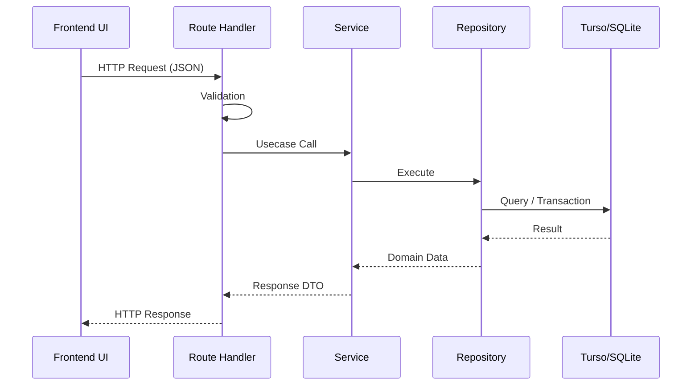

# Brewia API仕様書

## 共通仕様

Brewia の API は Base Path を `/api` とし、`Content-Type: application/json` を前提とする。バリデーションエラーや未検出エラーでは、レスポンスボディに `{ "error": "..." }` 形式の JSON を返却する。

## APIフロー

## エンドポイント仕様

### GET `/api/beans`

この API は豆一覧を取得する。成功時は 200 を返し、レスポンスボディは配列となる。取得失敗時は 500 を返し、レスポンスボディは `{ "error": "Internal Server Error" }` を返す。

### POST `/api/beans`

この API は豆を作成する。成功時は 201 を返し、レスポンスボディは `{ "id": "<beanId>" }` を返す。バリデーションエラー時は 400 と `{ "error": "Invalid request body" }` を返し、`Content-Type` 不正時は 415 と `{ "error": "Unsupported Media Type" }` を返し、作成失敗時は 500 と `{ "error": "Internal Server Error" }` を返す。

#### リクエストボディ

| 名称     | 変数名  | 型     | 必須 |
| -------- | ------- | ------ | ---- |
| 豆名     | name    | string | ○    |
| 焙煎所   | roaster | string | ○    |
| 生産国   | country | string | ○    |
| 生産地域 | region  | string | -    |
| 生産農園 | farm    | string | -    |
| 品種     | variety | string | -    |
| 生産処理 | process | string | -    |
| 焙煎度   | roast   | string | ○    |
| メモ     | notes   | string | -    |

#### レスポンスボディ

| 名称       | 変数名 | 型     | 必須 |
| ---------- | ------ | ------ | ---- |
| 豆ID       | id     | string | ○    |
| エラー内容 | error  | string | -    |

### GET `/api/beans/:id`

この API は豆詳細を取得する。成功時は 200 を返し、未検出時は 404 と `{ "error": "Bean not found" }` を返す。取得失敗時は 500 と `{ "error": "Internal Server Error" }` を返す。

#### レスポンスボディ

| 名称       | 変数名  | 型          | 必須 |
| ---------- | ------- | ----------- | ---- |
| 豆ID       | id      | string      | ○    |
| 豆名       | name    | string      | ○    |
| 生産国     | country | string      | ○    |
| 生産地域   | region  | string/null | -    |
| 生産農園   | farm    | string/null | -    |
| 生産処理   | process | string/null | -    |
| 品種       | variety | string/null | -    |
| 焙煎度     | roast   | string      | ○    |
| 焙煎所     | roaster | string/null | -    |
| メモ       | notes   | string/null | -    |
| 作成日時   | created | string      | ○    |
| 編集日時   | updated | string      | ○    |
| エラー内容 | error   | string      | -    |

### PUT `/api/beans/:id`

この API は豆情報を全項目更新する。リクエストボディは `POST /api/beans` と同一である。成功時は 200 を返し更新後の Bean を返却する。バリデーションエラー時は 400 と `{ "error": "Invalid request body" }`、未検出時は 404 と `{ "error": "Bean not found" }`、更新失敗時は 500 と `{ "error": "Internal Server Error" }` を返す。

#### レスポンスボディ

| 名称       | 変数名  | 型          | 必須 |
| ---------- | ------- | ----------- | ---- |
| 豆ID       | id      | string      | ○    |
| 豆名       | name    | string      | ○    |
| 生産国     | country | string      | ○    |
| 生産地域   | region  | string/null | -    |
| 生産農園   | farm    | string/null | -    |
| 生産処理   | process | string/null | -    |
| 品種       | variety | string/null | -    |
| 焙煎度     | roast   | string      | ○    |
| 焙煎所     | roaster | string/null | -    |
| メモ       | notes   | string/null | -    |
| 作成日時   | created | string      | ○    |
| 編集日時   | updated | string      | ○    |
| エラー内容 | error   | string      | -    |

### DELETE `/api/beans/:id`

この API は豆を削除し、関連する Brew と BrewFlavor も削除する。成功時は 204 を返しボディは空となる。未検出時は 404 と `{ "error": "Bean not found" }` を返し、削除失敗時は 500 と `{ "error": "Internal Server Error" }` を返す。

### GET `/api/brews`

この API は抽出一覧を取得する。`beanId` を指定した場合は対象 Bean の抽出のみを返す。成功時は 200 を返し、取得失敗時は 500 と `{ "error": "Internal Server Error" }` を返す。

#### クエリパラメータ

| 名称 | 変数名 | 型     | 必須 |
| ---- | ------ | ------ | ---- |
| 豆ID | beanId | string | -    |

### POST `/api/brews`

この API は抽出を作成する。成功時は 201 と `{ "id": "<brewId>" }` を返す。バリデーションエラー時は 400 と `{ "error": "Invalid request body" }`、参照 Bean 不存在時は 404 と `{ "error": "Bean not found" }`、作成失敗時は 500 と `{ "error": "Internal Server Error" }` を返す。

#### リクエストボディ

| 名称             | 変数名      | 型            | 必須 |
| ---------------- | ----------- | ------------- | ---- |
| 豆ID             | beanId      | string        | ○    |
| 豆量             | beanWeight  | number        | ○    |
| 挽き目           | beanGrind   | number/string | -    |
| 湯量             | waterWeight | number        | ○    |
| 湯温             | waterTemp   | number/string | -    |
| 抽出ステップ     | steps       | array         | -    |
| 香り             | aroma       | number        | ○    |
| 酸味             | acidity     | number        | ○    |
| 甘味             | sweetness   | number        | ○    |
| 質感             | body        | number        | ○    |
| 総合点           | overall     | number        | ○    |
| メモ             | notes       | string        | -    |
| フレーバーID一覧 | flavorIds   | string[]      | -    |

#### レスポンスボディ

| 名称       | 変数名 | 型     | 必須 |
| ---------- | ------ | ------ | ---- |
| 抽出ID     | id     | string | ○    |
| エラー内容 | error  | string | -    |

### GET `/api/brews/:id`

この API は抽出詳細を取得し、`bean` と `flavors` を含む。成功時は 200 を返す。未検出時は 404 と `{ "error": "Brew not found" }` を返し、取得失敗時は 500 と `{ "error": "Internal Server Error" }` を返す。

#### レスポンスボディ

| 名称           | 変数名      | 型          | 必須 |
| -------------- | ----------- | ----------- | ---- |
| 抽出ID         | id          | string      | ○    |
| 豆ID           | beanId      | string      | ○    |
| 豆量           | beanWeight  | number      | ○    |
| 挽き目         | beanGrind   | number/null | -    |
| 湯量           | waterWeight | number      | ○    |
| 湯温           | waterTemp   | number/null | -    |
| 抽出ステップ   | steps       | array       | ○    |
| 香り           | aroma       | number      | ○    |
| 酸味           | acidity     | number      | ○    |
| 甘味           | sweetness   | number      | ○    |
| 質感           | body        | number      | ○    |
| 総合点         | overall     | number      | ○    |
| メモ           | notes       | string/null | -    |
| 豆情報         | bean        | object      | ○    |
| フレーバー一覧 | flavors     | array       | ○    |
| 作成日時       | created     | string      | ○    |
| 編集日時       | updated     | string      | ○    |
| エラー内容     | error       | string      | -    |

### PUT `/api/brews/:id`

この API は抽出情報を全項目更新する。リクエストボディは `POST /api/brews` と同一である。成功時は 200 を返し更新後の Brew を返却する。バリデーションエラー時は 400 と `{ "error": "Invalid request body" }`、未検出時は 404 と `{ "error": "Brew not found" }`、更新失敗時は 500 と `{ "error": "Internal Server Error" }` を返す。

#### レスポンスボディ

| 名称         | 変数名      | 型          | 必須 |
| ------------ | ----------- | ----------- | ---- |
| 抽出ID       | id          | string      | ○    |
| 豆ID         | beanId      | string      | ○    |
| 豆量         | beanWeight  | number      | ○    |
| 挽き目       | beanGrind   | number/null | -    |
| 湯量         | waterWeight | number      | ○    |
| 湯温         | waterTemp   | number/null | -    |
| 抽出ステップ | steps       | array       | ○    |
| 香り         | aroma       | number      | ○    |
| 酸味         | acidity     | number      | ○    |
| 甘味         | sweetness   | number      | ○    |
| 質感         | body        | number      | ○    |
| 総合点       | overall     | number      | ○    |
| メモ         | notes       | string/null | -    |
| 作成日時     | created     | string      | ○    |
| 編集日時     | updated     | string      | ○    |
| エラー内容   | error       | string      | -    |

### DELETE `/api/brews/:id`

この API は抽出を削除し、関連する BrewFlavor も削除する。成功時は 204 を返しボディは空となる。未検出時は 404 と `{ "error": "Brew not found" }` を返し、削除失敗時は 500 と `{ "error": "Internal Server Error" }` を返す。

### GET `/api/flavors`

この API はフレーバー一覧を取得する。成功時は 200 を返し、取得失敗時は 500 と `{ "error": "Internal Server Error" }` を返す。

#### レスポンスボディ

| 名称         | 変数名      | 型     | 必須 |
| ------------ | ----------- | ------ | ---- |
| フレーバーID | id          | string | ○    |
| 名称         | name        | string | ○    |
| カテゴリ     | category    | string | ○    |
| サブカテゴリ | subcategory | string | ○    |
| 作成日時     | created     | string | ○    |
| 編集日時     | updated     | string | ○    |
| エラー内容   | error       | string | -    |
