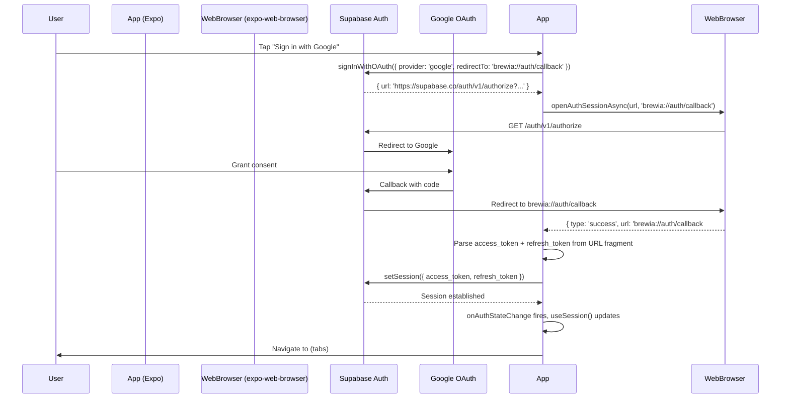

# Auth Architecture

Brewia uses Supabase Auth with Google OAuth, connected to the Expo app via deep linking.

> Note: The previous Auth.js + email magic link stack has been removed. Migration of existing Auth.js sessions is out of scope.

## Flow Overview



## Session Management (`useSession`)

`src/lib/auth.ts` exports `useSession()` which returns `{ session, loading }`:

- `loading = true` initially until `supabase.auth.getSession()` resolves
- `session` is `null` when unauthenticated, a `Session` object when logged in
- `onAuthStateChange` subscription keeps `session` up to date

```ts
export function useSession(): SessionState {
  const [session, setSession] = useState<Session | null>(null)
  const [loading, setLoading] = useState(true)
  // ...getSession() + onAuthStateChange
}
```

## Route Guard (`app/_layout.tsx`)

The root layout is the single enforcement point for authentication:

```ts
const { session, loading } = useSession()

if (loading) return <View style={{ flex: 1 }} />   // splash while resolving
if (!session) return <Redirect href="/(auth)/login" />
return <Stack />  // authenticated: show (tabs)
```

This prevents redirect loops by only redirecting when `loading === false`.

## Session Persistence

The Supabase client is configured with `AsyncStorage` for persistence:

```ts
createClient(url, key, {
  auth: {
    storage: AsyncStorage,
    autoRefreshToken: true,
    persistSession: true,
    detectSessionInUrl: false,
  },
})
```

On subsequent app opens, `getSession()` returns the stored session and the user is taken directly to the tabs without needing to re-authenticate.

## Server-Side Security (RLS)

Row Level Security on the database provides a second layer of enforcement beyond the client-side session check:

- All user-owned tables (`bean`, `brew`, `brew_flavor`, `preset`) have `WHERE user_id = auth.uid()` in their SELECT/INSERT/UPDATE/DELETE policies
- `flavor` is a read-only master table with `USING (true)` for SELECT and no write policies
- The `auth.uid()` function returns the UUID from the verified JWT — even if the client attempted to forge a `user_id`, the DB would reject the row

RLS policies are defined in `drizzle/0000_init.sql`.

## Test Mode: E2E Session Bypass

For local development and automated browser testing, Brewia supports a session bypass that skips Supabase OAuth entirely.

### Activation

Set `EXPO_PUBLIC_E2E_USER_ID` to any UUID before starting the Expo dev server:

```shell
EXPO_PUBLIC_E2E_USER_ID=00000000-0000-0000-0000-000000000001 pnpm exec expo start --web
```

### Behavior

`isE2EBypass()` in `src/lib/env.ts` returns `true` when **both** conditions are met:

1. `EXPO_PUBLIC_E2E_USER_ID` is a non-empty string.
2. `process.env.NODE_ENV !== 'production'`.

When `isE2EBypass()` is `true`, `useSession()` in `src/lib/auth.ts`:
- Does **not** call `supabase.auth.getSession()`.
- Does **not** subscribe to `onAuthStateChange`.
- Immediately sets a synthetic `Session` with `user.id = EXPO_PUBLIC_E2E_USER_ID`.
- Returns `{ session: syntheticSession, loading: false }` on the first render.

The root layout (`app/_layout.tsx`) sees `session !== null`, so it renders `<Stack />` directly without redirecting to `/(auth)/login`.

### Security Guarantees

- The bypass is a compile-time + runtime dead path in production. `NODE_ENV === 'production'` causes `isE2EBypass()` to return `false` unconditionally.
- `EXPO_PUBLIC_E2E_USER_ID` should **never** be set in `eas build` secrets or production `.env`.
- The synthetic session has `access_token: 'e2e'` which Supabase will reject on any authenticated API call. The bypass only affects the client-side session guard.
- Row Level Security on the database still enforces real `auth.uid()` checks. Supabase API calls made with the synthetic token will fail with `401 Unauthorized`.

### Usage in verify-web.mjs

The `scripts/verify-web.mjs` smoke test automatically sets `EXPO_PUBLIC_E2E_USER_ID=00000000-0000-0000-0000-000000000001` when spawning Metro:

```shell
pnpm verify:web
```

This allows the browser to navigate through the authenticated tab layout without any Google OAuth interaction.

## Supabase Dashboard Setup Checklist

1. Enable Google OAuth provider under Authentication > Providers
2. Add `brewia://auth/callback` to Authorized Redirect URLs
3. In Google Cloud Console, add `https://<project>.supabase.co/auth/v1/callback` to OAuth client authorized redirect URIs
