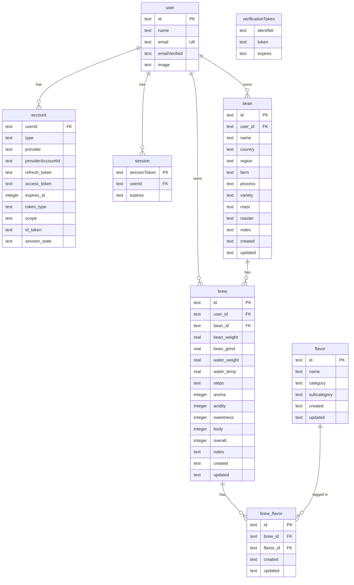

# Auth Architecture — Issue #82

ユーザー認証とユーザーごとのデータ管理の実装設計ドキュメント。

---

## 1. Goal と Non-goal

### Goals

- Auth.js (NextAuth v5 beta) + Google OAuth によるログイン/ログアウト
- ユーザーセッションを Turso（libSQL/SQLite）に永続化
- `bean` / `brew` をユーザー単位にスコープし、他ユーザーのデータに一切アクセスできないよう保護
- 既存データの喪失なし（最初のログインユーザーが既存データを引き取る backfill）
- `/login` と `/api/auth/*` 以外の全ルートでログイン必須

### Non-goals（後続課題）

- ユーザー間のデータシェア機能
- チーム/組織単位のテナンシー
- ロール（admin 等）
- プロフィール編集画面（最小表示のみ将来スコープ）
- パスワード認証
- 複数アカウントの統合/マージ

---

## 2. 合意済みの方針（再掲）

1. **認証プロバイダ**: Auth.js (NextAuth v5 beta / `next-auth@5`) + Drizzle Adapter (`@auth/drizzle-adapter`)。user/account/session/verificationToken テーブルを Turso に相乗り。
2. **ログイン手段**: Google OAuth のみ（Email Magic Link / Resend は Issue #107 で廃止済み）。
3. **既存データ移行**: 最初にログインしたユーザーが既存の全 bean/brew/brew_flavor を引き取る backfill SQL。データ喪失は避ける。
4. **`flavor` は共有マスタ**: `user_id` を付けない。全ユーザーで共有。
5. **未認証ゲート**: `/login` と `/api/auth/*` 以外はすべてログイン必須。未認証は `/login` にリダイレクト。

---

## 3. 最終的な DB スキーマ

### 3.1 Mermaid ERD



### 3.2 `brew_flavor` に `user_id` を付けない根拠

`brew_flavor` は `brew_id` を外部キーとして持ち、`brew` には `user_id` がある。
アクセス制御は常に「brew が当該ユーザーのものか」で決まるため、`brew_flavor` に独立した `user_id` を持たせることは冗長であり、整合性上のリスク（brew と brew_flavor の user_id が不一致になるバグ）を生む。
クエリ上も `brew_flavor JOIN brew WHERE brew.user_id = ?` で完結する。

### 3.3 Drizzle スキーマ擬似コード（`lib/db/schema.ts` 追記分）

```typescript
// --- Auth.js テーブル群（@auth/drizzle-adapter sqlite 最新仕様準拠）---

export const usersTable = sqliteTable('user', {
  id: text('id').notNull().primaryKey(),
  name: text('name'),
  email: text('email').notNull().unique(),
  emailVerified: integer('emailVerified', { mode: 'timestamp_ms' }),
  image: text('image'),
})

export const accountsTable = sqliteTable(
  'account',
  {
    userId: text('userId')
      .notNull()
      .references(() => usersTable.id, { onDelete: 'cascade' }),
    type: text('type').notNull(),
    provider: text('provider').notNull(),
    providerAccountId: text('providerAccountId').notNull(),
    refresh_token: text('refresh_token'),
    access_token: text('access_token'),
    expires_at: integer('expires_at'),
    token_type: text('token_type'),
    scope: text('scope'),
    id_token: text('id_token'),
    session_state: text('session_state'),
  },
  (t) => ({ pk: primaryKey({ columns: [t.provider, t.providerAccountId] }) })
)

export const sessionsTable = sqliteTable('session', {
  sessionToken: text('sessionToken').notNull().primaryKey(),
  userId: text('userId')
    .notNull()
    .references(() => usersTable.id, { onDelete: 'cascade' }),
  expires: integer('expires', { mode: 'timestamp_ms' }).notNull(),
})

export const verificationTokensTable = sqliteTable(
  'verificationToken',
  {
    identifier: text('identifier').notNull(),
    token: text('token').notNull(),
    expires: integer('expires', { mode: 'timestamp_ms' }).notNull(),
  },
  (t) => ({ pk: primaryKey({ columns: [t.identifier, t.token] }) })
)

// --- 既存テーブルへの user_id 追加（Step 1: nullable）---

export const beansTable = sqliteTable('bean', {
  id: text('id').primaryKey().$defaultFn(() => uuidv7()),
  userId: text('user_id').references(() => usersTable.id),  // nullable → Step 6 で notNull() 化
  // ...existing columns
})

export const brewsTable = sqliteTable('brew', {
  id: text('id').primaryKey().$defaultFn(() => uuidv7()),
  userId: text('user_id').references(() => usersTable.id),  // nullable → Step 6 で notNull() 化
  // ...existing columns
})
```

---

## 4. レイヤ責務とテナント境界の強制方法

### 4.1 責務マップ

```
middleware.ts
  └─ 未認証リクエストを /login にリダイレクト（ページナビ + API 両方）

Route Handler (app/api/**/route.ts)
  └─ requireUser() でセッションを取得し userId を Service に渡す
  └─ 認証エラー → 401

Service (app/**/service.ts)
  └─ userId を受け取り、Repository に渡す
  └─ ビジネスロジック。userId を自分で生成・推測しない

Repository (app/**/repository.ts)
  └─ userId を必須引数にする（型で強制）
  └─ 全クエリに WHERE user_id = userId を適用
  └─ 他人の行が返ることを構造的に不可能にする
```

### 4.2 `requireUser()` ヘルパ

**配置**: `lib/auth/require-user.ts`

```typescript
// 概念コード
import { auth } from '@/lib/auth/config'
import { redirect } from 'next/navigation'

export interface AuthenticatedUser {
  id: string
  email: string
  name: string | null
}

// Server Component / Server Action 用（redirect を内包）
export async function requireUser(): Promise<AuthenticatedUser> {
  const session = await auth()
  if (!session?.user?.id) {
    redirect('/login')
  }
  return {
    id: session.user.id,
    email: session.user.email!,
    name: session.user.name ?? null,
  }
}

// Route Handler 用（redirect ではなく null を返す）
export async function getAuthenticatedUser(): Promise<AuthenticatedUser | null> {
  const session = await auth()
  if (!session?.user?.id) {
    return null
  }
  return {
    id: session.user.id,
    email: session.user.email!,
    name: session.user.name ?? null,
  }
}
```

- `requireUser()` は Server Component / Server Action で使う。未認証時は `redirect('/login')` を発行。
- `getAuthenticatedUser()` は Route Handler で使う。未認証時は `null` を返し、呼び出し元が `401` を返す。
- middleware がほとんどのリクエストを事前にブロックするため、二重チェックではあるが、深層防護として両方を維持する。

### 4.3 Repository 層の型強制

**方針**: Repository のすべての public メソッドが `userId: string` を必須引数として受け取る。

```typescript
// BeansRepository の変更後シグネチャ例
export class BeansRepository {
  async findAll(userId: string): Promise<Bean[]>
  async findById(userId: string, id: string): Promise<Bean | undefined>
  async create(userId: string, input: BeanMutationInput): Promise<Bean>
  async update(userId: string, id: string, input: BeanMutationInput): Promise<Bean | undefined>
  async delete(userId: string, id: string): Promise<boolean>
}
```

TypeScript の型システムによって `userId` の渡し忘れはコンパイルエラーになる。
Drizzle クエリの内部では常に `.where(and(eq(beansTable.userId, userId), eq(beansTable.id, id)))` を使う。

### 4.4 Service 層のシグネチャ方針

Service メソッドも同様に `userId: string` を必須引数として受け取る（ファクトリパターンは採用しない）。

**採用理由**:
- 現行コードは `new BeansService()` を module スコープでインスタンス化するシングルトン（`export const beansService = new BeansService()`）。このパターンを維持できる。
- ファクトリ（`BeansRepository.forUser(userId)`）は DI が増えた場合に有効だが、現状の規模では過剰。
- userId をメソッド引数として流すほうが、呼び出しスタック上でいつでも可視化でき、テストでモックしやすい。

```typescript
// BeansService の変更後シグネチャ例
export class BeansService {
  async getBeans(userId: string): Promise<Bean[]>
  async getBeanById(userId: string, id: string): Promise<Bean | undefined>
  async createBean(userId: string, dto: UpsertBeanDto): Promise<Bean>
  async updateBean(userId: string, id: string, dto: UpsertBeanDto): Promise<Bean | undefined>
  async deleteBean(userId: string, id: string): Promise<boolean>
}
```

---

## 5. 認可ポリシーマトリクス

| レイヤ | 対象 | 正常系 | 未認証 | 他人のリソース |
|---|---|---|---|---|
| middleware | 全ルート（`/login`, `/api/auth/*` 除く） | 通過 | `/login` リダイレクト | — |
| Route Handler | `GET /api/beans` | 200 + 自分のデータのみ | 401 | — |
| Route Handler | `GET /api/beans/[id]` | 200 | 401 | 404（存在しないと同じ） |
| Route Handler | `POST /api/beans` | 201 | 401 | — |
| Route Handler | `PUT /api/beans/[id]` | 200 | 401 | 404 |
| Route Handler | `DELETE /api/beans/[id]` | 204 | 401 | 404 |
| Route Handler | `GET /api/brews` | 200 + 自分のデータのみ | 401 | — |
| Route Handler | `POST/PUT/DELETE /api/brews/[id]` | 200/204 | 401 | 404 |
| Route Handler | `POST /api/beans/extract` | 200 | 401 | — |
| Route Handler | `GET /api/flavors` | 200（全ユーザー共通） | 401 | — |
| Server Component | `app/page.tsx` など全ページ | 表示 | `/login` リダイレクト | — |
| Repository | 全メソッド | `WHERE user_id = ?` で絞り込み | 呼ばれない | クエリが 0 件を返す |

**404 を返す根拠**: 403 はリソースの存在を漏らす。404 はセキュリティ上より安全であり、「そのリソースが自分には見えない」という意味で一貫している。

### `/api/beans/extract` の認証要否

認証必須。LLM API コールはコスト発生を伴うため、未認証からのアクセスを許可しない。middleware がブロックするが、Route Handler でも `getAuthenticatedUser()` チェックを追加する。

### PWA オフライン時の挙動

- **ログイン済み → オフライン**: Service Worker の Network First 戦略により、ナビゲーションは `/offline` にフォールバック。API リクエストはキャッシュなし（`/api/` はスルー）なのでエラーになる。ユーザーはオフラインページを見る。セッション情報はブラウザの Cookie に残るため、オンラインに戻れば即座に復帰できる。
- **未ログイン → アプリアクセス**: middleware がリダイレクトする前にオフラインになった場合、`/offline` ページが表示される。ログインページ自体はプリキャッシュ対象外なのでオフラインでは表示できない。これは許容範囲内（ログインにはネットワークが必須）。
- **ログアウト時のキャッシュ**: `/api/` はキャッシュされないため、ログアウト後にキャッシュからデータが漏れるリスクはない。`/_next/static/` の静的アセットはユーザー固有の内容を含まないため問題なし。

---

## 6. ファイル構成の差分

### 新規追加ファイル

```
lib/
  auth/
    config.ts          # NextAuth({ providers, adapter, callbacks, ... }) の設定
    require-user.ts    # requireUser() / getAuthenticatedUser() ヘルパ
    index.ts           # config.ts から { auth, handlers, signIn, signOut } を re-export

app/
  api/
    auth/
      [...nextauth]/
        route.ts       # GET/POST を handlers にバインド

  login/
    page.tsx           # ログインページ（サインインボタン, プロバイダ選択 UI）

middleware.ts          # App Router の Edge middleware
```

### 変更ファイル

```
lib/db/schema.ts
  + usersTable, accountsTable, sessionsTable, verificationTokensTable
  + beansTable.userId (nullable text, FK→user.id)
  + brewsTable.userId (nullable text, FK→user.id)

app/beans/repository.ts
  - findAll()                        + findAll(userId: string)
  - findById(id)                     + findById(userId, id)
  - create(input)                    + create(userId, input)
  - update(id, input)                + update(userId, id, input)
  - delete(id)                       + delete(userId, id)
  全クエリに AND bean.user_id = userId 追加

app/brews/repository.ts
  - findAll()                        + findAll(userId: string)
  - findCountByBeanIdMap()           + findCountByBeanIdMap(userId)
  - findByBeanId(beanId)             + findByBeanId(userId, beanId)
  - findById(id)                     + findById(userId, id)
  - create(input)                    + create(userId, input)（userId を INSERT に含める）
  - update(id, input)                + update(userId, id, input)
  - delete(id)                       + delete(userId, id)
  全クエリに AND brew.user_id = userId 追加

app/beans/service.ts
  全メソッドに userId: string 引数追加

app/brews/service.ts
  全メソッドに userId: string 引数追加

app/api/beans/route.ts
app/api/beans/[id]/route.ts
app/api/brews/route.ts
app/api/brews/[id]/route.ts
app/api/beans/extract/route.ts
app/api/flavors/route.ts
  全 handler に getAuthenticatedUser() 追加 → 401 or userId を service に渡す

app/page.tsx
app/beans/[id]/page.tsx
app/beans/[id]/edit/page.tsx
app/brews/[id]/page.tsx
app/brews/[id]/edit/page.tsx
app/new/page.tsx
  requireUser() を追加し userId を service に渡す

app/layout.tsx
  セッションプロバイダ不要（Auth.js v5 は RSC ネイティブ）

.env.example
  AUTH_SECRET, AUTH_GOOGLE_ID, AUTH_GOOGLE_SECRET 追加（AUTH_RESEND_KEY / EMAIL_FROM は Issue #107 で削除済み）

drizzle/
  0001_add_auth_tables.sql        # Auth.js 4テーブル追加
  0002_add_user_id_nullable.sql   # bean/brew に user_id nullable 追加
  0003_backfill_user_id.sql       # backfill (MANUAL / アプリ初回サインイン時に実行)
  (0004_user_id_not_null.sql)     # 将来: NOT NULL 化（スライス 6）
```

### `middleware.ts` の設計

```typescript
// 配置: /Users/yuji/Documents/GitHub/brewia-issue-82/middleware.ts
import { auth } from '@/lib/auth'
import type { NextRequest } from 'next/server'

export default auth((req: NextRequest & { auth: unknown }) => {
  const isLoggedIn = !!req.auth
  const isAuthRoute = req.nextUrl.pathname.startsWith('/api/auth')
  const isLoginPage = req.nextUrl.pathname === '/login'
  const isOfflinePage = req.nextUrl.pathname === '/offline'

  if (isAuthRoute || isLoginPage || isOfflinePage) {
    return // 通過
  }

  if (!isLoggedIn) {
    const loginUrl = new URL('/login', req.url)
    return Response.redirect(loginUrl)
  }
})

export const config = {
  matcher: ['/((?!_next/static|_next/image|icon|manifest|sw\\.js|favicon).*)'],
}
```

**matcher の設計意図**:
- `_next/static`, `_next/image`: Next.js 内部アセット。middleware を通す必要なし。
- `icon`, `manifest`, `sw.js`, `favicon`: PWA・ブラウザ向け静的ファイル。ログイン不要。
- それ以外（ページ・API 含む）はすべて middleware を通す。

### `app/login/page.tsx` の責務

- Server Component。`requireUser()` は呼ばない（ログインページ自体は公開）。
- セッションがある場合は `/` にリダイレクト（`auth()` を呼んで確認）。
- Google ログインボタンのみを表示（Email Magic Link フォームは Issue #107 で廃止済み）。
- `signIn('google')` を Server Action から呼び出す。

---

## 7. マイグレーション戦略

Drizzle migration は `drizzle/` ディレクトリに連番 SQL ファイルとして出力される。以下の段階で実施する。

### マイグレーション 0001 — Auth.js テーブル追加

**ファイル**: `drizzle/0001_add_auth_tables.sql`（`pnpm db:generate` で生成）

内容:
- `user` テーブル作成
- `account` テーブル作成（FK: user.id CASCADE DELETE）
- `session` テーブル作成（FK: user.id CASCADE DELETE）
- `verificationToken` テーブル作成

実施タイミング: スライス 1 完了時点で本番 DB に適用。
ロールバック: これらのテーブルを DROP する逆 SQL（データなし期間なので安全）。

### マイグレーション 0002 — bean/brew に user_id 列追加（nullable）

**ファイル**: `drizzle/0002_add_user_id_nullable.sql`

```sql
ALTER TABLE bean ADD COLUMN user_id TEXT REFERENCES user(id);
ALTER TABLE brew ADD COLUMN user_id TEXT REFERENCES user(id);
```

実施タイミング: スライス 2 完了時点で本番 DB に適用。
注意: この時点では既存行の `user_id` は NULL。アプリはまだ全データを返す（スライス 3 で境界を引く前）。

### マイグレーション 0003 — backfill（最初のユーザーへの全データ割り当て）

**ファイル**: `drizzle/0003_backfill_user_id.sql`（手動実行 SQL）

```sql
-- 最初にサインインしたユーザーのIDをここに差し替えて実行すること
-- 運用手順: 本番で1人目がサインインした直後に管理者が手動で発行する

UPDATE bean SET user_id = '<FIRST_USER_ID>' WHERE user_id IS NULL;
UPDATE brew SET user_id = '<FIRST_USER_ID>' WHERE user_id IS NULL;
```

**代替案（アプリ内自動 backfill）**: 初回サインイン時の Auth.js `signIn` callback で、`user_id IS NULL` な行を検出して自動的にそのユーザーに割り当てるロジックをアプリコードとして実装する。この場合、本 SQL は実行不要になる。

推奨: アプリ内自動 backfill。理由は手動実行ミスのリスク排除と、デプロイフローへの組み込みやすさ。具体的には Auth.js の `signIn` callback 内で `db.update(beansTable).set({ userId: user.id }).where(isNull(beansTable.userId))` を実行する。

実施タイミング: スライス 2 または 3 で対応。本番への最初のユーザーログイン前に準備を完了させる。

### マイグレーション 0004 — NOT NULL 化（将来）

**ファイル**: `drizzle/0004_user_id_not_null.sql`（スライス 6）

SQLite は `ALTER COLUMN` をサポートしないため、テーブル再作成が必要。

手順:
1. `bean_new` / `brew_new` テーブルを `user_id NOT NULL` 制約付きで作成
2. `INSERT INTO bean_new SELECT * FROM bean` を実行（NULL 行が残っていたらエラーになる = 安全チェック）
3. `DROP TABLE bean` → `ALTER TABLE bean_new RENAME TO bean`
4. インデックス・FK を再作成

実施タイミング: backfill が完了し、全行に user_id が設定されたことを確認してから。

---

## 8. フェーズ分割（TDD スライス案）

### スライス 1: Auth.js 基盤

**目的**: Google OAuth でのログイン/ログアウトが動作する。セッションが Turso に保存される。（Email Magic Link / Resend は Issue #107 で廃止済み）

**対象ファイル**:
- `package.json` に `next-auth@5`, `@auth/drizzle-adapter` 追加
- `lib/db/schema.ts` に Auth.js 4テーブル追加
- `lib/auth/config.ts`, `lib/auth/require-user.ts`, `lib/auth/index.ts`
- `app/api/auth/[...nextauth]/route.ts`
- `app/login/page.tsx`
- `middleware.ts`
- `drizzle/0001_add_auth_tables.sql` 生成・適用

**受け入れ条件**:
- `/` にアクセス → 未ログインなら `/login` にリダイレクト
- Google ログイン → `/` に戻る
- ログアウト → `/login` に戻る
- Turso DB に session/user/account 行が作成される
- `/offline`, `/login`, `/api/auth/*` は未認証でアクセス可能

**テスト**:
- `middleware.ts` の matcher ロジックのユニットテスト（モック session）
- `requireUser()` の redirect 挙動テスト

---

### スライス 2: DB スキーマへの user_id 追加 + backfill

**目的**: `bean` / `brew` テーブルに `user_id` 列（nullable）を追加。初回サインイン時の自動 backfill ロジックを実装。

**対象ファイル**:
- `lib/db/schema.ts` の `beansTable` / `brewsTable` に `userId` 追加
- `lib/auth/config.ts` の `signIn` callback に backfill ロジック追加
- `drizzle/0002_add_user_id_nullable.sql` 生成・適用

**受け入れ条件**:
- マイグレーション適用後、既存の bean/brew 行に `user_id = NULL` が入っている
- 1人目のユーザーがサインインすると、`user_id IS NULL` の全 bean/brew がそのユーザーに割り当てられる
- 2人目以降はすでに NULL 行がないため backfill は何もしない（冪等）

**テスト**:
- backfill ロジックの単体テスト（DB モック、1行/0行/複数行のケース）
- 2回 backfill を実行しても影響がないことの確認

---

### スライス 3: Repository 層の user スコープ化

**目的**: `BeansRepository` / `BrewsRepository` のすべてのメソッドが `userId: string` を受け取り、クエリに `WHERE user_id = userId` を適用する。

**対象ファイル**:
- `app/beans/repository.ts` — 全メソッドシグネチャ変更
- `app/brews/repository.ts` — 全メソッドシグネチャ変更

**受け入れ条件**:
- TypeScript コンパイルが通る（userId 引数が必須のため呼び出し元がコンパイルエラーになる → 後続スライスで修正）
- Repository の各メソッドのユニットテストで、正しい userId フィルタが掛かることを確認
- 別ユーザーの bean_id を findById に渡すと undefined が返ること

**テスト**:
- `findById` に正しい userId + 存在する id → Bean を返す
- `findById` に誤った userId + 存在する id → undefined を返す
- `findAll` に userId を渡すと自分のデータのみ返る
- `create` に userId を渡すと DB 行に user_id が設定される

---

### スライス 4: Service / Route Handler / Server Component への波及

**目的**: 全 Service メソッドに `userId` 引数追加。Route Handler で `getAuthenticatedUser()` を呼び `401` または Service 呼び出し。Server Component で `requireUser()` を呼び Service に userId を渡す。

**対象ファイル**:
- `app/beans/service.ts`, `app/brews/service.ts`
- `app/api/beans/route.ts`, `app/api/beans/[id]/route.ts`
- `app/api/brews/route.ts`, `app/api/brews/[id]/route.ts`
- `app/api/beans/extract/route.ts`
- `app/api/flavors/route.ts`
- `app/page.tsx`, `app/beans/[id]/page.tsx`, `app/beans/[id]/edit/page.tsx`
- `app/brews/[id]/page.tsx`, `app/brews/[id]/edit/page.tsx`
- `app/new/page.tsx`

**受け入れ条件**:
- ログイン済みユーザーが `/api/beans` を叩くと自分の bean のみ返る
- 未認証リクエストに `401` が返る
- ホームページにアクセスすると自分のデータのみ表示される
- TypeScript コンパイルが通る

**テスト**:
- Route Handler のテスト（既存の `route.test.ts` パターンに倣い、`getAuthenticatedUser` をモック）
  - 認証あり → Service 呼び出し
  - 認証なし → 401
- `flavors` は認証必須だが userId フィルタは不要（全件返す）

---

### スライス 5: 他人リソース 404 化の整合性確認

**目的**: 他人の bean_id / brew_id を直接叩いた場合に必ず 404 が返ることを end-to-end で確認。スライス 3-4 の実装が正しく機能しているかの整合性テスト。

**対象ファイル**:
- `app/api/beans/[id]/route.ts` のテスト追加
- `app/api/brews/[id]/route.ts` のテスト追加

**受け入れ条件**:
- `GET /api/beans/:id` で他人の id → 404
- `PUT /api/beans/:id` で他人の id → 404
- `DELETE /api/beans/:id` で他人の id → 404（cascade 削除されない）
- 同様に `/api/brews/:id` でも 404

**テスト**:
- ユーザー A の bean_id でユーザー B としてリクエスト → 404
- findById が undefined を返すと Route が 404 を返すパス

---

### スライス 6: user_id NOT NULL 化

**目的**: 全行に user_id が設定されたことを確認後、NOT NULL 制約を適用。

**対象ファイル**:
- `lib/db/schema.ts` の `userId` を `.notNull()` に変更
- `drizzle/0004_user_id_not_null.sql` — SQLite のテーブル再作成 SQL
- `app/beans/repository.ts`, `app/brews/repository.ts` の型反映

**受け入れ条件**:
- マイグレーション適用後、`bean.user_id IS NULL` のクエリが 0 行を返す
- TypeScript 上で `userId` が `string | null` ではなく `string` として扱える
- backfill が完了していないと 0002 の INSERT が失敗する = 安全チェック

**テスト**:
- `create` 時に userId が必ず埋まること（型チェックで保証）

---

## 9. 既知のリスクと検出方法

### リスク 1: 他人データ漏洩（Repository の user_id 付け忘れ）

**リスク**: Repository のクエリに `WHERE user_id = userId` を付け忘れると、全ユーザーのデータが返る。

**検出方法**:
- TypeScript のシグネチャで `userId: string` を必須引数にしているため、コンパイルエラーで検出可能（ただし、関数内でクエリに使わない場合はランタイムまで気づかない）
- スライス 3 のユニットテストで「誤った userId → undefined/空配列」を必ずテストする
- PR レビューチェックリストに「全 WHERE 句に user_id フィルタがあるか」を追加

### リスク 2: セッション取得漏れ（Route Handler で requireUser を呼ばない）

**リスク**: Route Handler で `getAuthenticatedUser()` の呼び出しを忘れると、middleware を通過した後に認証なしで Service が呼ばれる。

**検出方法**:
- スライス 4 のテストで、認証モックなし → 401 を必ずテストする
- ESLint カスタムルール（将来）: `app/api/**/route.ts` に `getAuthenticatedUser` の呼び出しが必ずあることを確認（将来的な追加）
- 統合テストで未認証リクエストを全エンドポイントに対して実行

### リスク 3: migration 失敗時のロールバック

**リスク**:
- `0002` (user_id nullable 追加) は `ALTER TABLE` のみ。失敗した場合は手動で `ALTER TABLE bean DROP COLUMN user_id` を実行（SQLite 3.35 以降対応）。
- `0004` (NOT NULL 化) はテーブル再作成を伴う。失敗時に元テーブルが消えていると復旧が困難。

**検出方法 / 対処**:
- `0004` 実行前に必ず本番 DB のバックアップを取る（Turso のスナップショット機能）
- `0004` の SQL は、まず `bean_new` 作成 → INSERT → DROP 元テーブル の順にし、INSERT が 1 行でも失敗したらトランザクションをロールバックする設計にする
- backfill が完全に完了してから `0004` を適用する（`SELECT COUNT(*) FROM bean WHERE user_id IS NULL` が 0 を返すことを確認）

### リスク 4: PWA キャッシュにログイン状態が残る

**リスク**: ログアウト後も Service Worker のキャッシュにアプリシェルが残り、別ユーザーが同じデバイスでログインした際に前のユーザーの UI が一瞬見える。

**検出方法 / 対処**:
- `/api/` はキャッシュなしのため、API レスポンスは常にサーバーから取得される。問題は UI シェル（静的 JS/CSS）のみ。
- 静的アセットにはユーザー固有の内容が含まれないため、原則として問題なし。
- ログアウト後に `caches.delete(CACHE_NAME)` を呼び出すサービスワーカーのメッセージイベントを将来的に追加することを検討。現時点では優先度低。

### リスク 5: Auth.js v5 beta の不安定性

**リスク**: `next-auth@5` は 2025 年時点でまだ beta。Drizzle Adapter (`@auth/drizzle-adapter`) の SQLite 向けスキーマが変更される可能性。

**検出方法 / 対処**:
- `@auth/drizzle-adapter` の `README` にある SQLite スキーマを実装前に最終確認する
- `package.json` の `next-auth` バージョンをピン止め（`"next-auth": "5.0.0-beta.X"` の形式）
- Auth.js の CHANGELOG を購読してマイグレーション影響を早期検知する

---

## 10. 環境変数の追加一覧

`.env.example` に追加する項目:

```bash
# Auth.js
AUTH_SECRET=                    # openssl rand -base64 32 で生成。必須。
AUTH_GOOGLE_ID=                 # Google Cloud Console の OAuth クライアント ID
AUTH_GOOGLE_SECRET=             # Google Cloud Console の OAuth クライアントシークレット

# 既存（参考）
TURSO_DATABASE_URL=
TURSO_AUTH_TOKEN=
ANTHROPIC_API_KEY=
```

**補足**:
- `AUTH_SECRET` は本番環境では必ず固有のランダム値を設定する。dev 環境では Auth.js が自動生成するが、本番では明示指定が必須。
- `AUTH_URL` (コールバック URL のベース) は Vercel デプロイでは自動設定されるが、カスタムドメイン使用時は明示指定が必要。

---

## 11. オープンな判断事項

実装着手前にもう一度確認が必要な項目。

### 11.1 backfill の実行主体

**選択肢 A**: Auth.js の `signIn` callback 内でアプリが自動実行（推奨）。  
**選択肢 B**: 管理者が手動 SQL を実行。

既存データが本番 DB にある場合、「最初のユーザーが誰になるか」をアプリが判断できるのは A の方が安全。しかし、誤って backfill が複数回走るリスクがある（冪等性の確保が必要）。どちらにするかを確定してほしい。

### 11.2 既存データが複数ユーザー分に相当する場合

現在の前提は「データは1人の管理者のもの」だが、すでに複数人が使っている場合は誰に割り当てるかが不明。この前提が正しいか確認してほしい。

### 11.3 `app/login/page.tsx` のデザイン

Google ボタンのみの最小ログイン画面として実装済み（Issue #107 で Email フォームを廃止）。

### 11.4 `flavor` の管理

`flavor` は共有マスタとして認証なしでも閲覧可能にするか、認証必須のままとするか。現行設計では認証必須（middleware が全ルートを保護する）。もし `/api/flavors` を公開 API にするなら matcher から除外が必要。

### 11.5 NOT NULL 化（スライス 6）のタイミング

スライス 6 は「backfill 完了確認後」という条件付きで、実装とは別に運用判断が必要。スライス 5 完了後に即適用してよいか、それとも本番での運用確認期間を設けるかを決めてほしい。

### 11.6 Auth.js v5 の正確なバージョンピン

実装開始時点での `next-auth@5` の最新 beta バージョン番号と `@auth/drizzle-adapter` のバージョンを確認し、`package.json` にピン止めすること。

