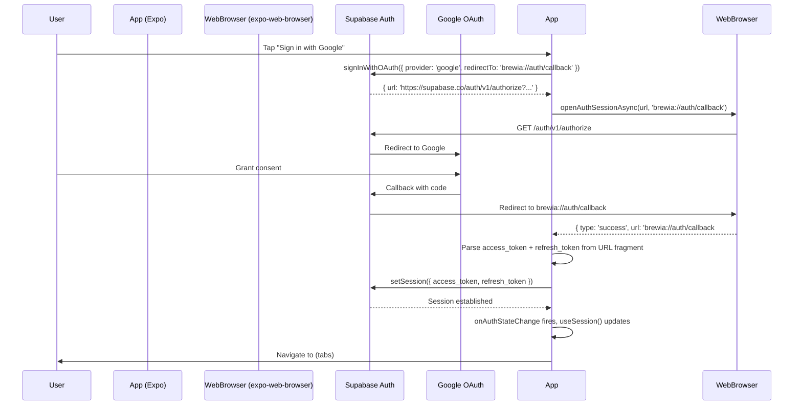

# Auth Architecture

Brewia uses Supabase Auth with Google OAuth, connected to the Expo app via deep linking.

> Note: The previous Auth.js + email magic link stack has been removed. Migration of existing Auth.js sessions is out of scope.

## Flow Overview



## Session Management (`useSession`)

`src/lib/auth.ts` exports `useSession()` which returns `{ session, loading }`:

- `loading = true` initially until `supabase.auth.getSession()` resolves
- `session` is `null` when unauthenticated, a `Session` object when logged in
- `onAuthStateChange` subscription keeps `session` up to date

```ts
export function useSession(): SessionState {
  const [session, setSession] = useState<Session | null>(null)
  const [loading, setLoading] = useState(true)
  // ...getSession() + onAuthStateChange
}
```

## Route Guard (`app/_layout.tsx`)

The root layout is the single enforcement point for authentication:

```ts
const { session, loading } = useSession()

if (loading) return <View style={{ flex: 1 }} />   // splash while resolving
if (!session) return <Redirect href="/(auth)/login" />
return <Stack />  // authenticated: show (tabs)
```

This prevents redirect loops by only redirecting when `loading === false`.

## Session Persistence

The Supabase client is configured with `AsyncStorage` for persistence:

```ts
createClient(url, key, {
  auth: {
    storage: AsyncStorage,
    autoRefreshToken: true,
    persistSession: true,
    detectSessionInUrl: false,
  },
})
```

On subsequent app opens, `getSession()` returns the stored session and the user is taken directly to the tabs without needing to re-authenticate.

## Server-Side Security (RLS)

Row Level Security on the database provides a second layer of enforcement beyond the client-side session check:

- All user-owned tables (`bean`, `brew`, `brew_flavor`, `preset`) have `WHERE user_id = auth.uid()` in their SELECT/INSERT/UPDATE/DELETE policies
- `flavor` is a read-only master table with `USING (true)` for SELECT and no write policies
- The `auth.uid()` function returns the UUID from the verified JWT — even if the client attempted to forge a `user_id`, the DB would reject the row

RLS policies are defined in `drizzle/0000_init.sql`.

## Supabase Dashboard Setup Checklist

1. Enable Google OAuth provider under Authentication > Providers
2. Add `brewia://auth/callback` to Authorized Redirect URLs
3. In Google Cloud Console, add `https://<project>.supabase.co/auth/v1/callback` to OAuth client authorized redirect URIs
