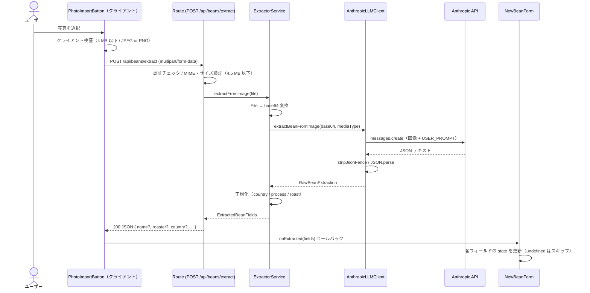
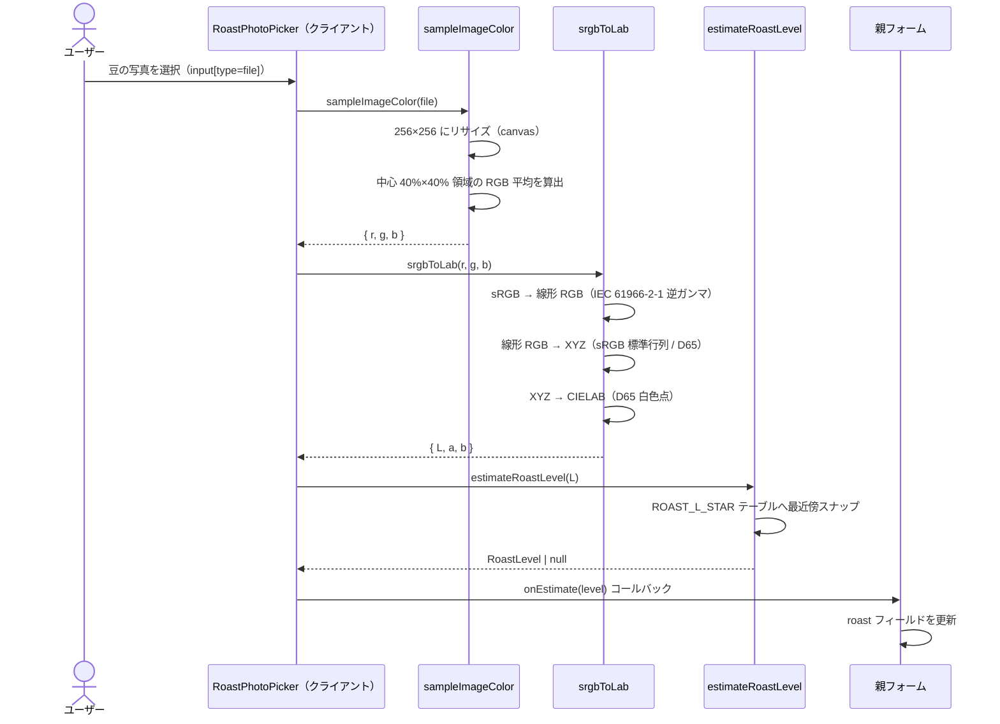

# 豆写真フィールド自動抽出 設計書

## 概要

ユーザーがコーヒー豆のパッケージ写真を選択すると、Claude Vision API が画像を解析し、Bean 新規作成フォームのテキスト系フィールドに値を自動入力します。本書の主軸は **Bean フォームのテキスト系フィールド自動抽出**（`POST /api/beans/extract` を経由する LLM 読み取り経路）です。加えて、**焙煎度推定（豆の色からの CIELAB 解析）は独立した色解析経路**として本書に併記します（詳細は「[焙煎度推定](#焙煎度推定)」を参照してください）。

リクエスト / レスポンスの I/O 契約は [docs/api-spec.md](./api-spec.md) を参照してください。

> 真実の源は `lib/llm/anthropic-client.ts` です。プロンプト本文を改修した際は本書のコードブロックを同期してください。

## データフロー



クライアント（`components/photo-import-button.tsx`）はファイル選択直後に 4 MB 超・非対応 MIME のファイルを弾きます。サーバー側の Route は 4.5 MB 超を追加で弾き（Vercel serverless の body 上限に合わせた二重検証）、認証済みユーザーであることも確認します。`ExtractorService` は `File` を base64 に変換してから `AnthropicLLMClient` に渡し、返ってきた `RawBeanExtraction` を正規化して `ExtractedBeanFields` に変換します。`AnthropicLLMClient` は `import 'server-only'` を宣言しており、クライアントバンドルへの混入を防ぎます。`NewBeanForm` は `undefined` フィールドをスキップし、LLM が読み取れたフィールドのみを既存の入力値に上書きします。

## プロンプト設計

### モデルと制約

| 項目           | 値                                                                        | 出典                             |
| -------------- | ------------------------------------------------------------------------- | -------------------------------- |
| モデル         | `claude-haiku-4-5`（`ANTHROPIC_MODEL` 環境変数で上書き可）                | `lib/llm/constants.ts:5,12`      |
| `max_tokens`   | `512`                                                                     | `lib/llm/anthropic-client.ts:63` |
| レスポンス形式 | JSON テキスト（マークダウンフェンスを `stripJsonFence` で除去後にパース） | `lib/llm/anthropic-client.ts:86` |

### システムプロンプト

出典: `lib/llm/anthropic-client.ts:8-10`

```text
あなたはコーヒー豆パッケージの画像を解析し、情報を JSON で抽出する専門家です。
画像から読み取れる情報のみを返してください。
読み取れないフィールドは JSON に含めないでください（null や空文字列は使わないこと）。
```

### ユーザープロンプトと JSON スキーマ

出典: `lib/llm/anthropic-client.ts:12-32`

````text
以下の画像はコーヒー豆のパッケージです。
画像から読み取れる情報を、下記の JSON スキーマに従って返してください。

出力は JSON のみとし、マークダウンや説明文は含めないでください。

{
  "name":    "豆の商品名（例: Yirgacheffe Kochere）",
  "roaster": "焙煎店・ブランド名（例: Onibus Coffee）",
  "country": "生産国。次のいずれかのみ使用: Ethiopia / Kenya / Colombia / Brazil / Guatemala / Panama / Costa Rica / Indonesia / Rwanda / Yemen / Blended",
  "region":  "生産地域（例: Yirgacheffe）",
  "farm":    "農園名・ウォッシングステーション名（例: Kochere Washing Station）",
  "variety": "品種（例: Heirloom, Gesha）",
  "process": "精製方法。次のいずれかのみ使用: Washed / Natural / Honey / Anaerobic / Wet Hulled",
  "notes":   "テイスティングノート・フレーバー情報（例: Jasmine, Blueberry, Citrus）",
  "roast":   "焙煎度。パッケージやラベルに印刷された焙煎度の文字情報を読み取る。次のいずれかのみ使用: Light / Cinnamon / Medium / High / City / Full City / French / Italian。「中煎り」「浅煎り」などの日本語表記や「Medium Roast」「City+」などの代替表記が記載されている場合は対応するいずれかにマップすること。豆の色から推定しないこと。パッケージから読み取れない場合はこのフィールドを省略すること"
}

重要: JSON のみを返してください。
- マークダウンコードブロック (```json ... ```) で囲まないこと
- 前後に説明文や挨拶を付けないこと
- 回答は必ず「{」で始まり「}」で終わる JSON オブジェクトのみとすること
````

### 出力の事後処理

LLM のレスポンスが ` ```json ... ``` ` 形式でラップされている場合でも正しくパースできるよう、`stripJsonFence()` を前処理として適用します（出典: `lib/llm/anthropic-client.ts:39-47`）。パース後の値が `null` / 配列 / プリミティブのいずれかである場合は `ExtractionParseError` をスローし、呼び出し元でエラー応答（HTTP 503）として処理します（出典: `lib/llm/anthropic-client.ts:86-99`）。

### サーバー側正規化

出典: `app/beans/extractor/service.ts` / `lib/llm/types.ts:32-41`

| フィールド               | 正規化ルール                                                              |
| ------------------------ | ------------------------------------------------------------------------- |
| `country`                | `COUNTRIES` 定数と**大文字小文字無視**で照合し、一致した場合のみセット    |
| `process`                | `PROCESSES` 定数と**完全一致**のみフォームへ流し込む                      |
| `roast`                  | `ROAST_LEVELS` 定数と**大文字小文字無視**で照合し、一致した場合のみセット |
| その他の文字列フィールド | `trim()` して空文字列なら省略、非空ならそのままセット                     |

## 焙煎度推定

本書の主軸は前節までで解説した **LLM 経路**（パッケージ印字の文字情報を Claude Vision API で読み取る系統）です。`roast` フィールドは LLM がパッケージ上の文字情報として読み取り、`ROAST_LEVELS` に一致した場合のみフォームへ流し込みます。豆の色から推定することはありません（ユーザープロンプト参照）。

**焙煎度推定は独立した別系統**（色解析経路）として実装されています。`components/roast-photo-picker.tsx` が起点となり、`lib/color/` の各モジュールを順に呼び出してフォームの `roast` セレクトを自動的に埋めます。この経路は LLM を使用せず、ブラウザ上でのみ動作します。以下の 4 節でアルゴリズムの各段階を出典付きで説明します。



### 色サンプリング

出典: `lib/color/image-sampler.ts:1-53`

ユーザーが選択した `File` から、後段の変換処理に渡す代表色（sRGB 平均値 `{ r, g, b }`）を 1 点取得します。`File` の MIME が `image/` で始まらない場合は即座にエラーをスローします（`image-sampler.ts:2-4`）。

処理の流れは以下のとおりです。

1. `URL.createObjectURL(file)` で `` に読み込み、256 × 256 の `<canvas>` へ `drawImage` でリサイズします（`image-sampler.ts:15-24`）。
2. サンプル領域として、キャンバス左端から 30% の位置を起点に 40% × 40% の中心矩形を算出します（`image-sampler.ts:26-29`）。これは画像周縁の背景色や過露光領域を除き、豆本体の色を取りやすくするための設計です。
3. `getImageData` で当該領域の全画素を取得し、R / G / B チャンネルをそれぞれ単純平均して返します（`image-sampler.ts:31-49`）。

ホワイトバランス補正・露出補正・フォーカス検出などは実装されておらず、純粋な中心領域の算術平均です。

### sRGB→CIELAB 変換

出典: `lib/color/srgb-to-lab.ts:1-51`

8bit sRGB（0–255 per channel）を CIELAB（D65 光源）へ変換する純関数 `srgbToLab(r, g, b)` です。副作用なし・外部依存なしで実装されています。変換は次の 3 段階で行います。

1. **sRGB → 線形 RGB**（IEC 61966-2-1 逆ガンマ）: 各チャンネルを 255 で正規化した後、閾値 `0.04045` を境にガンマ補正を逆算します（`srgb-to-lab.ts:17-20`）。
2. **線形 RGB → XYZ（D65）**: sRGB 標準の 3×3 行列でアフィン変換します（`srgb-to-lab.ts:27-29`）。
3. **XYZ → CIELAB（D65 白色点 `Xn=0.95047, Yn=1.0, Zn=1.08883`）**: CIELAB 関数 `f(t)` に立方根の閾値 `epsilon = (6/29)³ ≈ 0.008856` と線形領域の傾き `kappa = (1/3)·(29/6)² ≈ 7.787` を用いる標準実装です（`srgb-to-lab.ts:36-50`）。

戻り値は `{ L, a, b }` のうち、後段の焙煎度推定が使用するのは明度 `L*` のみです。`L*` は知覚的な明度であり、豆の色が暗いほど（深煎りほど）小さな値を取ります。

### 焙煎度マッピング

出典: `lib/color/roast-estimator.ts:1-30`、`lib/types.ts:11-22`

`estimateRoastLevel(lStar)` は `L*` を 8 段階の焙煎度ラベル（`lib/types.ts:11-20` の `ROAST_LEVELS`: `Light` / `Cinnamon` / `Medium` / `High` / `City` / `Full City` / `French` / `Italian`）のいずれかへ最近傍スナップします。

各焙煎度に基準 `L*` を対応付けたテーブル `ROAST_L_STAR`（`roast-estimator.ts:3-12`）は次のとおりです。

| 焙煎度    | 基準 L\* |
| --------- | -------- |
| Light     | 62       |
| Cinnamon  | 56       |
| Medium    | 50       |
| High      | 44       |
| City      | 38       |
| Full City | 32       |
| French    | 26       |
| Italian   | 20       |

入力 `L*` に対し `|L* − ROAST_L_STAR[level]|` が最小となる `level` を線形探索で返します（`roast-estimator.ts:17-27`）。`L* < 17` または `L* > 65` の場合は `null` を返します（`roast-estimator.ts:15`）。この範囲外ケースは UI 上で「Out of range」として扱われます。

`ROAST_L_STAR` の基準値は、焙煎度ごとに知られている豆色の `L*` レンジ中心を参考に設計されています（universal roasted arabica coffee color curve に由来する設計値）。実行時には `a*` / `b*` を再構成せず、`L*` のみで判定します。

なお `lib/roast-colors.ts` の `ROAST_COLORS` は焙煎度ごとの **UI 表示用 sRGB 色見本**（例: `Light: '#BA8D5D'`）であり、最近傍判定の入力には使用されません。

### フォーム反映

出典: `components/roast-photo-picker.tsx:1-106`

`RoastPhotoPicker` コンポーネントが色解析パイプライン全体を React から呼び出し、推定された `RoastLevel` を親フォームへ渡します。`<input type="file" accept="image/*">` を `<label>` 経由でトリガーする UI です（`roast-photo-picker.tsx:65-84`）。

状態は 4 値（`roast-photo-picker.tsx:16`）で管理します。

| 状態         | UI の表示                                     |
| ------------ | --------------------------------------------- |
| `idle`       | ボタンのみ表示                                |
| `processing` | スピナー（`Loader2 animate-spin`）を表示      |
| `done`       | `L* {値} · {焙煎度ラベル}` のプレビューを表示 |
| `error`      | エラーメッセージ（`Out of range` など）を表示 |

連続して写真を選択した際の競合は `generationRef`（`roast-photo-picker.tsx:20`）でシリアライズします。古い処理の結果が後から届いても `gen !== generationRef.current` の判定で破棄されます（`roast-photo-picker.tsx:38, 53`）。

推定成功時は `onEstimate(level)` コールバック（`roast-photo-picker.tsx:13`）を通じて親フォームへ `RoastLevel` を渡し、`roast` セレクトを自動更新します（`roast-photo-picker.tsx:49`）。

関連 Issue / PR:

- [Issue #59](https://github.com/yjn279/brewia/issues/59) — 焙煎度推定機能の起票
- [PR #72](https://github.com/yjn279/brewia/pull/72) — 色解析ライブラリ実装
- [PR #77](https://github.com/yjn279/brewia/pull/77) — RoastPhotoPicker UI 実装
