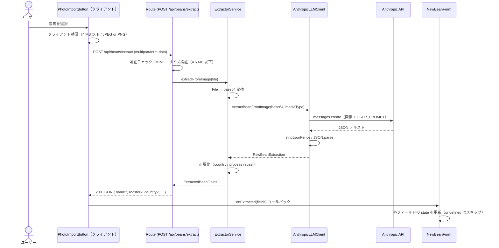

# 豆写真フィールド自動抽出 設計書

## 概要

ユーザーがコーヒー豆のパッケージ写真を選択すると、Claude Vision API が画像を解析し、Bean 新規作成フォームのテキスト系フィールドに値を自動入力します。本書のスコープは **Bean フォームのテキスト系フィールド自動抽出**（`POST /api/beans/extract` を経由する LLM 読み取り経路）であり、**焙煎度推定（豆の色からの CIELAB 解析）は別系統**として本書には含まれません（詳細は「[焙煎度推定との関係](#焙煎度推定との関係)」を参照してください）。

リクエスト / レスポンスの I/O 契約は [docs/api-spec.md](./api-spec.md) を参照してください。

> 真実の源は `lib/llm/anthropic-client.ts` です。プロンプト本文を改修した際は本書のコードブロックを同期してください。

## データフロー



クライアント（`components/photo-import-button.tsx`）はファイル選択直後に 4 MB 超・非対応 MIME のファイルを弾きます。サーバー側の Route は 4.5 MB 超を追加で弾き（Vercel serverless の body 上限に合わせた二重検証）、認証済みユーザーであることも確認します。`ExtractorService` は `File` を base64 に変換してから `AnthropicLLMClient` に渡し、返ってきた `RawBeanExtraction` を正規化して `ExtractedBeanFields` に変換します。`AnthropicLLMClient` は `import 'server-only'` を宣言しており、クライアントバンドルへの混入を防ぎます。`NewBeanForm` は `undefined` フィールドをスキップし、LLM が読み取れたフィールドのみを既存の入力値に上書きします。

## プロンプト設計

### モデルと制約

| 項目           | 値                                                                        | 出典                             |
| -------------- | ------------------------------------------------------------------------- | -------------------------------- |
| モデル         | `claude-haiku-4-5`（`ANTHROPIC_MODEL` 環境変数で上書き可）                | `lib/llm/constants.ts:5,12`      |
| `max_tokens`   | `512`                                                                     | `lib/llm/anthropic-client.ts:63` |
| レスポンス形式 | JSON テキスト（マークダウンフェンスを `stripJsonFence` で除去後にパース） | `lib/llm/anthropic-client.ts:86` |

### システムプロンプト

出典: `lib/llm/anthropic-client.ts:8-10`

```text
あなたはコーヒー豆パッケージの画像を解析し、情報を JSON で抽出する専門家です。
画像から読み取れる情報のみを返してください。
読み取れないフィールドは JSON に含めないでください（null や空文字列は使わないこと）。
```

### ユーザープロンプトと JSON スキーマ

出典: `lib/llm/anthropic-client.ts:12-32`

````text
以下の画像はコーヒー豆のパッケージです。
画像から読み取れる情報を、下記の JSON スキーマに従って返してください。

出力は JSON のみとし、マークダウンや説明文は含めないでください。

{
  "name":    "豆の商品名（例: Yirgacheffe Kochere）",
  "roaster": "焙煎店・ブランド名（例: Onibus Coffee）",
  "country": "生産国。次のいずれかのみ使用: Ethiopia / Kenya / Colombia / Brazil / Guatemala / Panama / Costa Rica / Indonesia / Rwanda / Yemen / Blended",
  "region":  "生産地域（例: Yirgacheffe）",
  "farm":    "農園名・ウォッシングステーション名（例: Kochere Washing Station）",
  "variety": "品種（例: Heirloom, Gesha）",
  "process": "精製方法。次のいずれかのみ使用: Washed / Natural / Honey / Anaerobic / Wet Hulled",
  "notes":   "テイスティングノート・フレーバー情報（例: Jasmine, Blueberry, Citrus）",
  "roast":   "焙煎度。パッケージやラベルに印刷された焙煎度の文字情報を読み取る。次のいずれかのみ使用: Light / Cinnamon / Medium / High / City / Full City / French / Italian。「中煎り」「浅煎り」などの日本語表記や「Medium Roast」「City+」などの代替表記が記載されている場合は対応するいずれかにマップすること。豆の色から推定しないこと。パッケージから読み取れない場合はこのフィールドを省略すること"
}

重要: JSON のみを返してください。
- マークダウンコードブロック (```json ... ```) で囲まないこと
- 前後に説明文や挨拶を付けないこと
- 回答は必ず「{」で始まり「}」で終わる JSON オブジェクトのみとすること
````

### 出力の事後処理

LLM のレスポンスが ` ```json ... ``` ` 形式でラップされている場合でも正しくパースできるよう、`stripJsonFence()` を前処理として適用します（出典: `lib/llm/anthropic-client.ts:39-47`）。パース後の値が `null` / 配列 / プリミティブのいずれかである場合は `ExtractionParseError` をスローし、呼び出し元でエラー応答（HTTP 503）として処理します（出典: `lib/llm/anthropic-client.ts:86-99`）。

### サーバー側正規化

出典: `app/beans/extractor/service.ts` / `lib/llm/types.ts:32-41`

| フィールド               | 正規化ルール                                                              |
| ------------------------ | ------------------------------------------------------------------------- |
| `country`                | `COUNTRIES` 定数と**大文字小文字無視**で照合し、一致した場合のみセット    |
| `process`                | `PROCESSES` 定数と**完全一致**のみフォームへ流し込む                      |
| `roast`                  | `ROAST_LEVELS` 定数と**大文字小文字無視**で照合し、一致した場合のみセット |
| その他の文字列フィールド | `trim()` して空文字列なら省略、非空ならそのままセット                     |

## 焙煎度推定との関係

本書のスコープは「パッケージに印字された焙煎度**文字列**の読み取り」です。`roast` フィールドは LLM がパッケージ上の文字情報として読み取り、`ROAST_LEVELS` に一致した場合のみフォームへ流し込みます。

豆の**色からの焙煎度推定**は、本書が対象とする LLM 経路とは独立した別系統として実装されています。具体的には `components/roast-photo-picker.tsx` と `lib/color/` が担い、処理の流れは「色サンプリング → sRGB→CIELAB 変換 → L\* に対し universal roasted arabica coffee color curve で a\*, b\* を推定 → 最寄りパレットへスナップ」となります。

この分離により、写真から自動入力する LLM 経路（本書）と色解析経路（RoastPhotoPicker）の責務が重複しません。

関連 Issue / PR:

- [Issue #59](https://github.com/yjn279/brewia/issues/59) — 焙煎度推定機能の起票
- [PR #72](https://github.com/yjn279/brewia/pull/72) — 色解析ライブラリ実装
- [PR #77](https://github.com/yjn279/brewia/pull/77) — RoastPhotoPicker UI 実装

詳細仕様は当該 PR および `lib/color/` のソースコードに委ねます。
