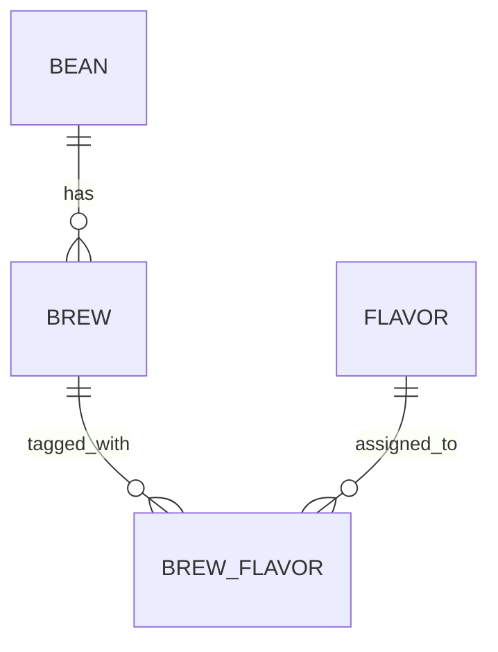

# Brewia データ仕様書

## データモデル

## エンティティ仕様

### Bean

| 論理名   | 物理名  | 型               | 必須 | 補足                |
| -------- | ------- | ---------------- | ---- | ------------------- |
| ID       | id      | text（UUIDv7）   | ○    | 主キー              |
| 名称     | name    | text             | ○    | -                   |
| 生産国   | country | text（enum）     | ○    | COUNTRIES に準拠    |
| 生産地域 | region  | text             | -    | -                   |
| 生産農園 | farm    | text             | -    | -                   |
| 生産処理 | process | text             | -    | -                   |
| 品種     | variety | text             | -    | -                   |
| 焙煎度   | roast   | text（enum）     | ○    | ROAST_LEVELS に準拠 |
| 焙煎所   | roaster | text             | -    | -                   |
| メモ     | notes   | text             | -    | -                   |
| 作成日時 | created | text（datetime） | ○    | CURRENT_TIMESTAMP   |
| 編集日時 | updated | text（datetime） | ○    | CURRENT_TIMESTAMP   |

### Brew

| 論理名       | 物理名       | 型               | 必須 | 補足              |
| ------------ | ------------ | ---------------- | ---- | ----------------- |
| ID           | id           | text（UUIDv7）   | ○    | 主キー            |
| 豆ID         | bean_id      | text（FK）       | ○    | Bean 参照         |
| 豆量         | bean_weight  | real             | ○    | g                 |
| 挽き目       | bean_grind   | real             | -    | クリック数        |
| 湯量         | water_weight | real             | ○    | g                 |
| 湯温         | water_temp   | real             | -    | ℃                 |
| 抽出ステップ | steps        | text（JSON）     | ○    | `[{time, water}]` |
| 香り         | aroma        | integer          | ○    | 1〜5              |
| 酸味         | acidity      | integer          | ○    | 1〜5              |
| 甘味         | sweetness    | integer          | ○    | 1〜5              |
| 質感         | body         | integer          | ○    | 1〜5              |
| 総合点       | overall      | integer          | ○    | 1〜5              |
| メモ         | notes        | text             | -    | -                 |
| 作成日時     | created      | text（datetime） | ○    | CURRENT_TIMESTAMP |
| 編集日時     | updated      | text（datetime） | ○    | CURRENT_TIMESTAMP |

### Flavor

| 論理名       | 物理名      | 型               | 必須 | 補足              |
| ------------ | ----------- | ---------------- | ---- | ----------------- |
| ID           | id          | text（UUIDv7）   | ○    | 主キー            |
| 名称         | name        | text             | ○    | -                 |
| カテゴリ     | category    | text             | ○    | -                 |
| サブカテゴリ | subcategory | text             | ○    | -                 |
| 作成日時     | created     | text（datetime） | ○    | CURRENT_TIMESTAMP |
| 編集日時     | updated     | text（datetime） | ○    | CURRENT_TIMESTAMP |

### BrewFlavor

| 論理名       | 物理名    | 型               | 必須 | 補足              |
| ------------ | --------- | ---------------- | ---- | ----------------- |
| ID           | id        | text（UUIDv7）   | ○    | 主キー            |
| 抽出ID       | brew_id   | text（FK）       | ○    | Brew 参照         |
| フレーバーID | flavor_id | text（FK）       | ○    | Flavor 参照       |
| 作成日時     | created   | text（datetime） | ○    | CURRENT_TIMESTAMP |
| 編集日時     | updated   | text（datetime） | ○    | CURRENT_TIMESTAMP |

## 制約要件

- Bean 削除時は、関連する Brew と BrewFlavor を削除して整合性を維持する。
- Brew 更新時は BrewFlavor を再構築する。
- Brew 削除時は BrewFlavor を削除してから Brew を削除する。

## 入力バリデーション要件

- Bean: `name` 必須、`country` は定義済み国、`roast` は 8 レベル。
- Brew: `beanWeight` / `waterWeight` は正数、評価項目は 1〜5 整数。
- Brew: `waterTemp` は未入力許容、入力時は 0〜100。
