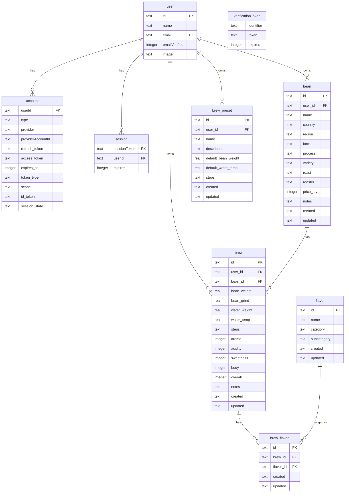

# データ仕様書

Brewia の DB スキーマ（テーブル定義・マイグレーション系列・ER 図）を正本として記述したドキュメント。

**正本**: 本ドキュメントは `lib/db/schema.ts` を正本とし、DB スキーマの事実を記載する。  
**アプリ型ビュー**: アプリケーション層で利用する型（`lib/types.ts` ベース）は [Data Structures](./data-structures.md) を参照。両ドキュメントは相互補完関係にある。片方を更新した場合は他方との整合性を確認すること。

**対象範囲**: `lib/db/schema.ts:1-117` の全テーブル定義、`drizzle/0000_*.sql` 〜 `drizzle/0005_*.sql` のマイグレーション系列  
**更新ポリシー**: スキーマ変更 PR がマージされた際に更新する。

---

## 1. テーブル一覧

| テーブル名 | 役割 | ユーザースコープ |
| --- | --- | --- |
| `user` | Auth.js ユーザー情報 | — |
| `account` | OAuth アカウント紐づけ | `user.id` に cascade |
| `session` | データベースセッション | `user.id` に cascade |
| `verificationToken` | メール検証トークン（現在は使用されていない） | — |
| `bean` | コーヒー豆情報 | `user_id` で分離 |
| `brew` | 抽出ログ | `user_id` で分離 |
| `flavor` | 風味マスタ（共有） | なし（全ユーザー共通） |
| `brew_flavor` | brew と flavor の中間テーブル | `brew.user_id` 経由 |
| `brew_preset` | 抽出プリセット | `user_id` で分離 |

---

## 2. テーブル定義

### 2.1 `user`

→ #82, `lib/db/schema.ts:7-13`

| カラム | SQL 型 | NOT NULL | デフォルト | 備考 |
| --- | --- | --- | --- | --- |
| `id` | TEXT | YES | — | PRIMARY KEY |
| `name` | TEXT | NO | — | — |
| `email` | TEXT | YES | — | UNIQUE |
| `emailVerified` | INTEGER | NO | — | Unix ミリ秒（timestamp_ms） |
| `image` | TEXT | NO | — | プロフィール画像 URL |

### 2.2 `account`

→ #82, `lib/db/schema.ts:15-33`

| カラム | SQL 型 | NOT NULL | デフォルト | 備考 |
| --- | --- | --- | --- | --- |
| `userId` | TEXT | YES | — | FK → `user.id` (CASCADE DELETE) |
| `type` | TEXT | YES | — | — |
| `provider` | TEXT | YES | — | 複合 PK の一部 |
| `providerAccountId` | TEXT | YES | — | 複合 PK の一部 |
| `refresh_token` | TEXT | NO | — | — |
| `access_token` | TEXT | NO | — | — |
| `expires_at` | INTEGER | NO | — | — |
| `token_type` | TEXT | NO | — | — |
| `scope` | TEXT | NO | — | — |
| `id_token` | TEXT | NO | — | — |
| `session_state` | TEXT | NO | — | — |

**主キー**: (`provider`, `providerAccountId`) の複合主キー

### 2.3 `session`

→ #82, `lib/db/schema.ts:35-41`

| カラム | SQL 型 | NOT NULL | デフォルト | 備考 |
| --- | --- | --- | --- | --- |
| `sessionToken` | TEXT | YES | — | PRIMARY KEY |
| `userId` | TEXT | YES | — | FK → `user.id` (CASCADE DELETE) |
| `expires` | INTEGER | YES | — | Unix ミリ秒（timestamp_ms） |

### 2.4 `verificationToken`

→ #82, `lib/db/schema.ts:43-51`

| カラム | SQL 型 | NOT NULL | デフォルト | 備考 |
| --- | --- | --- | --- | --- |
| `identifier` | TEXT | YES | — | 複合 PK の一部 |
| `token` | TEXT | YES | — | 複合 PK の一部 |
| `expires` | INTEGER | YES | — | Unix ミリ秒（timestamp_ms） |

**主キー**: (`identifier`, `token`) の複合主キー

> **注**: `verificationToken` はメールマジックリンク認証用テーブルだが、#107 / PR #113 でメール認証を廃止したため現在は実際には使用されていない。テーブル自体は `@auth/drizzle-adapter` の要求仕様として残している。

### 2.5 `bean`

→ #32, #33, #82, `lib/db/schema.ts:53-68`

| カラム | SQL 型 | NOT NULL | デフォルト | 備考 |
| --- | --- | --- | --- | --- |
| `id` | TEXT | YES | uuidv7() | PRIMARY KEY |
| `user_id` | TEXT | YES | — | FK → `user.id` |
| `name` | TEXT | YES | — | 豆名 |
| `country` | TEXT | YES | — | 生産国 |
| `region` | TEXT | YES | `''` | 生産地域 |
| `farm` | TEXT | YES | `''` | 農園名 |
| `process` | TEXT | YES | `''` | 精製方法 |
| `variety` | TEXT | YES | `''` | 品種 |
| `roast` | TEXT | YES | — | 焙煎度（`ROAST_LEVELS` の値） |
| `roaster` | TEXT | YES | `''` | ロースター名 |
| `price_jpy` | INTEGER | YES | `0` | 価格（円） |
| `notes` | TEXT | YES | `''` | メモ |
| `created` | TEXT | YES | `CURRENT_TIMESTAMP` | 作成日時 |
| `updated` | TEXT | YES | `CURRENT_TIMESTAMP` | 更新日時 |

### 2.6 `brew`

→ #62, #82, `lib/db/schema.ts:70-87`

| カラム | SQL 型 | NOT NULL | デフォルト | 備考 |
| --- | --- | --- | --- | --- |
| `id` | TEXT | YES | uuidv7() | PRIMARY KEY |
| `user_id` | TEXT | YES | — | FK → `user.id` |
| `bean_id` | TEXT | YES | — | FK → `bean.id` |
| `bean_weight` | REAL | YES | — | 豆量（g） |
| `bean_grind` | REAL | YES | `0` | 挽き目 |
| `water_weight` | REAL | YES | — | 湯量（g） |
| `water_temp` | REAL | YES | `0` | 湯温（℃） |
| `steps` | TEXT | YES | — | 注湯ステップ JSON (`[{ time, water }]`) |
| `aroma` | INTEGER | YES | — | 香り評価（0〜5） |
| `acidity` | INTEGER | YES | — | 酸味評価（0〜5） |
| `sweetness` | INTEGER | YES | — | 甘さ評価（0〜5） |
| `body` | INTEGER | YES | — | ボディ評価（0〜5） |
| `overall` | INTEGER | YES | — | 総合評価（0〜5） |
| `notes` | TEXT | YES | `''` | メモ |
| `created` | TEXT | YES | `CURRENT_TIMESTAMP` | 作成日時 |
| `updated` | TEXT | YES | `CURRENT_TIMESTAMP` | 更新日時 |

### 2.7 `flavor`

→ #63, `lib/db/schema.ts:89-96`

| カラム | SQL 型 | NOT NULL | デフォルト | 備考 |
| --- | --- | --- | --- | --- |
| `id` | TEXT | YES | uuidv7() | PRIMARY KEY |
| `name` | TEXT | YES | — | 風味名 |
| `category` | TEXT | YES | — | 大分類 |
| `subcategory` | TEXT | YES | — | 小分類 |
| `created` | TEXT | YES | `CURRENT_TIMESTAMP` | 作成日時 |
| `updated` | TEXT | YES | `CURRENT_TIMESTAMP` | 更新日時 |

`flavor` は **全ユーザー共通の共有マスタ**であり `user_id` を持たない（`docs/auth-architecture.md:33-34` 参照）。

### 2.8 `brew_flavor`

→ #63, `lib/db/schema.ts:98-104`

| カラム | SQL 型 | NOT NULL | デフォルト | 備考 |
| --- | --- | --- | --- | --- |
| `id` | TEXT | YES | uuidv7() | PRIMARY KEY |
| `brew_id` | TEXT | YES | — | FK → `brew.id` |
| `flavor_id` | TEXT | YES | — | FK → `flavor.id` |
| `created` | TEXT | YES | `CURRENT_TIMESTAMP` | 作成日時 |
| `updated` | TEXT | YES | `CURRENT_TIMESTAMP` | 更新日時 |

`brew_flavor` は `user_id` を持たない。アクセス制御は `brew.user_id` 経由で行う（`brew_flavor JOIN brew WHERE brew.user_id = ?`）。詳細は `docs/auth-architecture.md:132-137` を参照。

### 2.9 `brew_preset`

→ #85, `lib/db/schema.ts:106-116`

| カラム | SQL 型 | NOT NULL | デフォルト | 備考 |
| --- | --- | --- | --- | --- |
| `id` | TEXT | YES | uuidv7() | PRIMARY KEY |
| `user_id` | TEXT | YES | — | FK → `user.id` |
| `name` | TEXT | YES | — | プリセット名 |
| `description` | TEXT | YES | `''` | 説明 |
| `default_bean_weight` | REAL | YES | `0` | デフォルト豆量（g） |
| `default_water_temp` | REAL | YES | `0` | デフォルト湯温（℃） |
| `steps` | TEXT | YES | — | 注湯ステップ JSON (`[{ time, water }]`) |
| `created` | TEXT | YES | `CURRENT_TIMESTAMP` | 作成日時 |
| `updated` | TEXT | YES | `CURRENT_TIMESTAMP` | 更新日時 |

---

## 3. ユーザーごとのデータ分離方針

→ #82, `docs/auth-architecture.md:31-35`

| テーブル | 分離方法 |
| --- | --- |
| `bean` | `user_id NOT NULL` で `user.id` を参照。全クエリに `WHERE user_id = ?` |
| `brew` | `user_id NOT NULL` で `user.id` を参照。全クエリに `WHERE user_id = ?` |
| `brew_preset` | `user_id NOT NULL` で `user.id` を参照。全クエリに `WHERE user_id = ?` |
| `brew_flavor` | `user_id` なし。`brew` 経由でアクセス制御（`JOIN brew WHERE brew.user_id = ?`） |
| `flavor` | 共有マスタ。`user_id` なし。全ユーザーが同じ一覧を参照 |
| `user` / `account` / `session` | Auth.js が管理。アプリ層からは直接操作しない |

他ユーザーのリソースへのアクセスは 404 を返す（403 はリソース存在を漏らすため）。

---

## 4. マイグレーション系列

`drizzle/` ディレクトリに連番 SQL ファイルとして管理される。

### 0000: `0000_heavy_gladiator.sql` — 初期スキーマ

初期リリース時のスキーマ。`bean`・`brew`・`flavor`・`brew_flavor` の 4 テーブルを作成する。この時点では `user_id` カラムは存在せず、認証機能もない。

### 0001: `0001_add_price_jpy.sql` — 豆価格追加

→ #33

```sql
ALTER TABLE `bean` ADD COLUMN `price_jpy` integer;
```

`bean` テーブルに `price_jpy`（円単位の価格）を nullable で追加。

### 0002: `0002_auth_tables.sql` — 認証テーブル追加

→ #82

`user`・`account`・`session`・`verificationToken` の 4 テーブルを作成する。Auth.js (`@auth/drizzle-adapter`) が必要とする標準スキーマ。

### 0003: `0003_add_user_id_to_bean_brew.sql` — bean/brew に user_id 追加

→ #82

```sql
ALTER TABLE `bean` ADD `user_id` text REFERENCES user(id);
ALTER TABLE `brew` ADD `user_id` text REFERENCES user(id);
```

`bean` と `brew` に `user_id`（nullable）を追加し、`user.id` を参照する FK を設定する。

### 0004: `0004_add_brew_preset.sql` — 抽出プリセット追加

→ #85

`brew_preset` テーブルを新規作成する。この時点では `user_id`・`description`・`default_bean_weight`・`default_water_temp` が nullable。

### 0005: `0005_shocking_bloodscream.sql` — NOT NULL 締め直し

既存データをバックフィルし、`bean`・`brew`・`brew_preset` の各カラムを NOT NULL に締め直す。

- `bean.user_id IS NULL` の行を既存の最初のユーザーに割り当て
- `bean` の各テキストカラム（`region`・`farm` 等）を空文字でバックフィル
- `bean.price_jpy IS NULL` を `0` でバックフィル
- テーブル再作成で NOT NULL 制約を適用
- `brew_preset` も同様にバックフィルし NOT NULL 化
- `brew` も同様にバックフィルし NOT NULL 化

SQLite は `ALTER COLUMN` をサポートしないため、テーブル再作成（`CREATE TABLE __new_xxx` → `INSERT` → `DROP` → `RENAME`）で対応している。

---

## 5. ER 図

`docs/data-structures.md:94-149` の ERD を `user`・`account`・`session`・`brew_preset` を加えて拡張した版。


