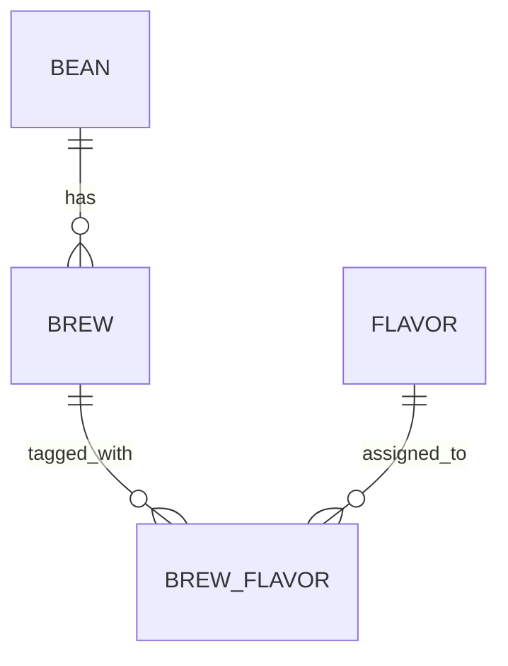

# Brewia データ仕様書

## データモデル

## エンティティ仕様

### Bean

| 項目名   | 物理名  | 型             | 必須 | 概要     |
| -------- | ------- | -------------- | ---- | -------- |
| ID       | id      | text(UUIDv7)   | ○    | 主キー   |
| 名称     | name    | text           | ○    | 豆の名称 |
| 生産国   | country | text(enum)     | ○    | 生産国   |
| 生産地域 | region  | text           | -    | 生産地域 |
| 生産農園 | farm    | text           | -    | 生産農園 |
| 生産処理 | process | text           | -    | 生産処理 |
| 品種     | variety | text           | -    | 品種     |
| 焙煎度   | roast   | text(enum)     | ○    | 焙煎度   |
| 焙煎所   | roaster | text           | -    | 焙煎所   |
| メモ     | notes   | text           | -    | 自由記述 |
| 作成日時 | created | text(datetime) | ○    | 作成日時 |
| 編集日時 | updated | text(datetime) | ○    | 更新日時 |

### Brew

| 項目名       | 物理名       | 型             | 必須 | 概要              |
| ------------ | ------------ | -------------- | ---- | ----------------- |
| ID           | id           | text(UUIDv7)   | ○    | 主キー            |
| 豆ID         | bean_id      | text(FK)       | ○    | Bean 参照         |
| 豆量         | bean_weight  | real           | ○    | 豆の重量（g）     |
| 挽き目       | bean_grind   | real           | -    | クリック数        |
| 湯量         | water_weight | real           | ○    | 湯の重量（g）     |
| 湯温         | water_temp   | real           | -    | 湯温（℃）         |
| 抽出ステップ | steps        | text(JSON)     | ○    | `[{time, water}]` |
| 香り         | aroma        | integer        | ○    | 1〜5              |
| 酸味         | acidity      | integer        | ○    | 1〜5              |
| 甘味         | sweetness    | integer        | ○    | 1〜5              |
| 質感         | body         | integer        | ○    | 1〜5              |
| 総合点       | overall      | integer        | ○    | 1〜5              |
| メモ         | notes        | text           | -    | 自由記述          |
| 作成日時     | created      | text(datetime) | ○    | 作成日時          |
| 編集日時     | updated      | text(datetime) | ○    | 更新日時          |

### Flavor

| 項目名       | 物理名      | 型             | 必須 | 概要           |
| ------------ | ----------- | -------------- | ---- | -------------- |
| ID           | id          | text(UUIDv7)   | ○    | 主キー         |
| 名称         | name        | text           | ○    | フレーバー名称 |
| カテゴリ     | category    | text           | ○    | 大分類         |
| サブカテゴリ | subcategory | text           | ○    | 小分類         |
| 作成日時     | created     | text(datetime) | ○    | 作成日時       |
| 編集日時     | updated     | text(datetime) | ○    | 更新日時       |

### BrewFlavor

| 項目名       | 物理名    | 型             | 必須 | 概要        |
| ------------ | --------- | -------------- | ---- | ----------- |
| ID           | id        | text(UUIDv7)   | ○    | 主キー      |
| 抽出ID       | brew_id   | text(FK)       | ○    | Brew 参照   |
| フレーバーID | flavor_id | text(FK)       | ○    | Flavor 参照 |
| 作成日時     | created   | text(datetime) | ○    | 作成日時    |
| 編集日時     | updated   | text(datetime) | ○    | 更新日時    |

## 制約要件

- Bean 削除時は、関連する Brew と BrewFlavor を削除して整合性を維持する。
- Brew 更新時は BrewFlavor を再構築する。
- Brew 削除時は BrewFlavor を削除してから Brew を削除する。

## 入力バリデーション要件

- Bean: `name` 必須、`country` は定義済み国、`roast` は 8 レベル。
- Brew: `beanWeight` / `waterWeight` は正数、評価項目は 1〜5 整数。
- Brew: `waterTemp` は未入力許容、入力時は 0〜100。
