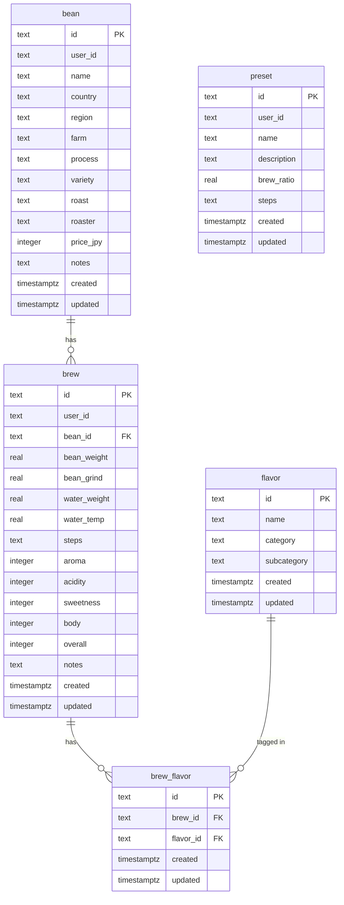

# Data Structures

This document describes the database tables, column types, JSON field structures, and their TypeScript type counterparts.

## Entity Relationship



## Table Descriptions

### `bean`

Stores coffee bean records. Each bean is owned by a single user via `user_id` (references `auth.users(id)`).

| Column | Type | Notes |
|---|---|---|
| `id` | `text` | UUID v7, client-generated |
| `user_id` | `text` | References `auth.users(id)`, enforced by FK and RLS |
| `name` | `text` | Bean name |
| `country` | `text` | Origin country (one of `COUNTRIES` enum) |
| `region` | `text` | Sub-region within country |
| `farm` | `text` | Farm or producer name |
| `process` | `text` | Processing method |
| `variety` | `text` | Coffee variety |
| `roast` | `text` | Roast level (one of `ROAST_LEVELS` enum) |
| `roaster` | `text` | Roastery name |
| `price_jpy` | `integer` | Price in Japanese Yen |
| `notes` | `text` | Free-text notes |
| `created` | `timestamptz` | Creation timestamp |
| `updated` | `timestamptz` | Last update timestamp |

### `brew`

Stores brew session records. Each brew references one bean.

| Column | Type | Notes |
|---|---|---|
| `id` | `text` | UUID v7, client-generated |
| `user_id` | `text` | References `auth.users(id)` |
| `bean_id` | `text` | References `bean(id)` |
| `bean_weight` | `real` | Dose in grams |
| `bean_grind` | `real` | Grind setting (0 = unset) |
| `water_weight` | `real` | Total water in ml |
| `water_temp` | `real` | Temperature in Celsius |
| `steps` | `text` | JSON-encoded `BrewStep[]` (see below) |
| `aroma` | `integer` | Score 0–5 |
| `acidity` | `integer` | Score 0–5 |
| `sweetness` | `integer` | Score 0–5 |
| `body` | `integer` | Score 0–5 |
| `overall` | `integer` | Score 0–5 |
| `notes` | `text` | Free-text tasting notes |
| `created` | `timestamptz` | Creation timestamp |
| `updated` | `timestamptz` | Last update timestamp |

### `flavor`

Master table of flavor tags. Read-only for app users; no user-owned flavors.

| Column | Type | Notes |
|---|---|---|
| `id` | `text` | UUID v7 |
| `name` | `text` | Flavor name (e.g. "Blueberry") |
| `category` | `text` | Top-level category (e.g. "Fruity") |
| `subcategory` | `text` | Sub-category |
| `created` | `timestamptz` | |
| `updated` | `timestamptz` | |

### `brew_flavor`

Join table between `brew` and `flavor`.

| Column | Type | Notes |
|---|---|---|
| `id` | `text` | UUID v7 |
| `brew_id` | `text` | References `brew(id) ON DELETE CASCADE` |
| `flavor_id` | `text` | References `flavor(id) ON DELETE CASCADE` |
| `created` | `timestamptz` | |
| `updated` | `timestamptz` | |

On brew create/update, all existing `brew_flavor` rows are deleted and replaced with the new set.

### `preset`

Stores reusable brew preset templates. Table was named `brew_preset` in the initial migration and renamed to `preset` in migration 0001.

| Column | Type | Notes |
|---|---|---|
| `id` | `text` | UUID v7, client-generated |
| `user_id` | `text` | References `auth.users(id)` |
| `name` | `text` | Preset name |
| `description` | `text` | Optional description |
| `brew_ratio` | `real` | Water-to-bean ratio (e.g. 15 means 1:15) |
| `steps` | `text` | JSON-encoded `BrewStep[]` (see below) |
| `created` | `timestamptz` | |
| `updated` | `timestamptz` | |

## JSON Field: `BrewStep[]`

Both `brew.steps` and `preset.steps` store a JSON array of pour steps:

```json
[
  { "time": 0, "water": 50 },
  { "time": 45, "water": 100 },
  { "time": 90, "water": 100 }
]
```

TypeScript type:

```ts
export interface BrewStep {
  time: number  // seconds elapsed
  water: number // water poured at this step (ml)
}
```

## TypeScript Types

Defined in `src/types/domain.ts`:

| TS Type | DB Table | Notes |
|---|---|---|
| `Bean` | `bean` | camelCase mapping of columns |
| `Brew` | `brew` | `steps: BrewStep[]` (parsed from JSON) |
| `Flavor` | `flavor` | |
| `BrewFlavor` | `brew_flavor` | |
| `Preset` | `preset` | `steps: BrewStep[]` (parsed from JSON) |
| `BrewStep` | embedded in `brew.steps`, `preset.steps` | |

### Enums

```ts
COUNTRIES     = ['Brazil', 'Ethiopia', ...]  // 19 values
ROAST_LEVELS  = ['Light', 'Cinnamon', ...]   // 8 values
PROCESSES     = ['Washed', 'Natural', ...]   // 5 values
COUNTRY_FLAGS = Record<Country, string>       // emoji flag map
```

## Column Mapping (DB snake_case to TS camelCase)

The Supabase JS client returns rows with the original column names. The API layer maps them manually:

| DB column | TS property |
|---|---|
| `user_id` | `userId` |
| `bean_id` | `beanId` |
| `bean_weight` | `beanWeight` |
| `bean_grind` | `beanGrind` |
| `water_weight` | `waterWeight` |
| `water_temp` | `waterTemp` |
| `price_jpy` | `priceJpy` |
| `brew_id` | `brewId` |
| `flavor_id` | `flavorId` |
| `brew_ratio` | `brewRatio` |
