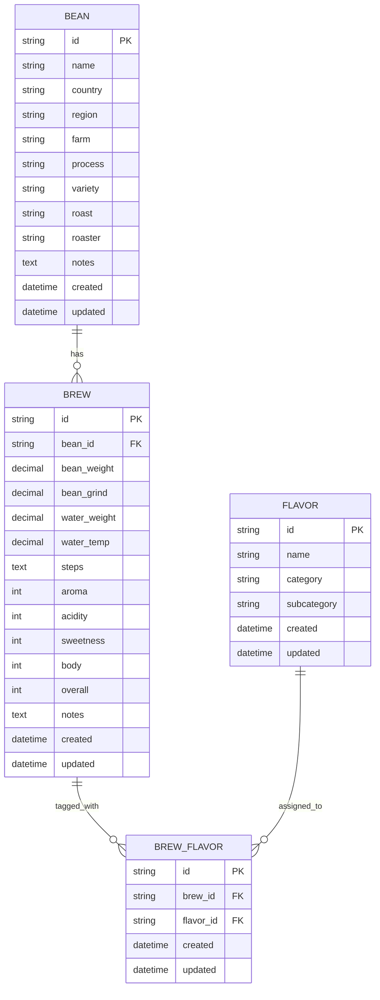

# Data Structures

`lib/types.ts` の型情報を、名称・変数名・型・概要で整理しています。

## Bean

| 名称 | 変数名 | 型 | 概要 |
| --- | --- | --- | --- |
| 豆ID | id | string | 豆を一意に識別するID |
| 豆名 | name | string | コーヒー豆の名称 |
| 生産国 | country | string | 豆の生産国 |
| 生産地域 | region | string \| null | 豆の生産地域（未入力可） |
| 農園名 | farm | string \| null | 生産農園（未入力可） |
| 精製方法 | process | string \| null | ウォッシュト/ナチュラルなど（未入力可） |
| 品種 | variety | string \| null | コーヒー豆の品種（未入力可） |
| 焙煎度 | roast | RoastLevel (string) | 焙煎度（Light / Cinnamon / Medium / High / City / Full City / French / Italian） |
| ロースター | roaster | string \| null | 焙煎した店舗/ブランド名（未入力可） |
| メモ | notes | string \| null | 豆に関する自由記述（未入力可） |
| 作成日時 | created | string | レコード作成日時 |
| 更新日時 | updated | string | レコード更新日時 |

## Brew

| 名称 | 変数名 | 型 | 概要 |
| --- | --- | --- | --- |
| 抽出ID | id | string | 抽出ログを一意に識別するID |
| 豆ID | beanId | string | 紐づく Bean のID |
| 豆量 | beanWeight | number | 使用した豆の重量（g） |
| 挽き目 | beanGrind | number \| null | 挽き目の指標値（未入力可） |
| 湯量 | waterWeight | number | 使用した総湯量（g/ml） |
| 湯温 | waterTemp | number \| null | 抽出時の湯温（℃、未入力可） |
| 注湯ステップ | steps | BrewStep[] | 時間と注湯量の配列データ |
| 香り | aroma | number | 香りの評価（1-5） |
| 酸味 | acidity | number | 酸味の評価（1-5） |
| 甘さ | sweetness | number | 甘さの評価（1-5） |
| ボディ | body | number | コク/質感の評価（1-5） |
| 総合 | overall | number | 総合評価（1-5） |
| メモ | notes | string \| null | 抽出に関する自由記述（未入力可） |
| 作成日時 | created | string | レコード作成日時 |
| 更新日時 | updated | string | レコード更新日時 |

## BrewStep（JSON構造）

```json
[
  { "time": 0, "water": 0 },
  { "time": 30, "water": 40 },
  { "time": 60, "water": 120 },
  { "time": 90, "water": 180 },
  { "time": 120, "water": 225 }
]
```

| 名称 | 変数名 | 型 | 概要 |
| --- | --- | --- | --- |
| 経過時間 | time | number | 抽出開始からの経過秒数 |
| 累計注湯量 | water | number | その時点までの累計注湯量 |

## Flavor

| 名称 | 変数名 | 型 | 概要 |
| --- | --- | --- | --- |
| フレーバーID | id | string | フレーバーを一意に識別するID |
| フレーバー名 | name | string | 風味名（例: Citrus） |
| カテゴリ | category | string | 大分類 |
| サブカテゴリ | subcategory | string | 小分類 |
| 作成日時 | created | string | レコード作成日時 |
| 更新日時 | updated | string | レコード更新日時 |

## BrewFlavor

| 名称 | 変数名 | 型 | 概要 |
| --- | --- | --- | --- |
| 紐づけID | id | string | Brew と Flavor の関連ID |
| 抽出ID | brewId | string | 紐づく Brew のID |
| フレーバーID | flavorId | string | 紐づく Flavor のID |
| 作成日時 | created | string | レコード作成日時 |
| 更新日時 | updated | string | レコード更新日時 |

## Joined Types

| 名称 | 変数名 | 型 | 概要 |
| --- | --- | --- | --- |
| BeanWithBrews | BeanWithBrews | `extends Bean` | Bean に紐づく抽出一覧を含む型 |
| 抽出一覧 | brews | `Brew[]` | BeanWithBrews で追加されるプロパティ |
| BrewWithBean | BrewWithBean | `extends Brew` | 抽出ログに豆情報と風味一覧を含む型 |
| 豆情報 | bean | `Bean` | BrewWithBean で追加されるプロパティ |
| 風味一覧 | flavors | `Flavor[]` | BrewWithBean で追加されるプロパティ |

## Data


