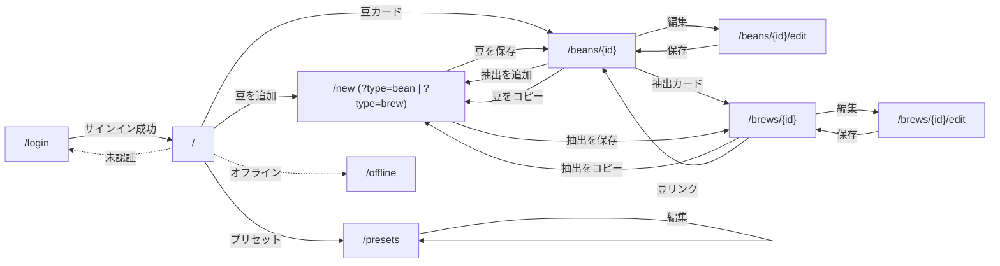

# 画面仕様書

Brewia の各画面の構成と挙動。Next.js App Router のページ単位（`app/**/page.tsx`）で記述する。レイアウト基本幅は `max-w-md` のモバイルファースト。

---

## 画面一覧と遷移

### ルートマップ

| パス | 役割 | 認証 |
| --- | --- | --- |
| `/` | ホーム / 統計 / 豆ライブラリ | 必須 |
| `/login` | ログイン | 公開 |
| `/offline` | オフラインフォールバック | 公開 |
| `/new` | 新規エントリ（タブで Bean / Brew 切替） | 必須 |
| `/beans/{id}` | 豆詳細 + 抽出履歴 | 必須 |
| `/beans/{id}/edit` | 豆編集 | 必須 |
| `/brews/{id}` | 抽出詳細 | 必須 |
| `/brews/{id}/edit` | 抽出編集 | 必須 |
| `/presets` | プリセット一覧 | 必須 |

### 遷移図

### 共通要素

- ヘッダ: `PageHeader`（左に戻る / タイトル、右にアクション群と `UserMenu`）
- ヘッダアクション: `HeaderAction`（`primary` / `secondary` バリアント）
- ユーザーメニュー: メールアドレス表示 + Sign out
- 空状態: `Empty` + `EmptyMedia` + `EmptyTitle` + `EmptyDescription` + `EmptyContent`
- カード: `Card`（`asChild` で section や Link をラップ）
- セクション見出し: `SectionHeading`（小文字トークン）
- データ表示: `DataField` / `InfoRow` / `MetricTile`
- 通知: `sonner` の Toast

すべてのページで `dynamic = 'force-dynamic'` を指定し、サーバ側でセッションとユーザーデータを毎回取得する。

## ホーム `/`

### 目的

ログイン直後のランディングページ。これまでの抽出 / 豆数のサマリと自分の豆ライブラリ一覧を表示する。

### レイアウト

| エリア | 内容 |
| --- | --- |
| ヘッダ | タイトル `Brewia` / Presets ボタン / Add bean ボタン / `UserMenu` |
| Welcome | `Greeting`（時刻に応じた挨拶） |
| Your Coffee Journey | `StatsCard` ×2: `Total Brews` / `Bean Variety` |
| Bean Library | `BeanCard` 一覧。空のときは `Empty` で `Add your first bean` CTA を表示 |

### 主な操作

| 操作 | 結果 |
| --- | --- |
| ヘッダの `+` | `/new?type=bean` |
| ヘッダの `BookMarked` | `/presets` |
| `BeanCard` タップ | `/beans/{id}` |
| `UserMenu` → Sign out | `signOutAction` 経由でサインアウト |

## ログイン `/login`

### 目的

未認証ユーザーのみが訪問する公開ページ。セッションがあれば即 `/` にリダイレクトする。

### 構成

| 要素 | 説明 |
| --- | --- |
| 見出し | `Brewia` / `Sign in to track your coffee journey` |
| Google ボタン | `signIn('google')` を発火する Server Action |

Email Magic Link は廃止（`#107`, `#113`）。プロバイダは Google のみ。Apple ログインは継続課題（`#106`）。

## 新規エントリ `/new`

### 目的

1 つのエントリポイントで「豆 (Bean) の追加」と「抽出 (Brew) のログ」を切替できる。

### タブ切替（`NewEntryTabs`）

- 既定タブはクエリ `type=bean | brew` または「Bean が 0 件なら強制的に Bean タブ」
- `Log Brew` タブは Bean が 0 件のとき disabled

### クエリパラメータ

| キー | 用途 |
| --- | --- |
| `type` | `bean` または `brew` |
| `bean` | Brew タブの初期豆 ID |
| `copyBean` | 豆をひな形にロード |
| `copyBrew` | 抽出をひな形にロード |

### Bean フォーム（`NewBeanForm`）

| 入力 | UI |
| --- | --- |
| 豆名 / ロースター | テキスト |
| 価格 (JPY) | テキスト（数字以外を除外し `Intl.NumberFormat` で表示） |
| 国 | Select（地域ごとにグルーピング） |
| 地域 / 農園 / 品種 / 精製 | テキスト / Select |
| 焙煎度 | `RoastPalette`（8 段階のカラーパレット）+ Slider |
| 焙煎度（写真） | `RoastPhotoPicker`（CIELAB L\* 曲線で推定） |
| 写真からのフィールド抽出 | `PhotoImportButton`（LLM 経由） |
| メモ | Textarea |

写真関連のボタンは抽出後 Toast でメッセージを表示する（成功 / 部分成功 / 失敗）。

### Brew フォーム（`NewBrewForm`）

| セクション | 内容 |
| --- | --- |
| Bean Selection | Bean ドロップダウン |
| Brew Timer | `BrewTimer`（Start / Lap / Stop / Reset、センチ秒表示） |
| Extraction Steps | 注湯ステップ行（時間・湯量）、DnD 並び替え、`PourChart` プレビュー、プリセット呼び出し / 保存ダイアログ |
| Brew Parameters | 豆量・湯量・湯温・挽き目（インライン単位） |
| Taste Profile | 5 軸スライダー（aroma / acidity / sweetness / body / overall） |
| Flavor Notes | フレーバータグの複数選択 |
| Notes | Textarea |

### Reset 確認ダイアログ

`BrewTimer` の Reset 押下時、`AlertDialog` で「ステップ行も初期化される」ことを警告し、確定でタイマーとステップ入力を初期化する（`#98`, `#104`）。

## 豆詳細 `/beans/{id}`

### 目的

豆 1 件のメタ情報と、その豆で淹れた抽出履歴を一画面で表示する。

### 構成

| エリア | 内容 |
| --- | --- |
| ヘッダ | Back / `Bean Details` / Copy / Edit / Delete / Add brew / `UserMenu` |
| Hero | 国旗（`COUNTRY_FLAGS`）+ 豆名 + ロースター |
| Data Grid (2 列) | Country / Region / Farm / Variety / Process / Price (>0 のときのみ) |
| Roast | カラードット + 焙煎度ラベル |
| Notes | 自由記述（空のときは非表示） |
| Brew History | 紐づく `BrewCard` 一覧（0 件のときセクションごと非表示） |

### 主な操作

| 操作 | 結果 |
| --- | --- |
| Copy bean | `/new?type=bean&copyBean={id}` |
| Edit | `/beans/{id}/edit` |
| Delete | 確認後 `DELETE /api/beans/{id}` 実行、成功で `/` にリダイレクト |
| Add brew | `/new?type=brew&bean={id}` |
| `BrewCard` | `/brews/{brew.id}` |

### 削除時の警告文

`この豆を削除しますか？紐づく抽出も削除されます。`

## 豆編集 `/beans/{id}/edit`

| 項目 | 値 |
| --- | --- |
| ヘッダ | Back / `Edit Bean` |
| 本体 | `NewBeanForm mode="edit" initialBean={bean}` |
| Save 時 | `PUT /api/beans/{id}` 経由、成功で `/beans/{id}` |

## 抽出詳細 `/brews/{id}`

### 目的

1 件の抽出ログを、参照豆・パラメータ・注湯プロファイル・テイスティングを一画面で表示する。

### 構成

| エリア | 内容 |
| --- | --- |
| ヘッダ | Back to bean / `Brew Details` / Copy / Edit / Delete / `UserMenu` |
| Bean Reference | 豆カード（タップで `/beans/{bean.id}`） |
| Parameters | `MetricTile` ×4: Coffee / Water / Temperature / Grind。湯温・挽き目は 0 のとき `-` |
| Brew Ratio | `1:{water/bean}` を中央に表示 |
| Pour Profile | `PourChart`（注湯ステップを面グラフ表示） |
| Taste Profile | `TasteBars`（overall > 0 のときのみ表示） |
| Flavor Notes | `FlavorBadge` のチップ並び（0 件のとき非表示） |
| Tasting Notes | 自由記述（空のとき非表示） |

### 主な操作

| 操作 | 結果 |
| --- | --- |
| Copy brew | `/new?type=brew&copyBrew={id}` |
| Edit | `/brews/{id}/edit` |
| Delete | 確認後 `DELETE /api/brews/{id}`、成功で `/beans/{bean.id}` |
| Bean リンク | `/beans/{bean.id}` |

### 削除時の警告文

`この抽出ログを削除しますか？`

## 抽出編集 `/brews/{id}/edit`

| 項目 | 値 |
| --- | --- |
| ヘッダ | Back / `Edit Brew` |
| 本体 | `NewBrewForm mode="edit" initialBrew={brew} initialBeanId={beanId}` |
| Save 時 | `PUT /api/brews/{id}` 経由、成功で `/brews/{id}` |

## プリセット `/presets`

### 目的

自分が保存した抽出レシピのテンプレート一覧。個別に編集 / 削除を行う。

### 構成

| エリア | 内容 |
| --- | --- |
| ヘッダ | Back / `Presets` / `UserMenu` |
| Your Presets | カード一覧。0 件のとき `Empty` で `Start brewing` CTA |
| 各カード | 名前 / 説明 / `{steps}件 · {beanWeight}g bean · {waterTemp}°C` の概要行 / Edit / Delete |

### 主な操作

| 操作 | 結果 |
| --- | --- |
| Edit | `PresetEditDialog`（抽出ステップ UI は New Brew Form と同形 — `#109`, `#115`） |
| Delete | 確認後 `DELETE /api/brew-presets/{id}` |
| Start brewing | `/new?type=brew` |

固定 / 組み込みプリセットは表示しない（`#97`）。プリセット保存ダイアログは `New Brew Form` の `Extraction Steps` ヘッダから起動する（`#108`）。

## オフライン `/offline`

| 要素 | 説明 |
| --- | --- |
| 見出し | `You are offline` |
| 本文 | `No internet connection. Please check your network and try again.` |
| ボタン | `Back to Home` → `/` |

Service Worker のナビゲーション失敗時に表示される。`/api/*` はキャッシュ対象外のため、データ取得を伴うページはオフラインでは表示できず本ページに退避する。

## ヘッダ仕様

### PageHeader 仕様

- sticky `top-0`、`backdrop-blur`、`border-b`
- 高さ 56px (`h-14`)、内側 `max-w-md`
- 左 `leading`（戻るボタン + タイトルなど）、右 `actions`（アクションボタン群）

### HeaderAction バリアント

| variant | 用途 |
| --- | --- |
| `primary` | 主要 CTA（追加 / 保存系） |
| `secondary` | 副次（編集 / コピー） |

### UserMenu

- メールアドレスをトリガに表示
- メニュー項目: `Sign out`（`signOutAction`）

## アクセス制御挙動

| シナリオ | 挙動 |
| --- | --- |
| 未認証で任意のページへアクセス | middleware が `/login` にリダイレクト |
| 未認証で `/api/**` へアクセス | Route Handler が 401 を返す |
| 他ユーザーの ID を直叩き | Route Handler が 404、Server Component は `notFound()` |
| ログアウト | `signOutAction` で Auth.js セッションを破棄し `/login` に戻る |

## PWA 表示挙動

| 状態 | 挙動 |
| --- | --- |
| ホーム画面追加 | スタンドアロン表示（マニフェスト準拠） |
| 静的アセットのリクエスト | Cache First |
| その他 GET | Network First |
| `/api/*` | キャッシュ対象外（常にオンライン取得） |
| ナビゲーション失敗 | `/offline` を表示 |

詳細は `docs/development-guide.md` の PWA セクションを参照。

## 関連ドキュメント

- 全機能の要件と出典 Issue: `docs/requirements.md`
- HTTP API: `docs/api-spec.md`
- データモデル: `docs/data-spec.md`
- 写真→フォーム抽出: `docs/photo-form-extraction.md`
- 認証アーキテクチャ: `docs/auth-architecture.md`
