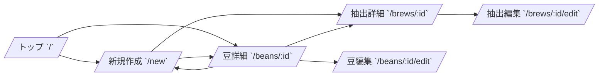

# Brewia 画面仕様書

## 画面一覧

| 画面名   | パス              | 役割                           |
| -------- | ----------------- | ------------------------------ |
| トップ   | `/`               | 総抽出数・総豆数・豆一覧の表示 |
| 新規作成 | `/new`            | 豆作成・抽出作成の実行         |
| 豆詳細   | `/beans/:id`      | 豆情報と紐づく抽出履歴の参照   |
| 豆編集   | `/beans/:id/edit` | 豆情報の更新                   |
| 抽出詳細 | `/brews/:id`      | 抽出条件・評価・チャートの参照 |
| 抽出編集 | `/brews/:id/edit` | 抽出情報の更新                 |

## 画面フロー

## 画面要件

### トップ画面

- 総抽出数（Total Brews）と総豆数（Total Beans）を表示する。
- 豆一覧を表示し、豆詳細へ遷移できる。
- 豆未登録時は空状態と作成導線を表示する。

### 新規作成画面

- 豆作成フォームと抽出作成フォームを切り替え可能とする。
- 抽出作成フォームでは豆一覧・フレーバー一覧を選択可能とする。

### 豆詳細画面

- 豆の基本情報（名称、生産国、生産地域、生産農園、生産処理、品種、焙煎度、焙煎所、メモ）を表示する。
- 生産国は国旗付きで表示し、ブレンドは `🏳️‍🌈` を表示する。
- 紐づく抽出履歴を表示する。
- 編集・削除・抽出作成への導線を提供する。

### 抽出詳細画面

- 抽出レシピ（豆量、挽き目、湯量、湯温、抽出ステップ）を表示する。
- カップ評価（香り、酸味、甘味、質感、総合点）を表示する。
- 抽出比率（Brew Ratio）を表示する。
- 抽出ステップを折れ線グラフで表示し、ステップ番号とメモリ線を表示する。
- カップ評価をレーダーチャートで表示する。
- フレーバーとメモを表示する。
- 編集・削除導線を提供する。

### 編集画面

- 豆編集/抽出編集画面は既存値を初期表示する。
- 保存成功時は詳細画面へ遷移する。

## エラーハンドリング

- 対象データ不存在時は 404 画面を表示する。
- 削除時は確認ダイアログを表示する。
- バリデーションエラー時は保存処理を中断する。
