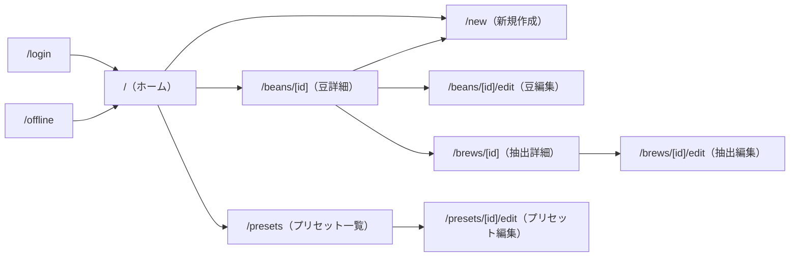

# 画面仕様書

Brewia の全画面（`app/**/page.tsx`）をルート単位で記述した仕様書。

**対象範囲**: `app/page.tsx`・`app/new/page.tsx`・`app/beans/[id]/page.tsx`・`app/beans/[id]/edit/page.tsx`・`app/brews/[id]/page.tsx`・`app/brews/[id]/edit/page.tsx`・`app/presets/page.tsx`・`app/presets/[id]/edit/page.tsx`・`app/login/page.tsx`・`app/offline/page.tsx` の全 10 画面  
**更新ポリシー**: 画面追加・ルート変更・主要コンポーネントの変更時に更新する。  
**関連ドキュメント**: 認証・ミドルウェアの詳細は [Auth Architecture](./auth-architecture.md)。要件の背景は [要件定義書](./requirements.md) を参照。

---

## 1. 認可方針（共通）

→ #82, `middleware.ts`

`middleware.ts` により、以下の 3 パスを除くすべてのルートがログイン必須となる。

| パス | 認可 |
| --- | --- |
| `/login` | 公開 |
| `/offline` | 公開 |
| `/api/auth/*` | 公開（NextAuth ハンドラ） |
| 上記以外（全ページ・API） | ログイン必須（未認証は `/login` へリダイレクト） |

Server Component 側でも `requireUser()` を呼び二重チェックを行う（深層防護）。

---

## 2. 画面仕様

### 2.1 ホーム画面

→ #32, #62, `app/page.tsx`

| 項目 | 内容 |
| --- | --- |
| パス | `/` |
| 認可 | 要ログイン |
| 役割 | 豆ライブラリの一覧表示と統計サマリーのダッシュボード |
| データ取得 | `beansService.getBeans(user.id)` / `brewsService.getBrews(user.id)` |

**主要 UI コンポーネント**:

| コンポーネント | 役割 |
| --- | --- |
| `PageHeader` | ヘッダー（Brewia ロゴ・プリセットリンク・豆追加ボタン・ユーザーメニュー） |
| `Greeting` | ウェルカムメッセージ |
| `StatsCard` | Total Brews / Bean Variety の統計カード |
| `BeanCard` | 豆一覧の各カード（豆詳細へのリンク） |
| `UserMenu` | サインアウトボタンを含むユーザーメニュー |
| `Empty` | 豆が 0 件の場合の空状態 UI |

**主要アクション**:

- ヘッダーのプリセットアイコン → `/presets` に遷移
- ヘッダーの `+` ボタン → `/new?type=bean` に遷移（新規豆作成）
- BeanCard クリック → `/beans/[id]` に遷移（豆詳細）

---

### 2.2 新規作成タブ画面

→ #32, #62, #78, #85, #109, `app/new/page.tsx`

| 項目 | 内容 |
| --- | --- |
| パス | `/new` |
| クエリパラメータ | `?type=bean\|brew`（タブ切り替え）・`?bean=<id>`（抽出先の豆 ID）・`?copyBean=<id>`（豆コピー元）・`?copyBrew=<id>`（抽出コピー元） |
| 認可 | 要ログイン |
| 役割 | Bean 新規作成フォームと Brew 新規作成フォームを tabs で切り替える入口 |
| データ取得 | `beansService.getBeans`・`flavorsService.getFlavors`・コピー元 bean/brew の取得 |

**主要 UI コンポーネント**:

| コンポーネント | 役割 |
| --- | --- |
| `PageHeader` | ヘッダー（戻るボタン・ユーザーメニュー） |
| `NewEntryTabs` | Bean/Brew タブの切り替えコンテナ |
| `NewBeanForm` | 豆新規作成フォーム（写真から自動入力ボタン含む） |
| `NewBrewForm` | 抽出新規作成フォーム（タイマー・プリセット適用含む） |

**主要アクション**:

- Bean タブ: 写真からの自動入力（`POST /api/beans/extract`）、フォーム送信（`POST /api/beans`）
- Brew タブ: プリセット適用、タイマー操作、フォーム送信（`POST /api/brews`）
- `copyBean` / `copyBrew` クエリパラメータがある場合、コピー元の値をフォームに初期値として設定する

---

### 2.3 豆詳細画面

→ #32, #62, `app/beans/[id]/page.tsx`

| 項目 | 内容 |
| --- | --- |
| パス | `/beans/[id]` |
| 認可 | 要ログイン |
| 役割 | 指定した豆の詳細情報と紐づく抽出履歴の表示 |
| データ取得 | `beansService.getBeanById(user.id, id)` / `brewsService.getBrewsByBeanId(user.id, id)` |

**主要 UI コンポーネント**:

| コンポーネント | 役割 |
| --- | --- |
| `PageHeader` | ヘッダー（ホームに戻る・豆コピー・編集・削除・抽出追加ボタン・ユーザーメニュー） |
| `Card` / `DataField` | 豆情報の表示（国旗・豆名・ロースター・各属性） |
| `BrewCard` | 抽出履歴の各カード |
| `DeleteResourceButton` | 豆削除ボタン（`DELETE /api/beans/:id`。確認ダイアログ付き） |

**主要アクション**:

- コピーボタン → `/new?type=bean&copyBean=<id>` に遷移
- 編集ボタン → `/beans/[id]/edit` に遷移
- 削除ボタン → 確認後 `DELETE /api/beans/:id` を呼び出し、完了後 `/` にリダイレクト
- 抽出追加ボタン → `/new?type=brew&bean=<id>` に遷移

存在しない豆 ID（または他ユーザーの豆 ID）アクセス時は `notFound()` を発火する。

---

### 2.4 豆編集画面

→ #32, `app/beans/[id]/edit/page.tsx`

| 項目 | 内容 |
| --- | --- |
| パス | `/beans/[id]/edit` |
| 認可 | 要ログイン |
| 役割 | 指定した豆の属性を編集する |
| データ取得 | `beansService.getBeanById(user.id, id)` |

**主要 UI コンポーネント**:

| コンポーネント | 役割 |
| --- | --- |
| ページヘッダー（インライン） | 豆詳細に戻るリンク |
| `NewBeanForm` | mode="edit" で呼び出す。既存値を初期値として表示し `PUT /api/beans/:id` で更新 |

存在しない豆 ID アクセス時は `notFound()` を発火する。

---

### 2.5 抽出詳細画面

→ #62, #63, #78, `app/brews/[id]/page.tsx`

| 項目 | 内容 |
| --- | --- |
| パス | `/brews/[id]` |
| 認可 | 要ログイン |
| 役割 | 指定した抽出ログの詳細表示（パラメータ・注湯プロファイル・テイストプロファイル・風味・メモ） |
| データ取得 | `brewsService.getBrewById(user.id, id)`（Bean 情報・Flavor 一覧を含む） |

**主要 UI コンポーネント**:

| コンポーネント | 役割 |
| --- | --- |
| `PageHeader` | ヘッダー（豆詳細に戻る・抽出コピー・編集・削除ボタン・ユーザーメニュー） |
| `MetricTile` | 豆量・湯量・湯温・挽き目の表示タイル |
| `PourChart` | 注湯ステップの棒グラフ可視化 |
| `TasteBars` | 味覚 5 評価のバー表示 |
| `FlavorBadge` | 各風味タグのバッジ表示 |
| `DeleteResourceButton` | 抽出削除ボタン（`DELETE /api/brews/:id`。確認ダイアログ付き） |

**主要アクション**:

- コピーボタン → `/new?type=brew&copyBrew=<id>` に遷移
- 編集ボタン → `/brews/[id]/edit` に遷移
- 削除ボタン → 確認後 `DELETE /api/brews/:id` を呼び出し、完了後 `/beans/:beanId` にリダイレクト

存在しない抽出 ID アクセス時は `notFound()` を発火する。

---

### 2.6 抽出編集画面

→ #62, #63, `app/brews/[id]/edit/page.tsx`

| 項目 | 内容 |
| --- | --- |
| パス | `/brews/[id]/edit` |
| 認可 | 要ログイン |
| 役割 | 指定した抽出ログを編集する |
| データ取得 | `brewsService.getBrewById`・`beansService.getBeans`・`flavorsService.getFlavors` |

**主要 UI コンポーネント**:

| コンポーネント | 役割 |
| --- | --- |
| ページヘッダー（インライン） | 抽出詳細に戻るリンク |
| `NewBrewForm` | mode="edit" で呼び出す。既存値を初期値として表示し `PUT /api/brews/:id` で更新 |

存在しない抽出 ID アクセス時は `notFound()` を発火する。

---

### 2.7 抽出プリセット一覧画面

→ #85, `app/presets/page.tsx`

| 項目 | 内容 |
| --- | --- |
| パス | `/presets` |
| 認可 | 要ログイン |
| 役割 | 認証ユーザーの抽出プリセット一覧を表示・削除できる |
| データ取得 | `brewPresetsService.getBrewPresets(user.id)` |

**主要 UI コンポーネント**:

| コンポーネント | 役割 |
| --- | --- |
| `PageHeader` | ヘッダー（ホームに戻る・ユーザーメニュー） |
| プリセットカード（インライン） | プリセット名・説明・ステップ数の表示 |
| `Button` → 編集リンク | `/presets/[id]/edit` へのリンク |
| `DeleteResourceButton` | プリセット削除ボタン（`DELETE /api/brew-presets/:id`） |
| `Empty` | プリセットが 0 件の場合の空状態 UI |

---

### 2.8 抽出プリセット編集画面

→ #85, #109, PR #115, `app/presets/[id]/edit/page.tsx`

| 項目 | 内容 |
| --- | --- |
| パス | `/presets/[id]/edit` |
| 認可 | 要ログイン |
| 役割 | 指定したプリセットの属性（名前・説明・デフォルト値・注湯ステップ）を編集する |
| データ取得 | `brewPresetsService.getBrewPresetById(user.id, id)` |

**主要 UI コンポーネント**:

| コンポーネント | 役割 |
| --- | --- |
| `PageHeader` | ヘッダー（プリセット一覧に戻る） |
| `PresetEditForm` | プリセット専用の編集フォーム（`app/presets/[id]/edit/preset-edit-form.tsx`）。`PUT /api/brew-presets/:id` で更新 |

PR #115 で抽出ステップ入力 UI を `NewBrewForm` と揃えた（→ #109）。

存在しないプリセット ID アクセス時は `notFound()` を発火する。

---

### 2.9 ログイン画面

→ #82, PR #113, `app/login/page.tsx`

| 項目 | 内容 |
| --- | --- |
| パス | `/login` |
| 認可 | 不要（公開）。ログイン済みの場合は `/` にリダイレクト |
| 役割 | Google OAuth でサインインするエントリポイント |

**主要 UI コンポーネント**:

| コンポーネント | 役割 |
| --- | --- |
| Google Sign In ボタン | Server Action `handleGoogleSignIn` を呼び出し `signIn('google')` を実行 |

**認証フロー**: Google OAuth のみ対応。メールマジックリンクは #107 / PR #113 で廃止済みのため、メール入力フォームは存在しない。

---

### 2.10 オフラインフォールバック画面

→ `app/offline/page.tsx`, `docs/development-guide.md:232-255`

| 項目 | 内容 |
| --- | --- |
| パス | `/offline` |
| 認可 | 不要（公開） |
| 役割 | Service Worker の Network First 戦略でネットワーク不通時にフォールバックする画面 |

**主要 UI コンポーネント**:

| コンポーネント | 役割 |
| --- | --- |
| "You are offline" テキスト | オフライン状態の説明 |
| "Back to Home" リンク | `/` への遷移ボタン |

---

## 3. 横断仕様

### 3.1 UI トークン統一

→ PR #80, PR #81, PR #94

全画面で Tailwind CSS のデザイントークン（`bg-background`・`text-foreground`・`border-border` 等）を統一して使用する。カード・ヘッダー・インプットのスタイルは `components/ui/` のベースコンポーネントで統一されている。

### 3.2 写真撮影 UI（Bean フォーム）

→ #58, #61, #84, `docs/photo-form-extraction.md`

`NewBeanForm` 内の `PhotoImportButton`（`components/photo-import-button.tsx`）でカメラ/ギャラリーから画像を選択し、`POST /api/beans/extract` に送信して各フィールドに自動入力する。解析中はスピナーを表示し、ボタンを無効化する。

### 3.3 抽出タイマー

→ #78

`NewBrewForm` にタイマーコンポーネントがあり、注湯タイミングを計測しながらステップを入力できる。

### 3.4 プリセット適用

→ #85, #109, PR #115

`NewBrewForm` のプリセット選択で既存プリセットを適用すると、デフォルト豆量・湯温・注湯ステップが自動入力される。

---

## 4. ナビゲーション図

---

## 5. 画面一覧

| 画面名 | パス | 認可 | 関連ファイル |
| --- | --- | --- | --- |
| ホーム | `/` | 要 | `app/page.tsx` |
| 新規作成タブ | `/new` | 要 | `app/new/page.tsx` |
| 豆詳細 | `/beans/[id]` | 要 | `app/beans/[id]/page.tsx` |
| 豆編集 | `/beans/[id]/edit` | 要 | `app/beans/[id]/edit/page.tsx` |
| 抽出詳細 | `/brews/[id]` | 要 | `app/brews/[id]/page.tsx` |
| 抽出編集 | `/brews/[id]/edit` | 要 | `app/brews/[id]/edit/page.tsx` |
| プリセット一覧 | `/presets` | 要 | `app/presets/page.tsx` |
| プリセット編集 | `/presets/[id]/edit` | 要 | `app/presets/[id]/edit/page.tsx` |
| ログイン | `/login` | 不要 | `app/login/page.tsx` |
| オフライン | `/offline` | 不要 | `app/offline/page.tsx` |
