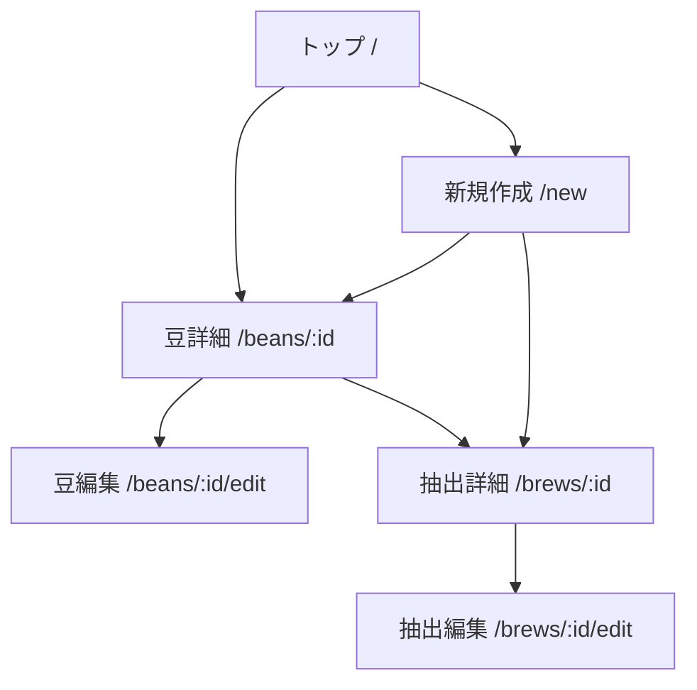

# Brewia 画面仕様書

## 画面構成

### 共通レイアウト

- ヘッダーは固定表示とし、主要操作（戻る/追加/編集/削除）を上部に集約する。
- メインコンテンツはモバイル幅を基準として縦スクロールで構成する。
- カード UI を基本単位とし、情報のまとまり（豆情報、抽出情報、チャート、メモ）を分離表示する。

### 画面階層

### 画面一覧

| 画面名   | パス              | 主要目的                     | 主要データ                   |
| -------- | ----------------- | ---------------------------- | ---------------------------- |
| トップ   | `/`               | 全体状況の把握と豆一覧参照   | Beans, Brews 集計            |
| 新規作成 | `/new`            | 豆/抽出の新規登録            | Beans, Flavors               |
| 豆詳細   | `/beans/:id`      | 豆情報と紐づく抽出履歴の参照 | Bean, Brews                  |
| 豆編集   | `/beans/:id/edit` | 豆情報の更新                 | Bean                         |
| 抽出詳細 | `/brews/:id`      | 抽出条件と評価の参照         | BrewWithBean                 |
| 抽出編集 | `/brews/:id/edit` | 抽出情報の更新               | BrewWithBean, Beans, Flavors |

## 画面仕様

### トップ画面

**表示要素**

- サービス名ヘッダー
- サマリーカード（Total Brews / Total Beans）
- 豆一覧カード
- 空状態 UI（豆未登録時）

**操作要素**

- 新規作成ボタン（`/new`）
- 豆カード押下（`/beans/:id`）

### 新規作成画面

**表示要素**

- 戻るボタン
- タブ切り替え（豆作成 / 抽出作成）
- 豆作成フォーム
- 抽出作成フォーム（豆選択、フレーバー選択、ステップ入力、評価入力）

**操作要素**

- 作成実行
- タブ切り替え

### 豆詳細画面

**表示要素**

- 豆ヒーロー（国旗、豆名、焙煎所、焙煎度）
- 産地情報（生産国、生産地域、生産農園、品種、生産処理）
- メモ
- 紐づく抽出履歴

**操作要素**

- 豆編集（`/beans/:id/edit`）
- 豆削除（`DELETE /api/beans/:id`）
- 抽出作成（`/new?type=brew&bean=:id`）
- 抽出詳細遷移（`/brews/:id`）

### 豆編集画面

**表示要素**

- 戻るボタン
- 初期値付き豆フォーム

**操作要素**

- 保存（`PUT /api/beans/:id`）
- キャンセル（詳細に戻る）

### 抽出詳細画面

**表示要素**

- 参照豆情報（豆名、焙煎所、国旗、総合点）
- 抽出パラメータ（豆量、挽き目、湯量、湯温、抽出比率）
- 抽出ステップ折れ線グラフ（時間×湯量、ステップ番号、メモリ線）
- レーダーチャート（香り、酸味、甘味、質感、総合点）
- フレーバータグ
- テイスティングメモ

**操作要素**

- 抽出編集（`/brews/:id/edit`）
- 抽出削除（`DELETE /api/brews/:id`）
- 豆詳細遷移（`/beans/:id`）

### 抽出編集画面

**表示要素**

- 戻るボタン
- 初期値付き抽出フォーム（Bean/Flavor/Steps/評価）

**操作要素**

- 保存（`PUT /api/brews/:id`）
- キャンセル（詳細に戻る）

## エラーハンドリング

- 対象データ不存在時は 404 画面表示。
- 入力バリデーションエラー時は保存処理を中断し、エラーを表示。
- 削除時は確認ダイアログを表示し、誤操作を防止する。
