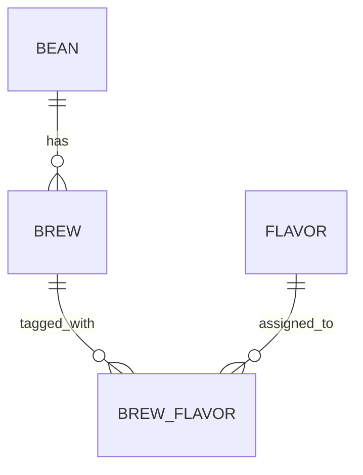

# Brewia データ仕様書

## 1. データモデル

## 2. テーブル定義

### 2.1 bean

| 論理名   | 物理名  | 型   | NOT NULL | PK  | FK  | 備考                      |
| -------- | ------- | ---- | -------- | --- | --- | ------------------------- |
| ID       | id      | text | ○        | ○   | -   | UUIDv7                    |
| 名称     | name    | text | ○        | -   | -   | trim 後 1 文字以上        |
| 生産国   | country | text | ○        | -   | -   | 許可 enum                 |
| 生産地域 | region  | text | -        | -   | -   | nullable                  |
| 生産農園 | farm    | text | -        | -   | -   | nullable                  |
| 生産処理 | process | text | -        | -   | -   | nullable                  |
| 品種     | variety | text | -        | -   | -   | nullable                  |
| 焙煎度   | roast   | text | ○        | -   | -   | 許可 enum                 |
| 焙煎所   | roaster | text | -        | -   | -   | 入力上は必須              |
| メモ     | notes   | text | -        | -   | -   | nullable                  |
| 作成日時 | created | text | ○        | -   | -   | default CURRENT_TIMESTAMP |
| 更新日時 | updated | text | ○        | -   | -   | default CURRENT_TIMESTAMP |

### 2.2 brew

| 論理名       | 物理名       | 型      | NOT NULL | PK  | FK      | 備考                      |
| ------------ | ------------ | ------- | -------- | --- | ------- | ------------------------- |
| ID           | id           | text    | ○        | ○   | -       | UUIDv7                    |
| 豆ID         | bean_id      | text    | ○        | -   | bean.id | Bean 参照                 |
| 豆量         | bean_weight  | real    | ○        | -   | -       | > 0                       |
| 挽き目       | bean_grind   | real    | -        | -   | -       | nullable                  |
| 湯量         | water_weight | real    | ○        | -   | -       | > 0                       |
| 湯温         | water_temp   | real    | -        | -   | -       | 0〜100 or null            |
| 抽出ステップ | steps        | text    | ○        | -   | -       | JSON 文字列               |
| 香り         | aroma        | integer | ○        | -   | -       | 1〜5                      |
| 酸味         | acidity      | integer | ○        | -   | -       | 1〜5                      |
| 甘味         | sweetness    | integer | ○        | -   | -       | 1〜5                      |
| 質感         | body         | integer | ○        | -   | -       | 1〜5                      |
| 総合点       | overall      | integer | ○        | -   | -       | 1〜5                      |
| メモ         | notes        | text    | -        | -   | -       | nullable                  |
| 作成日時     | created      | text    | ○        | -   | -       | default CURRENT_TIMESTAMP |
| 更新日時     | updated      | text    | ○        | -   | -       | default CURRENT_TIMESTAMP |

### 2.3 flavor

| 論理名       | 物理名      | 型   | NOT NULL | PK  | FK  | 備考                      |
| ------------ | ----------- | ---- | -------- | --- | --- | ------------------------- |
| ID           | id          | text | ○        | ○   | -   | UUIDv7                    |
| 名称         | name        | text | ○        | -   | -   |                           |
| カテゴリ     | category    | text | ○        | -   | -   |                           |
| サブカテゴリ | subcategory | text | ○        | -   | -   |                           |
| 作成日時     | created     | text | ○        | -   | -   | default CURRENT_TIMESTAMP |
| 更新日時     | updated     | text | ○        | -   | -   | default CURRENT_TIMESTAMP |

### 2.4 brew_flavor

| 論理名       | 物理名    | 型   | NOT NULL | PK  | FK        | 備考                      |
| ------------ | --------- | ---- | -------- | --- | --------- | ------------------------- |
| ID           | id        | text | ○        | ○   | -         | UUIDv7                    |
| 抽出ID       | brew_id   | text | ○        | -   | brew.id   |                           |
| フレーバーID | flavor_id | text | ○        | -   | flavor.id |                           |
| 作成日時     | created   | text | ○        | -   | -         | default CURRENT_TIMESTAMP |
| 更新日時     | updated   | text | ○        | -   | -         | default CURRENT_TIMESTAMP |

## 3. 関連・整合性仕様

- Bean 削除時は、関連 Brew と BrewFlavor を削除してから Bean を削除する。
- Brew 削除時は、関連 BrewFlavor を削除してから Brew を削除する。
- Brew 更新時は、BrewFlavor を全削除後に再登録する。

## 4. 入力バリデーション仕様

### 4.1 Bean

| 項目    | 条件               | エラー条件 |
| ------- | ------------------ | ---------- |
| name    | trim 後 1 文字以上 | 空文字     |
| roaster | trim 後 1 文字以上 | 空文字     |
| country | 許可 enum          | enum 外値  |
| roast   | 許可 enum          | enum 外値  |

### 4.2 Brew

| 項目                                 | 条件               | エラー条件     |
| ------------------------------------ | ------------------ | -------------- |
| beanId                               | 1 文字以上         | 空文字         |
| beanWeight                           | 正の数             | 0 以下         |
| waterWeight                          | 正の数             | 0 以下         |
| waterTemp                            | null または 0〜100 | 範囲外         |
| aroma/acidity/sweetness/body/overall | 1〜5 の整数        | 範囲外 or 小数 |
| steps[].time                         | 0 以上             | 負数           |
| steps[].water                        | 0 以上             | 負数           |

## 5. テスト観点

- Bean 作成時に enum 外 country を送ると 400 になること。
- Brew 作成時に `beanWeight=0` で 400 になること。
- Bean 削除時に関連 Brew/BrewFlavor が残らないこと。
- Brew 更新時に古い BrewFlavor が再構築されること。
