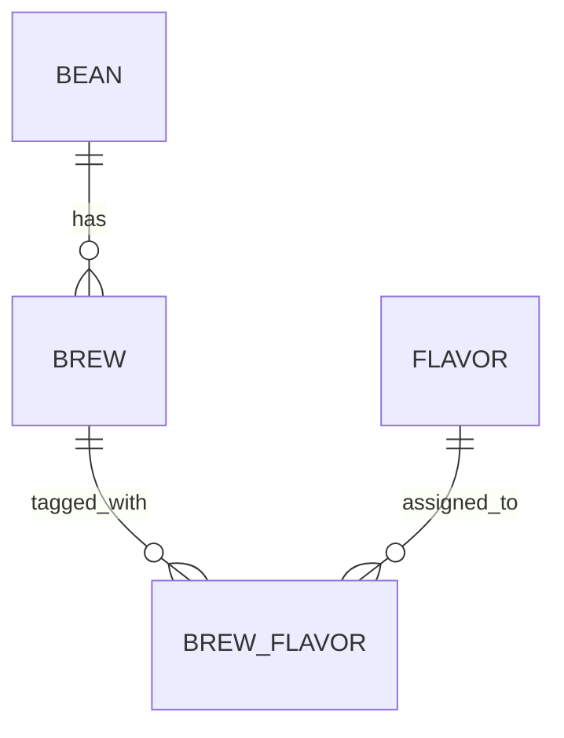

# Brewia データ仕様書

## 用語定義

| 和名         | 英名           | 定義                                |
| ------------ | -------------- | ----------------------------------- |
| エンティティ | Entity         | 業務上の管理対象を表すデータ単位。  |
| 論理モデル   | Logical Model  | エンティティ間の関係を示すモデル。  |
| 物理モデル   | Physical Model | DB テーブルとして実装されるモデル。 |
| 主キー       | Primary Key    | 各レコードを一意に識別するキー。    |
| 外部キー     | Foreign Key    | 他テーブルの主キーを参照するキー。  |

## 機能要件

### データモデル

### 豆（Bean）

| 和名     | 英名    | 物理名  | 型             | 必須 | 概要     |
| -------- | ------- | ------- | -------------- | ---- | -------- |
| ID       | ID      | id      | text(UUIDv7)   | ○    | 主キー   |
| 名称     | Name    | name    | text           | ○    | 豆の名称 |
| 生産国   | Country | country | text           | ○    | 生産国   |
| 生産地域 | Region  | region  | text           | -    | 生産地域 |
| 生産農園 | Farm    | farm    | text           | -    | 生産農園 |
| 生産処理 | Process | process | text           | -    | 生産処理 |
| 品種     | Variety | variety | text           | -    | 品種     |
| 焙煎度   | Roast   | roast   | text           | ○    | 焙煎度   |
| 焙煎所   | Roaster | roaster | text           | -    | 焙煎所   |
| メモ     | Note    | notes   | text           | -    | 自由記述 |
| 作成日時 | Created | created | text(datetime) | ○    | 作成日時 |
| 編集日時 | Updated | updated | text(datetime) | ○    | 更新日時 |

### 抽出（Brew）

| 和名         | 英名         | 物理名       | 型             | 必須 | 概要              |
| ------------ | ------------ | ------------ | -------------- | ---- | ----------------- |
| ID           | ID           | id           | text(UUIDv7)   | ○    | 主キー            |
| 豆ID         | Bean ID      | bean_id      | text(FK)       | ○    | Bean 参照         |
| 豆量         | Bean Weight  | bean_weight  | real           | ○    | 豆の重量（g）     |
| 挽き目       | Bean Grind   | bean_grind   | real           | -    | クリック数        |
| 湯量         | Water Weight | water_weight | real           | ○    | 湯の重量（g）     |
| 湯温         | Water Temp   | water_temp   | real           | -    | 湯温（℃）         |
| 抽出ステップ | Brew Steps   | steps        | text(JSON)     | ○    | `[{time, water}]` |
| 香り         | Aroma        | aroma        | integer        | ○    | 1〜5              |
| 酸味         | Acidity      | acidity      | integer        | ○    | 1〜5              |
| 甘味         | Sweetness    | sweetness    | integer        | ○    | 1〜5              |
| 質感         | Body         | body         | integer        | ○    | 1〜5              |
| 総合点       | Overall      | overall      | integer        | ○    | 1〜5              |
| メモ         | Note         | notes        | text           | -    | 自由記述          |
| 作成日時     | Created      | created      | text(datetime) | ○    | 作成日時          |
| 編集日時     | Updated      | updated      | text(datetime) | ○    | 更新日時          |

### フレーバー（Flavor）

| 和名         | 英名        | 物理名      | 型             | 必須 | 概要           |
| ------------ | ----------- | ----------- | -------------- | ---- | -------------- |
| ID           | ID          | id          | text(UUIDv7)   | ○    | 主キー         |
| 名称         | Name        | name        | text           | ○    | フレーバー名称 |
| カテゴリ     | Category    | category    | text           | ○    | 大分類         |
| サブカテゴリ | Subcategory | subcategory | text           | ○    | 小分類         |
| 作成日時     | Created     | created     | text(datetime) | ○    | 作成日時       |
| 編集日時     | Updated     | updated     | text(datetime) | ○    | 更新日時       |

### 抽出フレーバー（BrewFlavor）

| 和名         | 英名      | 物理名    | 型             | 必須 | 概要        |
| ------------ | --------- | --------- | -------------- | ---- | ----------- |
| ID           | ID        | id        | text(UUIDv7)   | ○    | 主キー      |
| 抽出ID       | Brew ID   | brew_id   | text(FK)       | ○    | Brew 参照   |
| フレーバーID | Flavor ID | flavor_id | text(FK)       | ○    | Flavor 参照 |
| 作成日時     | Created   | created   | text(datetime) | ○    | 作成日時    |
| 編集日時     | Updated   | updated   | text(datetime) | ○    | 更新日時    |

### データ制約

- 豆削除時は、関連する抽出と抽出フレーバーを削除して整合性を維持する。
- 抽出更新時は、抽出フレーバーを再構築する。
- 抽出削除時は、抽出フレーバーを削除してから抽出を削除する。

### 入力制約

- 豆の `name` は必須。
- 生産国は国一覧に含まれる値のみ選択可能。
- 焙煎度は 8 レベルから選択可能。
- 抽出評価（香り/酸味/甘味/質感/総合点）は 1〜5 の整数とする。
- 豆量・湯量は正の数とする。
