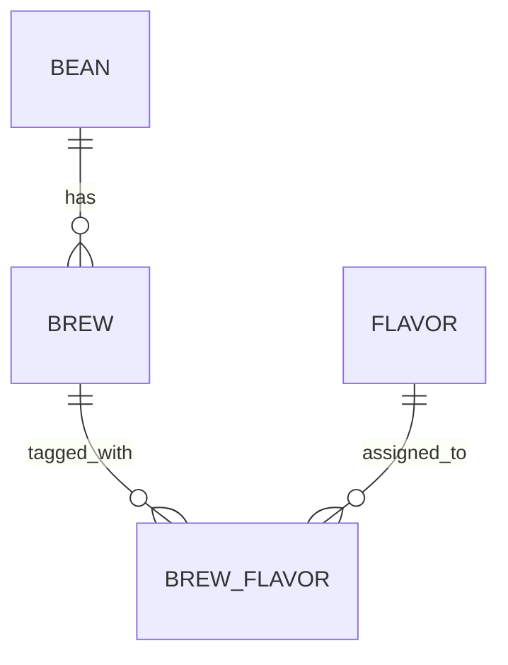

# Brewia データ仕様書

## サービス概要

### 用語定義

| 用語         | 定義                                 |
| ------------ | ------------------------------------ |
| エンティティ | 業務上の管理対象を表すデータ単位。   |
| 論理モデル   | 業務観点でのデータ関連を表すモデル。 |
| 物理モデル   | DB テーブルとして実装される構造。    |
| NULL 許容    | 値未設定を許容する列。               |

### 背景

Bean・Brew・Flavor は相互参照が多く、削除や更新時にデータ不整合が発生しやすい。
そのため、型定義・DB スキーマ・関連制約を同一方針で定義する必要がある。

### 目的

データ構造と制約を明文化し、実装・運用・将来拡張時の整合性を担保する。

## データ要件

### データモデル

## 機能要件

### Bean

| 項目名     | カラム名 | 型             | 必須 | 説明                |
| ---------- | -------- | -------------- | ---- | ------------------- |
| ID         | id       | text(UUIDv7)   | ○    | Bean 主キー         |
| 豆名       | name     | text           | ○    | 表示名              |
| 生産国     | country  | text(enum)     | ○    | COUNTRIES に準拠    |
| 生産地域   | region   | text           | -    | 産地詳細            |
| 農園名     | farm     | text           | -    | 生産者情報          |
| 精製方法   | process  | text           | -    | Washed/Natural など |
| 品種       | variety  | text           | -    | 品種情報            |
| 焙煎度     | roast    | text(enum)     | ○    | ROAST_LEVELS に準拠 |
| ロースター | roaster  | text           | -    | 焙煎店舗名          |
| メモ       | notes    | text           | -    | 自由記述            |
| 作成日時   | created  | text(datetime) | ○    | CURRENT_TIMESTAMP   |
| 更新日時   | updated  | text(datetime) | ○    | CURRENT_TIMESTAMP   |

### Brew

| 項目名       | カラム名     | 型             | 必須 | 説明              |
| ------------ | ------------ | -------------- | ---- | ----------------- |
| ID           | id           | text(UUIDv7)   | ○    | Brew 主キー       |
| Bean ID      | bean_id      | text(FK)       | ○    | bean.id 参照      |
| 豆量         | bean_weight  | real           | ○    | g 単位            |
| 挽き目       | bean_grind   | real           | -    | グラインダー値    |
| 湯量         | water_weight | real           | ○    | g/ml              |
| 湯温         | water_temp   | real           | -    | ℃                 |
| 注湯ステップ | steps        | text(JSON)     | ○    | `[{time, water}]` |
| 香り         | aroma        | integer        | ○    | 1〜5              |
| 酸味         | acidity      | integer        | ○    | 1〜5              |
| 甘さ         | sweetness    | integer        | ○    | 1〜5              |
| ボディ       | body         | integer        | ○    | 1〜5              |
| 総合         | overall      | integer        | ○    | 1〜5              |
| メモ         | notes        | text           | -    | 自由記述          |
| 作成日時     | created      | text(datetime) | ○    | CURRENT_TIMESTAMP |
| 更新日時     | updated      | text(datetime) | ○    | CURRENT_TIMESTAMP |

### Flavor

| 項目名       | カラム名    | 型             | 必須 | 説明              |
| ------------ | ----------- | -------------- | ---- | ----------------- |
| ID           | id          | text(UUIDv7)   | ○    | Flavor 主キー     |
| 名称         | name        | text           | ○    | 風味名            |
| カテゴリ     | category    | text           | ○    | 大分類            |
| サブカテゴリ | subcategory | text           | ○    | 小分類            |
| 作成日時     | created     | text(datetime) | ○    | CURRENT_TIMESTAMP |
| 更新日時     | updated     | text(datetime) | ○    | CURRENT_TIMESTAMP |

### BrewFlavor

| 項目名    | カラム名  | 型             | 必須 | 説明              |
| --------- | --------- | -------------- | ---- | ----------------- |
| ID        | id        | text(UUIDv7)   | ○    | 関連主キー        |
| Brew ID   | brew_id   | text(FK)       | ○    | brew.id 参照      |
| Flavor ID | flavor_id | text(FK)       | ○    | flavor.id 参照    |
| 作成日時  | created   | text(datetime) | ○    | CURRENT_TIMESTAMP |
| 更新日時  | updated   | text(datetime) | ○    | CURRENT_TIMESTAMP |

### 入力バリデーション方針

- Bean 作成・更新時:
  - `name`, `roaster` は trim 後に 1 文字以上必須。
  - `country`, `roast` は定義済み enum のみ許容。
  - 任意文字列は空文字を許容し、保存時に正規化する。
- Brew 作成・更新時:
  - `beanWeight`, `waterWeight` は正の数。
  - `waterTemp` は未入力許容、入力時は 0〜100。
  - 評価項目（aroma など）は整数 1〜5。
  - `flavorIds` は配列として受け取り、重複を除外する。

### 整合性要件

- Bean 削除時は関連 Brew と BrewFlavor を先に削除してから Bean を削除する。
- Brew 更新時は BrewFlavor を再構築し、中間データの整合性を保つ。
- Brew 削除時は BrewFlavor を削除してから Brew を削除する。
