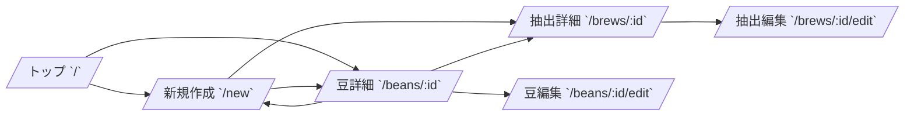

# Brewia 画面仕様書

## サービス概要

### 用語定義

| 用語           | 定義                                       |
| -------------- | ------------------------------------------ |
| 画面           | URL 単位で提供される UI。                  |
| コンポーネント | 画面内の再利用可能な表示・入力部品。       |
| 空状態         | データ未登録時に表示する案内 UI。          |
| CTA            | ユーザーの主要アクションへ誘導するボタン。 |

### 背景

Brewia はモバイル利用を前提としており、画面遷移数が多いほど入力負荷が高まる。
そのため、画面ごとの目的と導線を定義し、短い操作ステップで記録を完了できる設計が必要である。

### 目的

主要画面の責務、表示項目、アクション、遷移先を明確化し、実装と QA の基準を統一する。

## 画面要件

### 画面フロー

## 機能要件

### トップ画面（`/`）

- **目的**: 現在の記録状況を一覧で把握し、次アクションへ遷移する。
- **主要表示**:
  - サービス名ヘッダー
  - サマリーカード（Total Brews / Bean Variety）
  - Bean 一覧カード
  - 空状態（Bean 未登録時）
- **主要アクション**:
  - 「＋」から新規作成画面へ遷移
  - Bean カードタップで Bean 詳細へ遷移

### 新規作成画面（`/new`）

- **目的**: Bean 作成または Brew 作成をタブで切り替えて実行する。
- **主要表示**:
  - 戻るボタン
  - 新規作成タブ（Bean / Brew）
  - Bean 作成フォーム
  - Brew 作成フォーム（Bean 一覧、Flavor 一覧を利用）
- **主要アクション**:
  - Bean 作成 API 呼び出し
  - Brew 作成 API 呼び出し
  - 作成後、詳細画面へ遷移

### Bean 詳細画面（`/beans/:id`）

- **目的**: Bean の属性と紐づく Brew 履歴を確認し、管理操作を行う。
- **主要表示**:
  - Bean ヒーロー（国旗、豆名、ロースター、焙煎度）
  - 産地情報（地域、国、農園、品種、精製）
  - メモ（任意表示）
  - Brew 履歴一覧
- **主要アクション**:
  - 編集ボタンで Bean 編集へ遷移
  - 削除ボタンで Bean 削除 API 呼び出し
  - 「＋」で Brew 新規作成へ遷移（Bean 指定付き）
  - Brew カードタップで Brew 詳細へ遷移

### Bean 編集画面（`/beans/:id/edit`）

- **目的**: 既存 Bean 情報を更新する。
- **主要表示**:
  - 戻るボタン
  - 初期値入り Bean フォーム
- **主要アクション**:
  - Bean 更新 API 呼び出し
  - 成功時に Bean 詳細へ遷移

### Brew 詳細画面（`/brews/:id`）

- **目的**: 抽出条件と味覚評価を 1 画面で参照する。
- **主要表示**:
  - 参照 Bean 情報（豆名、ロースター、国旗、overall）
  - 抽出パラメータ（豆量、湯量、湯温、挽き目、抽出比率）
  - 注湯プロファイル（PourChart）
  - テイストプロファイル（TasteRadar）
  - Flavor タグ（任意表示）
  - テイスティングメモ（任意表示）
- **主要アクション**:
  - 編集ボタンで Brew 編集へ遷移
  - 削除ボタンで Brew 削除 API 呼び出し
  - Bean 情報タップで Bean 詳細へ遷移

### Brew 編集画面（`/brews/:id/edit`）

- **目的**: 既存 Brew 情報を更新する。
- **主要表示**:
  - 戻るボタン
  - 初期値入り Brew フォーム
- **主要アクション**:
  - Brew 更新 API 呼び出し
  - 成功時に Brew 詳細へ遷移

## エラーハンドリング

- 対象データが存在しない場合は `notFound()` により 404 ページを表示する。
- 削除操作は確認ダイアログを表示し、誤操作を防止する。
- API バリデーションエラー時は 400 を受け取り、保存処理を中断する。
