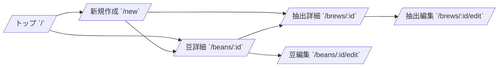

# Brewia 画面仕様書

## 用語定義

| 和名         | 英名        | 定義                                 |
| ------------ | ----------- | ------------------------------------ |
| 画面         | Screen      | URL 単位で提供される UI。            |
| 入力フォーム | Form        | 豆情報・抽出情報を登録/編集する UI。 |
| 画面遷移     | Navigation  | 画面間を移動する操作。               |
| 空状態       | Empty State | データ未登録時に表示する案内。       |

## 機能要件

### 画面構成

| 和名         | 英名        | パス              | 概要                                          |
| ------------ | ----------- | ----------------- | --------------------------------------------- |
| トップ画面   | Dashboard   | `/`               | 総抽出数・総豆数と豆一覧を表示する。          |
| 新規作成画面 | New Entry   | `/new`            | 豆作成/抽出作成フォームを切り替えて表示する。 |
| 豆詳細画面   | Bean Detail | `/beans/:id`      | 豆情報と紐づく抽出履歴を表示する。            |
| 豆編集画面   | Bean Edit   | `/beans/:id/edit` | 豆情報を編集する。                            |
| 抽出詳細画面 | Brew Detail | `/brews/:id`      | 抽出レシピとカップ評価を表示する。            |
| 抽出編集画面 | Brew Edit   | `/brews/:id/edit` | 抽出情報を編集する。                          |

### 画面フロー

### ダッシュボード機能（トップ画面）

- 総抽出数（Total Brews）と総豆数（Total Beans）を表示する。
- 豆一覧をカード形式で表示する。
- 豆未登録時は空状態を表示し、豆作成へ誘導する。

### 豆管理画面仕様

- 豆詳細画面では、以下を表示する。
  - 豆の基本情報（名称、生産国、生産地域、生産農園、生産処理、品種、焙煎度、焙煎所、メモ）
  - 生産国の国旗（ブレンドは `🏳️‍🌈`）
  - 紐づく抽出履歴
- 豆詳細画面では、豆の作成・コピー・編集・削除に遷移可能とする。
- 豆編集画面では、既存値を初期表示して更新できること。

### 抽出管理画面仕様

- 抽出詳細画面では、以下を表示する。
  - 抽出レシピ（豆量、挽き目、湯量、湯温、抽出ステップ）
  - カップ評価（香り、酸味、甘味、質感、総合点）
  - 抽出比率（Brew Ratio）
  - フレーバー
  - メモ
- 抽出ステップは、横軸を時間、縦軸を湯量とする折れ線グラフで表示する。
  - 各ステップにステップ番号を表示する。
  - 時間・湯量に基づくメモリ線を表示する。
- カップ評価はレーダーチャートで表示する。
- 抽出詳細画面では、抽出の作成・コピー・編集・削除に遷移可能とする。

### フレーバー管理画面仕様

- 新規作成画面の抽出フォームでフレーバーを一覧表示・選択可能とする。

### エラーハンドリング

- 対象データが存在しない場合は 404 画面を表示する。
- 削除時は確認ダイアログを表示する。
- 入力バリデーションエラー時は保存処理を中断する。
