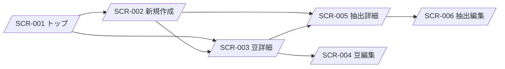

# Brewia 画面仕様書

## 1. 画面一覧

| 画面ID  | 画面名   | パス              | 主目的                   |
| ------- | -------- | ----------------- | ------------------------ |
| SCR-001 | トップ   | `/`               | サマリー確認と豆一覧表示 |
| SCR-002 | 新規作成 | `/new`            | 豆/抽出の新規登録        |
| SCR-003 | 豆詳細   | `/beans/:id`      | 豆情報と抽出履歴参照     |
| SCR-004 | 豆編集   | `/beans/:id/edit` | 豆情報の更新             |
| SCR-005 | 抽出詳細 | `/brews/:id`      | 抽出レシピと評価参照     |
| SCR-006 | 抽出編集 | `/brews/:id/edit` | 抽出情報の更新           |

## 2. 画面遷移

## 3. 画面仕様

### 3.1 SCR-001 トップ

#### 表示項目

| 項目ID  | 項目名      | 種別     | 表示仕様                     |
| ------- | ----------- | -------- | ---------------------------- |
| TOP-001 | タイトル    | テキスト | `Brewia` を表示。            |
| TOP-002 | Total Brews | 数値     | 抽出総件数を表示。           |
| TOP-003 | Total Beans | 数値     | 豆総件数を表示。             |
| TOP-004 | Bean 一覧   | カード   | 豆名・国旗・焙煎情報を表示。 |
| TOP-005 | 空状態      | パネル   | 豆 0 件時のみ表示。          |

#### 操作

| 操作ID      | 操作            | 結果                  |
| ----------- | --------------- | --------------------- |
| TOP-ACT-001 | ＋ボタン押下    | SCR-002 に遷移        |
| TOP-ACT-002 | Bean カード押下 | 対象の SCR-003 に遷移 |

#### テスト観点

- 豆 0 件で空状態表示、1 件以上で一覧表示となること。
- 件数表示が DB 件数と一致すること。

### 3.2 SCR-002 新規作成

#### 表示項目

| 項目ID  | 項目名        | 種別     | 表示仕様             |
| ------- | ------------- | -------- | -------------------- |
| NEW-001 | 戻るボタン    | ボタン   | SCR-001 に戻る。     |
| NEW-002 | タブ          | タブ     | Bean/Brew を切替。   |
| NEW-003 | Bean フォーム | フォーム | 豆作成項目を表示。   |
| NEW-004 | Brew フォーム | フォーム | 抽出作成項目を表示。 |

#### 入力バリデーション

- Bean: 名称、焙煎所、生産国、焙煎度は必須。
- Brew: beanId、豆量、湯量、評価 5 項目は必須。
- Brew: 豆量/湯量は正の数、湯温は 0〜100、評価は 1〜5。

#### 操作

| 操作ID      | 操作           | 結果                   |
| ----------- | -------------- | ---------------------- |
| NEW-ACT-001 | Bean 保存      | 成功時 SCR-003 に遷移  |
| NEW-ACT-002 | Brew 保存      | 成功時 SCR-005 に遷移  |
| NEW-ACT-003 | 入力不正で保存 | エラー表示、遷移しない |

### 3.3 SCR-003 豆詳細

#### 表示項目

| 項目ID  | 項目名     | 種別     | 表示仕様                             |
| ------- | ---------- | -------- | ------------------------------------ |
| BDT-001 | 豆基本情報 | テキスト | 名称、生産地、処理、品種、焙煎など。 |
| BDT-002 | 国旗       | アイコン | 生産国の国旗（ブレンドは `🏳️‍🌈`）。    |
| BDT-003 | Brew 履歴  | リスト   | 当該 Bean の抽出一覧。               |
| BDT-004 | 編集ボタン | ボタン   | SCR-004 に遷移。                     |
| BDT-005 | 削除ボタン | ボタン   | 確認後、削除。                       |
| BDT-006 | 追加ボタン | ボタン   | Bean 指定で SCR-002 へ。             |

#### 操作と遷移

- 削除成功時は SCR-001 へ遷移。
- 抽出カード押下で SCR-005 に遷移。

### 3.4 SCR-004 豆編集

- 初期値として対象 Bean の全項目を表示する。
- 保存時は `PUT /api/beans/:id` を実行し、成功時 SCR-003 へ戻る。
- 対象なしの場合は 404 を表示する。

### 3.5 SCR-005 抽出詳細

#### 表示項目

| 項目ID  | 項目名             | 種別             | 表示仕様                         |
| ------- | ------------------ | ---------------- | -------------------------------- |
| BWD-001 | 参照 Bean 情報     | カード           | 豆名、焙煎所、国旗、総合点。     |
| BWD-002 | 抽出パラメータ     | テキスト         | 豆量、湯量、湯温、挽き目、比率。 |
| BWD-003 | 抽出ステップグラフ | 折れ線グラフ     | 時間×湯量、ステップ番号付き。    |
| BWD-004 | 味覚レーダー       | レーダーチャート | 5 項目の評価を表示。             |
| BWD-005 | フレーバー         | タグ             | 複数表示。                       |
| BWD-006 | メモ               | テキスト         | 任意表示。                       |

#### 操作

- 編集ボタン押下で SCR-006 に遷移。
- 削除成功時は対象 Bean の SCR-003 に遷移。

#### テスト観点

- 比率が `waterWeight/beanWeight`（小数 1 桁）で表示されること。
- ステップグラフの点数が steps 配列長と一致すること。

### 3.6 SCR-006 抽出編集

- 初期値として対象 Brew の全項目を表示する。
- 保存時は `PUT /api/brews/:id` を実行し、成功時 SCR-005 へ戻る。
- 対象なしの場合は 404 を表示する。

## 4. 共通エラー仕様

- API 400 応答時: 保存処理を中断し、入力エラーを表示する。
- API 404 応答時: not found 画面を表示する。
- 削除操作時: 必ず確認ダイアログを表示する。
