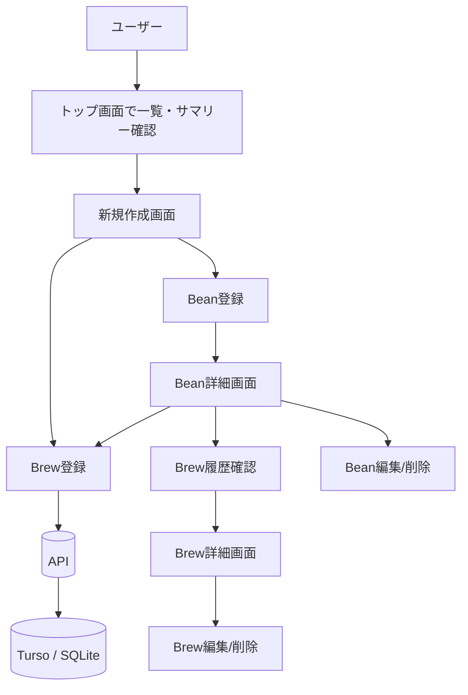

# Brewia 要件定義書

## サービス概要

### 用語定義

| 用語                 | 定義                                                               |
| -------------------- | ------------------------------------------------------------------ |
| Bean（豆）           | コーヒー豆の銘柄・産地・焙煎などの基本情報を保持するエンティティ。 |
| Brew（抽出）         | 1回の抽出記録。レシピ、注湯ステップ、評価、メモを保持する。        |
| Flavor（風味）       | テイスティング時に付与する風味タグ。                               |
| BrewFlavor           | Brew と Flavor の多対多関係を表す関連データ。                      |
| テイスティングスコア | aroma / acidity / sweetness / body / overall の5軸評価（1〜5）。   |

### 背景

自宅抽出やカフェ体験の記録は、メモアプリやSNSなどに分散しやすく、豆ごとの振り返りが難しい。
また、抽出レシピ（豆量・湯量・温度・注湯ステップ）と味覚評価が分離されることで、再現性の高い改善サイクルを作りにくい。

### 目的

Brewia は、Bean と Brew を中心に「コーヒー体験の航海日誌」を構築する。
モバイル前提の操作性で、記録・参照・比較を一気通貫で実現し、以下を達成する。

- 豆ごとの抽出履歴を時系列で蓄積する。
- レシピ条件と味覚評価の関係を可視化する。
- 次回抽出の再現性と改善速度を高める。

## 業務要件

### 業務フロー

### ステークホルダー

- エンドユーザー（コーヒー抽出を日常的に行う利用者）
- プロダクトオーナー（記録体験の価値設計）
- 開発者（機能追加、保守、運用）

### 対象業務

- Bean 情報の登録・更新・削除・一覧参照
- Brew ログの登録・更新・削除・一覧参照
- Flavor によるタグ付け参照
- 豆別抽出履歴の振り返り

### 非機能要件

- モバイル UI で片手操作しやすいレイアウトであること
- 入力値（重量、温度、時間）を数値中心で素早く登録できること
- API 入力をバリデーションし、不正なデータを保存しないこと
- Bean 削除時に関連 Brew / BrewFlavor を整合性を保って削除すること

## 機能要件

### ダッシュボード機能

- 総抽出数（Total Brews）と豆数（Bean Variety）を表示する。
- Bean 一覧を表示し、各 Bean 詳細へ遷移できる。
- Bean が未登録の場合、空状態 UI と初回登録導線を表示する。

### Bean 管理機能

- Bean の新規作成、詳細表示、編集、削除ができる。
- Bean には名前、生産国、地域、農園、精製、品種、焙煎度、ロースター、メモを保持する。
- Bean 詳細では紐づく Brew 履歴を参照できる。

### Brew 管理機能

- Brew の新規作成、詳細表示、編集、削除ができる。
- Brew には豆量、挽き目、湯量、湯温、注湯ステップ、5軸評価、メモを保持する。
- Brew 詳細では抽出比率、注湯チャート、レーダーチャート、Flavor タグを表示する。

### Flavor 参照機能

- Flavor 一覧を取得し、Brew 作成・編集時のタグ選択に利用する。

### API 連携機能

- Bean / Brew / Flavor の REST API を提供する。
- 作成・更新系 API は Zod スキーマで入力検証する。
- 取得・更新・削除時に対象が存在しない場合は 404 を返却する。
